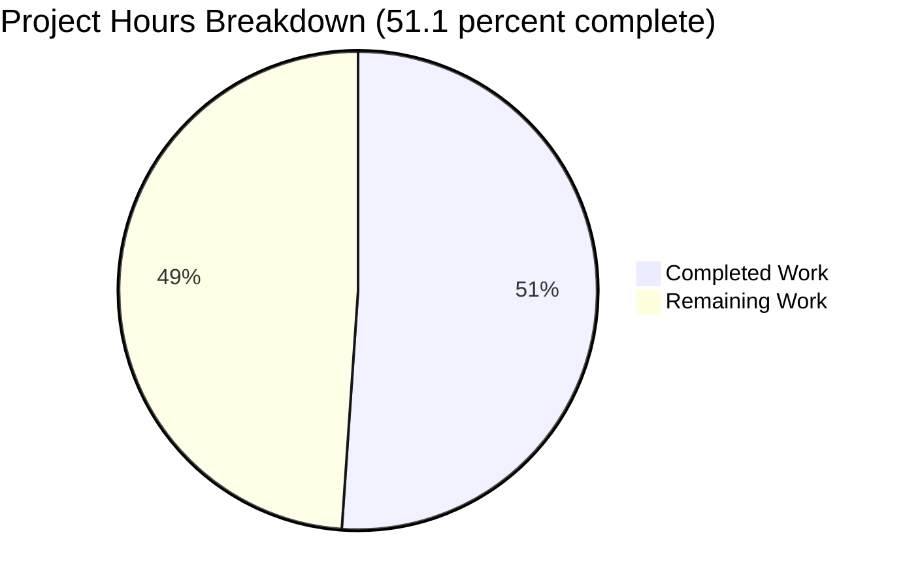
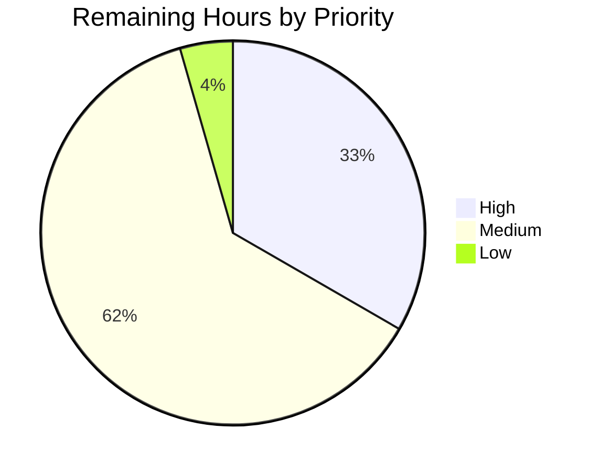

# 1. Executive Summary

## 1.1 Project Overview

A small Node.js HTTP service — no framework, no datastore — answers `GET /hello` with `Hello world` and `GET /health` with its status. This work restructured the `/hello` handler into guard-clause form: non-GET requests leave through an early return and the GET path sits flat. Every observable behaviour is unchanged — the export, the response writes, the delegation to the shared 405 writer, and the log text, levels and order — and a 30-case characterisation suite pins it, its two helpers documented in the repository's own JSDoc shape.

## 1.2 Completion Status

**51.1% complete** — 47 of 92 hours delivered. Completed hours: Dark Blue (#5B39F3); remaining hours: White (#FFFFFF).



| Metric | Hours |
|---|---|
| Total Hours | 92 |
| Completed Hours (AI + Manual) | 47 |
| Remaining Hours | 45 |

47 ÷ 92 = **51.1%**, all autonomous delivery work. The delivered capability is complete and verified; the residual hours are the repository's release-readiness work plus one withheld change awaiting a decision.

## 1.3 Key Accomplishments

- `/hello` restructured to a guard clause: 47 lines, GET path un-nested (`src/backend/handlers/helloHandler.js`).
- Ten restating comments and three whitespace-only lines removed; header, JSDoc and every needed statement byte-identical.
- 27 characterisation cases added to the suite's 30, pinning call order, fourteen guarded method-value classes, the `TypeError` before any side effect, error propagation, return discipline, the export surface and the two-read method contract.
- Both test helpers now carry JSDoc, and every characterisation marker names a reason instead of restating its title.
- The test edit is append-only — first 137 lines byte-identical, 211 inserted, 0 deleted — two files changed, both manifests untouched, no dependency added.
- Verified live end to end with the handler at 100% coverage; the pre-change tree through the same gate confirms 27 more passing tests and no failure.

## 1.4 Critical Unresolved Issues

**10 of the 30 tracked items remain open**: 8 defects reported rather than repaired, 1 withheld structural change and 1 delivery-automation gap. Of the 21 scoped clauses, 20 are delivered and 1 is withheld.

| Issue | Impact | Owner | ETA |
|---|---|---|---|
| Withheld structural change: the redundant `method` local is retained because removing it cannot be shown equivalent (1 item) | The requested simplification is not in the tree; needs a decision on whether getter-backed requests are in contract | Maintainer / product owner | 3h once decided |
| Pre-existing defects left in place (8 items): a suite requiring a module that does not exist; the missing backend manifest that stops the container image building; two coverage-threshold keys naming no file; a test reporter configured but declared in no manifest; the API integration suite unable to reach the handler; a setup file that never loads; the documented lint configuration absent; an over-length log line | Two block release outright — the image cannot build and the API integration suite cannot run — and the reporter gap stops a clean checkout running the suite at all | Repository owner | 3–19h per item, see Section 2.2 |
| No continuous integration or deployment automation (1 item) | Releases depend on manual steps, and a red gate cannot be attributed to a change | Repository owner | 4–8h |

## 1.5 Access Issues

No access issues identified: the service is credential-free, needs no third-party secret, and no repository permission blocked the build, test or runtime checks.

## 1.6 Recommended Next Steps

1. **[High]** Provide the backend manifest so the container image builds.
2. **[High]** Make the API integration suite able to start its server, restoring route coverage of `/hello`.
3. **[High]** Decide the withheld local: authorise its removal and re-verify, or accept the exception.
4. **[Medium]** Declare the test toolchain and reporter, and add CI running the gate.
5. **[Medium]** Green the five failing suites and lift uncovered modules to the configured thresholds.

# 2. Project Hours Breakdown

## 2.1 Completed Work Detail

| Component | Hours | Description |
|---|---|---|
| Guard-clause restructure | 4 | The non-GET early return with its bare `return;`, the four GET statements de-indented, and the blank-line layout re-derived so the file reads cleanly inside a byte-identity constraint (`src/backend/handlers/helloHandler.js`). |
| Comment and whitespace trim | 2 | A per-line disposition of the ten restating comments against a keep-only-what-the-code-does-not-say test, plus the three whitespace-only lines they left behind; three JSDoc blocks and the module header retained. |
| Behaviour-preservation analysis and equivalence proofs | 8 | The per-path side-effect inventory, the helper-equivalence argument over every method-value class, the absent-request failure path, and the reproduction that showed the local's removal non-equivalent — the case the stop rule acts on. |
| Characterisation suite | 11 | Two test-local helpers and ten blocks (27 cases, 211 appended lines) covering ordered call traces, fourteen guarded method-value classes, the `TypeError` before any side effect, error propagation, return discipline, the export surface and the two-read `request.method` contract. |
| Verification execution | 8 | The pre-change baseline, the appended suite before and after the restructure, both integration suites, two live captures with their response and 23-line log comparisons, the diff check and the syntax sweep. |
| Independent review and runtime QA of the change | 10 | Package-gate runs against the change and against the pre-change base, HTTP verification across all methods and the health and 404 paths, the security pass over the refusal surface and injection carriers, the emitted-log pass, the browser-driven client evidence, and acceptance runs. |
| Characterisation-suite documentation | 2 | JSDoc above both helpers in the repository's own shape, the two block markers rewritten to state what their titles do not, and the re-proof of the acceptance evidence afterwards (15 insertions, 2 deletions, comment text only). |
| Change record | 2 | The reviewer-facing record of the work: structural changes, equivalence evidence with commands and results, the case left unchanged, and the defect inventory. |
| **Total** | **47** | Equals the Completed Hours in Section 1.2. |

## 2.2 Remaining Work Detail

| Category | Hours | Priority |
|---|---|---|
| Withheld structural change: decide the redundant local and, if authorised, remove it and re-verify the two-read pins | 3 | High |
| Runnable API integration suite: give it the server it starts and align the configuration surface it reads | 4 | High |
| Buildable container image: the Dockerfile copies a backend manifest that does not exist | 3 | High |
| Four smaller repository defects: the stale suite requiring a missing module, two dead coverage keys, the undeclared test reporter, the unregistered setup file | 5 | High |
| Remaining five failing package suites brought to green (config, index, router, server, logger) | 11 | Medium |
| The configured coverage thresholds met — router.js 36.84%, index.js 23.07%, logger.js 72.72% against a global 85 / 80 / 90 / 85 | 6 | Medium |
| Lint and format configuration added, as the contributing guide already documents | 3 | Medium |
| Continuous integration added and running the package gate | 4 | Medium |
| Container build and run verified, and the supported-runtime question settled (the project documents Node 18.x, which is past upstream support) | 4 | Medium |
| Style exceptions settled deliberately: two over-length lines inside the frozen test region and the moved 107-character success log | 2 | Low |
| **Total** | **45** | Equals the Remaining Hours in Section 1.2 and the pie chart in Section 7. |

## 2.3 Hour Calculation and Confidence

Completed 47h + Remaining 45h = **92 total hours**; 47 ÷ 92 = **51.1% complete**. Every hour traces to a requirement clause of the plan of record or to a path-to-production need: the completed column to the restructure, the comment trim, the equivalence analysis, the characterisation suite, the verification runs, the independent review of the change, the suite documentation and the change record; the remaining column to the one withheld clause, the defects that stop a container build and a suite from running, the five failing suites, the coverage shortfall, and the tooling and automation the repository does not yet have.

Confidence is **high** on the completed side — the deliverables were inspected line by line against the pre-change baseline, the suite was executed against both trees, and every command quoted here was run against the delivered tree — and **medium-high** on the remaining side, where the suite repairs are sized from the observed failure set and the coverage work from the measured gaps per module.

# 3. Test Results

| Area / Category | Framework | Tests | Passed | Failed | Coverage | What This Proves |
|---|---|---|---|---|---|---|
| `/hello` handler behaviour and its characterisation suite (`src/backend/__tests__/handlers/helloHandler.test.js`) | Jest 29.7.0, node environment | 30 | 30 | 0 | `handlers/helloHandler.js` 100% statements / branches / functions / lines | The GET path performs exactly five effects in order; fourteen guarded method-value classes each log once and delegate once writing nothing; an absent or unstringifiable request throws before any side effect; collaborator errors propagate; the handler returns `undefined`; the export surface and arity are fixed; `request.method` is read exactly twice. |
| Routed HTTP integration (`src/backend/__tests__/integration/health.test.js`) | Jest + supertest against the real server | 7 | 7 | 0 | — | The real middleware, router and 405 writer serve `GET /hello` as `200 Hello world` and a non-GET as `405` with `Allow: GET`, through the application's own pipeline. |
| API integration suite (`src/backend/__tests__/integration/api.test.js`) | Jest + supertest | 5 | 0 | 5 | — | Nothing about `/hello`: the suite fails in its setup, before any handler runs, because it starts a server factory the server module does not export. Pre-existing and unchanged by this work. |
| Whole-package gate (13 suites, `src/backend/jest.config.js`) | Jest with coverage | 93 | 71 | 22 | All files 70.96 / 61.76 / 69.64 / 71.22 (statements / branches / functions / lines) | The delivered tree runs cleanly in the changed area; the 22 failures are the repository's pre-existing set, in seven suites outside this change. |
| Isolating baseline run (the pre-change tree, extracted and run with the identical gate) | Jest with coverage | 66 | 44 | 22 | All files 70.86 / 61.76 / 69.64 / 71.11 | The comparison that isolates this work: the same seven suites and the same 22 tests fail before and after, so the change adds 27 passing tests and no failure. |
| Build/syntax check (no compile step exists) | `node --check` per file | 27 files | 27 | 0 | — | Every tracked JavaScript file parses; the changed handler and its suite included. |

**Not Covered**

- **The `/hello` route through the dedicated API integration suite.** That suite cannot start (see row 3), so it exercises nothing. The route's end-to-end coverage comes from the health integration suite and from the runtime checks in Section 4. A human should restore the suite before treating it as evidence.
- **The 405 response as the real error handler writes it, at unit level.** The unit lane deliberately substitutes a double for the 405 writer, so its status, `Allow` header and body are asserted only through the integration suite and the live checks.
- **A browser or client-side surface.** None exists: the service returns plain text and JSON documents with no HTML, script or client state, so there is nothing UI-side to test — the browser check in Section 4 reads status and content type from the network layer, not from page behaviour.
- **Comment and JSDoc wording.** The documentation added to the suite is prose; no test asserts a comment's text, so it is verified by reading the lines and by the suite and served behaviour remaining identical.
- **The documented Node 18.x line.** The service and the suite were exercised on Node 20.x only. The added tokens are unary `!` and a bare `return;`, syntax the module already used, so 18.x compatibility rests on inspection rather than a run there.
- **Lint, format and dependency-vulnerability scanning.** No linter, formatter or security scanner is configured in the repository, so style was reviewed by hand against the contributing guide and no vulnerability scan was performed.
- **The container build and the infrastructure scripts.** The image cannot build as shipped, so nothing container-related — build, run, health probe, orchestration — was exercised.
- **Load, soak and performance testing.** No performance target is defined for this service; it was exercised sequentially and concurrently only as part of the runtime checks, not measured.

# 4. Runtime Validation & UI Verification

Status of each flow driven against the running service (development mode, a real listener, Node 20.x):

- ✅ **Startup** — `Server started on 127.0.0.1:<port>` followed by `Application startup complete.`, after the notice that no `.env` file was found and the defaults are in use.
- ✅ **`GET /hello`** — `200`, `text/plain`, `Content-Length: 11`, body `Hello world`, with `X-Content-Type-Options: nosniff`, `X-Frame-Options: DENY` and `Content-Security-Policy: default-src 'none'`.
- ✅ **Non-GET `/hello`** — `POST`, `PUT`, `DELETE`, `OPTIONS` and `HEAD` each answer `405`, `text/plain`, body `Method Not Allowed`, with `Allow: GET`, delegated once to the shared 405 writer.
- ✅ **`GET /health`** — `200`, `application/json`, body `{"status":"up"}`.
- ✅ **Unknown path** — `404`, `text/plain`, body `Not Found`.
- ✅ **Log contract** — GET emits the entry line, then the request line, then the success line; every refusal emits the entry line, then the unsupported-method line at `ERROR`, then the request line at `WARN`, then `Responding with 405 Method Not Allowed`. No uncaught exception or unexpected error-level line appeared anywhere in the stream.
- ✅ **Graceful shutdown** — `SIGTERM` logs `SIGTERM signal received. Shutting down server...` then `Server stopped`; the process exits and releases the port.
- ✅ **Browser rendering** — `/hello` rendered as `Hello world` plain text and `/health` in the browser's JSON view, with status and content type read from the network layer; the console carried no page error. Scripted in-page requests are refused by the service's own `Content-Security-Policy`, which is the intended posture for a text-and-JSON API.
- ⚠ **`/hello` through the API integration suite** — that suite's setup fails before the handler is reached, so it contributed no runtime evidence here; the route was driven directly against the running listener instead.
- ⚠ **Container run** — not exercised: the image does not build as shipped.

**Never exercised at runtime:** any user interface — the service has no HTML, script, style or client state, so its whole rendering surface is the browser's default plain-text and JSON views; authentication, sessions and credentials, none of which exist in the require graph; TLS, since the listener is plain HTTP; any datastore, broker, queue or cache, none of which exists; the container build and run; metrics, tracing or correlation identifiers, none of which are emitted; the alternate router module, which is off the production path; and the out-of-scope modules' own runtime paths, which this change does not touch.

# 5. Compliance & Quality Review

## 5.1 Compliance Matrix

| Deliverable | Benchmark | Status | Progress |
|---|---|---|---|
| Guard-clause restructure of the `/hello` handler | Target form: non-GET guard with early return, GET path flat | ✅ Pass | 100% |
| Comment doctrine — comments explain why, not what | Repository contributing conventions | ✅ Pass | 100% |
| JSDoc on the suite's helper functions | Repository contributing conventions | ✅ Pass | 2 of 2 helpers |
| Byte-identity of every retained statement, import, JSDoc block and export | Behaviour-preservation requirement | ✅ Pass | 100% |
| Characterisation proved against the unrefactored code before the source changed | Verification requirement | ✅ Pass | 27 cases, 30 green |
| Append-only test edit, pre-existing content untouched | Change-boundary requirement | ✅ Pass | 211 inserted, 0 deleted |
| No behaviour change: responses, headers, log text, levels and order | Behaviour-preservation requirement | ✅ Pass | verified live |
| Change confined to the two intended files | Change-boundary requirement | ✅ Pass | 2 paths, 0 stray |
| No new dependencies; manifests unchanged | Dependency constraint | ✅ Pass | manifests byte-identical |
| Documented runtime compatibility (Node 18.x) | Runtime contract | ⚠ Partial | syntax the module already used; exercised on Node 20.x only |
| Repository-wide test and coverage health | Production readiness | ⚠ Partial | changed area green and fully covered; repository gate red at its baseline (22 failures in 7 suites) with project totals 70.96 / 61.76 / 69.64 / 71.22 against 85 / 80 / 90 / 85 |
| Container image and delivery automation | Production readiness | ❌ Fail | image cannot build; no CI and no lint tooling |

## 5.2 AAP & Rule Divergences and Gaps

| What the AAP/Rule Required | What Was Delivered Instead | Why It Diverged | Impact | Remediation |
|---|---|---|---|---|
| Remove the redundant local copy of the request method | The local is retained at `src/backend/handlers/helloHandler.js:31` and used by the guard at line 33 and the error log at line 34 | Equivalence cannot be shown, and the instruction for exactly that case is to stop, leave the code and report it | The requested simplification is absent; the second read stays load-bearing | Decide whether getter-backed requests are in contract; if yes, 3h to remove and re-verify |
| Verification to run on Node 18.20.8 | Validation ran on Node 20.20.2, the line this environment pins | The environment pins the 20.x line and provisions the toolchain for it | None for this change, which is runtime-neutral; no 18.x run was performed | Re-run on 18.20.8 only if the project must be certified on its documented line |
| Install the test packages locally and keep the installation out of the commit | Nothing was installed; the packages resolve read-only from outside the checkout, and nothing is declared in a manifest | The environment forbids a `node_modules` directory inside a checkout; the repository declares no test toolchain at all | A clean checkout cannot run the suite until the toolchain is declared | Declare the toolchain and the reporter; part of the 5h defect work |
| Commit on a branch named for the change type; capture on the documented fixed port | The assigned branch was used, and captures ran on this environment's own port | The branch is assigned and must not be changed; the fixed port may not be bound outside a private network namespace on a shared host | Cosmetic and operational only; the commit-format half of the convention is followed | None |
| Test additions sized to the projected 176 insertions / 314 lines | 211 insertions / 349 lines | The plan fixes no internal formatting beyond single-blank-line separation, and the repository's own documentation convention requires JSDoc on the two helpers, which the projection predates | A reader comparing the hunk header with the projection sees a difference that is blank lines plus thirteen lines of JSDoc | None; treat 211 / 0 as the delivered figure |
| Added and moved lines stay within 100 characters | The relocated success log is 107 characters (`src/backend/handlers/helloHandler.js:42`) | The plan names it the single accepted exception and forbids wrapping it | One line stays over the guideline, and no linter exists to flag it | Settle deliberately in a later formatting pass (2h, Low) |
| The reviewer-facing record lives in the pull-request description | The full record rides in the delivered commits' messages; no repository file was added | The change boundary admits no new file and published history was not rewritten | The record is readable from the branch history but not from the working tree | Zero cost: paste it as the pull-request description when the change is opened |
| Repair unrelated defects noticed on the way | All eight were reported and left exactly as they were | The instruction is to report them rather than repair them | Two block release — the image build and the API integration suite — and the reporter gap stops a clean checkout running the suite | The tasks in Section 2.2 |

**The withheld structural change.** The plan's structural criterion asked for the "redundant" local copy of the request method to be removed, and it stands at `src/backend/handlers/helloHandler.js:31`. Removing it is not behaviour-preserving: the property is configurable, so a caller can back it with a getter, and the non-GET path would then read it a third time and write a different value into the error log — reproducing that case showed the log naming `PUT` where the delivered code names `POST`. The instruction for a case whose equivalence cannot be shown is explicit — stop, leave that part of the code as it is, and report it — so the local and both its uses were kept, and three characterisation cases now pin the two-read contract so an attempt to remove it later fails loudly. The reader's decision is whether requests whose method is backed by a getter are in contract; if they are not, the removal is 3 hours of work followed by re-running the read-count cases.

**The verification interpreter.** Validation ran on the mandated Node 20.x line, while the plan named Node 18.20.8 and the project documents Node 18.x. This is a substitution forced by the environment, not a choice about the code: the host pins the newer line and provisions the pinned test packages for it. The change is runtime-neutral — it adds only a unary `!` and a bare `return;` to syntax the module already used — so nothing in the delivered behaviour depends on the newer interpreter. The honest caveat is that no run was performed on 18.x, which is why that line appears under Not Covered in Section 3; re-run the suite there if the project must be certified on 18.x.

**Dependency provisioning and the undeclared reporter.** The plan asked for a local install of the test packages that would be kept out of the commit; nothing was installed, the packages resolved read-only from outside the checkout, and both manifests are byte-identical to their pre-change state, so the "no new dependencies" constraint is met by effect. This matters to the reader for a different reason: `package.json` declares no test dependencies at all, while `src/backend/jest.config.js` configures a reporter that must be present before any run with that configuration will start. A clean checkout therefore cannot run the suite without outside provisioning — the toolchain gap noted in Section 3, and one of the remaining tasks in Section 2.2.

**Environment-mandated substitutions.** Two details differ from the plan because the environment required it: the work sits on the branch the run assigned rather than one named for the change type, and the live captures ran on this environment's own port rather than the fixed port the plan's capture snippet names, which may not be bound outside a private network namespace on a shared host. Neither touches the deliverable. The commit-format half of the same convention is satisfied on every commit (`refactor:`, `test:` and `docs:` subjects), and the captures kept the plan's readiness bound, per-request deadline and teardown guardrails, so their evidence stands.

**The size of the test addition.** The plan projected 176 inserted lines and 314 total; the delivered file has 211 insertions and 349 lines. The difference is blank separator lines plus the two helpers' JSDoc: every helper, block, case, marker comment and convention the plan specifies is present, the inserted content is one hunk with zero deletions, and the first 137 lines are byte-identical to the pre-change file (sha256 `02a81e4c…`). The documentation is required by the repository's own convention, which asks for JSDoc on functions and is what the plan's projection predates. A reader comparing the hunk header against that projection should read 211 / 0 as the delivered figure; nothing needs changing.

**The one over-length line.** The relocated success log is 107 characters, against the 100-character guideline the contributing guide states (`src/backend/handlers/helloHandler.js:42`). The plan names it the single accepted exception and forbids wrapping it, because wrapping is not a requested change and an explanatory comment on the line would itself breach the fixed set of lines the change is allowed to touch. Two pre-existing lines inside the test file's frozen region are also over the limit (144 and 112 characters, at `src/backend/__tests__/handlers/helloHandler.test.js:81` and `:106`). No linter exists to flag any of them, so this is a decision for a later, separately authorised formatting pass rather than a defect of this change.

**Where the reviewer-facing record lives.** The plan's record — structural changes, equivalence evidence with commands and results, the case left unchanged, and the eight defects with file and line — is carried in the delivered commits' messages rather than in a repository file or a pull-request description. The change boundary admits no new file and the published history was not rewritten, so the commit messages are the carrier that survives. It is reachable from the branch history with `git log`; the zero-cost step is to paste it as the description when the change is opened for review.

**The pre-existing defects.** They were left in place on instruction, and they are what stand between this deliverable and a release from this repository rather than anything in the change itself. The container image cannot build because the Dockerfile copies a backend manifest that does not exist; the API integration suite fails in setup because it starts a server factory the server module does not export and reads a configuration surface the module does not expose; a suite requires a module that was never created; two coverage-threshold keys name files that do not exist; the configured reporter is declared nowhere; the setup file never loads and stubs logger methods that do not exist; the lint configuration the contributing guide documents is absent; and one success log exceeds the line guideline. A ninth item of the same class is reported with them: the alternate router module calls a logger method that does not exist, so it throws if it is ever moved onto the request path. Each is quoted with its file and line in the delivered record, and each has a task with hours in Section 2.2.

# 6. Risk Assessment

| Risk | Category | Severity | Probability | Mitigation | Status |
|---|---|---|---|---|---|
| The container image cannot be built: the Dockerfile copies a backend manifest that does not exist and then installs from it | Technical | High | Certain | Provide the manifest or correct the image's copy-and-install steps before any deployment | Open — buildable container image, Section 2.2 |
| The package gate is red at its baseline (22 failures in 7 suites, global coverage below every configured threshold), so a future regression may be mistaken for the known failure set | Technical | High | Certain | Record the baseline failure set and compare every run against it; bring the suites to green | Open — remaining suites and coverage thresholds, Section 2.2 |
| The API integration suite cannot reach the handler, leaving the `/hello` route without coverage in that suite | Integration | Medium | High | Give the suite the server it starts and align the configuration surface it reads | Open — runnable API integration suite, Section 2.2 |
| A clean checkout cannot run the suite: the configured test reporter is declared in no manifest and the test packages are provisioned from outside the repository | Operational | Medium | High | Declare the test toolchain and reporter; add continuous integration | Open — repository defects and CI, Section 2.2 |
| No continuous integration, no deployment automation and no lint or format configuration, while the contributing guide documents a linter that is not present | Operational | Medium | Certain | Add the documented configuration and a pipeline that runs the gate on the supported runtime | Open — lint configuration and CI, Section 2.2 |
| The project documents Node 18.x, which is past its upstream support window, and pins it in both container definitions, while validation ran on the 20.x line | Operational | Medium | Certain | Decide the supported line and align the container base, the documentation and the gate with it | Open — container build/run and supported runtime, Section 2.2 |
| The alternate router module calls a logger method that does not exist, so it throws on its first log call | Technical | Low | Low | Repoint the call or remove the module when its suite is repaired; it is off the production path today | Open — the failing-suites task, Section 2.2 |
| The entry and error logs interpolate the request method without sanitisation, so a value carrying control characters would forge or split log records if such a value reached the handler | Security | Low | Low | Over the wire the HTTP parser rejects a malformed method token before routing; if the log text is ever revisited, sanitise centrally in the logger | Accepted — no exposure observed |

# 7. Visual Project Status

**Hours: 47 completed (Dark Blue #5B39F3) against 45 remaining (White #FFFFFF) — 51.1% complete.**


**Remaining effort by priority**



**Remaining hours by work category (the Section 2.2 detail, totalling 45)**

| Category | Hours | Priority |
|---|---|---|
| Withheld structural change: decide and, if authorised, remove the redundant local and re-verify | 3 | High |
| Runnable API integration suite | 4 | High |
| Buildable container image | 3 | High |
| Four smaller repository defects | 5 | High |
| Remaining five failing suites brought to green | 11 | Medium |
| Configured coverage thresholds met | 6 | Medium |
| Lint and format configuration added | 3 | Medium |
| Continuous integration added and running the package gate | 4 | Medium |
| Container build/run verified and supported runtime settled | 4 | Medium |
| Style exceptions settled | 2 | Low |
| **Total** | **45** | |

# 8. Summary & Recommendations

**What was delivered.** The `/hello` handler now reads as a guard clause: a non-GET request logs, delegates to the shared 405 writer and returns, and the GET path sits flat beneath it. Ten comments that only restated the line below them are gone, while the module header, both JSDoc blocks, the imports, the private helper and the export remain byte-identical to what came before. The change lands in exactly two files — the handler and its suite — as 7 added and 19 removed handler lines plus 211 appended suite lines, with both manifests untouched, and the suite's two helpers now carry JSDoc in the repository's own shape.

**What was proved.** A 30-case suite runs green, 27 of those cases added by this work: they pin the order of the GET path's five effects, fourteen guarded method-value classes, the `TypeError` an absent or unstringifiable request raises before any side effect, propagation of collaborator errors, the handler's `undefined` return even when collaborators return values, the export surface and its arity, and the two-read contract on the request method. The changed handler sits at 100% statement, branch, function and line coverage, and running the pre-change tree through the same gate shows the same seven failing suites and the same 22 failing tests, so the change adds 27 passing tests and no failure. On the running service the contract was verified end to end — 200 `text/plain` with the three security headers, 405 with `Allow: GET` for five other methods, 200 `application/json` on the health route, 404 elsewhere, the pinned log sequence, graceful shutdown — including through a real browser.

**What remains, and why it is more than the change itself.** The project stands at **51.1% of the 92 hours scoped**, and the residual 45 hours are almost entirely release-readiness of the surrounding repository rather than unfinished work on the handler. The container image cannot build because the Dockerfile copies a backend manifest that does not exist; the API integration suite fails in setup because it starts a server the server module does not export, so the route has no coverage in that suite; the package gate is red at its pre-existing baseline (22 failures across 7 suites, global coverage at 70.96 / 61.76 / 69.64 / 71.22 against configured thresholds of 85 / 80 / 90 / 85); the configured test reporter is declared in no manifest, so a clean checkout cannot run the suite at all; and there is no continuous integration, no deployment automation and no linter, even though the contributing guide documents one. One further item awaits a decision rather than effort: the redundant local copy of the request method was withheld because removing it cannot be shown behaviour-preserving for a getter-backed property, and only the maintainer can say whether such requests are in contract.

**Critical path to production.** Provide the backend manifest so the image builds, then make the API integration suite runnable, then declare the test toolchain so a pipeline can run the gate — those three unblock everything else. After that, bring the five remaining failing suites to green and lift the uncovered modules to the thresholds already configured, add the lint configuration, and put the gate on the supported Node line in CI. The withheld local and the style exceptions are decisions, not blockers.

**Production readiness assessment.** The delivered capability is production-ready and verified: its behaviour is unchanged, its boundary is exactly the two files intended, its runtime contract holds on a live listener, and it is covered at 100% in the changed area. The repository it lands in is not yet release-ready, for reasons that pre-date this change and that this change was instructed not to repair. Treat the refactor as shippable on review, and treat the container build, the API suite, the toolchain declaration and the delivery pipeline as the work that has to follow it.

# 9. Development Guide

Every command below is run from the project root, `hao-backprop-test-main (1)/hao-backprop-test-main/` (the path contains a space and parentheses, so quote it). Each was executed during verification, and the expected output shown is what was observed.

### System Prerequisites

- **Node.js 18.x LTS or higher** — documented in `README.md` and used as the container base (`FROM node:18-alpine` in both container definitions). Validation ran on Node 20.20.2 with npm 10.8.2.
- No build step, no bundler, no database, no message broker, no cache and no credentials. The service has no runtime dependencies: `package.json` declares none.

```bash
cd "hao-backprop-test-main (1)/hao-backprop-test-main"
node --version          # v20.20.2 on the verification host; any 18.x or newer line works
```

### Environment Setup

Nothing has to be configured: `PORT`, `HOST`, `NODE_ENV` and `LOG_LEVEL` all have working defaults (3000, `0.0.0.0`, `development`, `INFO`). No `.env` file is required — the startup log notes when none is found and falls back to the defaults and the environment variables.

**Test toolchain.** The repository declares no test dependencies, and `src/backend/jest.config.js` configures a reporter that must be present before any run with that configuration will start; the integration suites also need a request client, and the configuration module loads a dotenv-style reader. Provide those four packages in the environment before running the suite. On a developer machine that is one command from the project root:

```bash
npm install --no-save jest@29.7.0 dotenv@16.0.3 supertest@6.3.3 jest-junit@16.0.0
npx jest --version      # 29.7.0 — the runner the verification used
```

(The verification host resolved the same four versions read-only from outside the checkout, so nothing was installed and no manifest changed. If you intend the suite to be runnable from a clean clone, declare them in a manifest instead — that is one of the remaining tasks in Section 2.2.)

### Application Startup

```bash
cd src/backend
HOST=127.0.0.1 PORT=3000 NODE_ENV=development LOG_LEVEL=INFO node index.js
```

Expected output on a healthy start:

```text
No .env file found or unable to read it. Using default values and environment variables.
... INFO: Starting Node.js Hello World application...
... INFO: Server started on 127.0.0.1:3000
... INFO: Application startup complete.
```

`NODE_ENV=test` skips the startup path; requiring the entry module in any other mode starts a real listener.

### Verification Steps

Syntax check — the project has no compile step, so this is its build check:

```bash
for f in $(git ls-files '*.js'); do node --check "$f" || echo "FAIL $f"; done   # no output = clean (27 files checked)
```

Unit suite for the `/hello` handler:

```bash
npx jest --config src/backend/jest.config.js src/backend/__tests__/handlers/helloHandler.test.js
```

Expected: `Test Suites: 1 passed, 1 total`, `Tests: 30 passed, 30 total`, exit 0.

Integration suites — these bind fixed ports, so on a shared host run them inside a private network namespace:

```bash
unshare -n sh -c 'ip link set lo up && npx jest --config src/backend/jest.config.js src/backend/__tests__/integration/health.test.js'
```

Expected: `Tests: 7 passed, 7 total`, exit 0. The API integration suite, by contrast, fails in its setup before reaching the handler (it starts a server factory the server module does not export) — see the defect list in Section 3.

Whole-package gate:

```bash
unshare -n sh -c 'ip link set lo up && npx jest --config src/backend/jest.config.js --coverage'
```

Expected today: exit 1, `Test Suites: 7 failed, 6 passed, 13 total`, `Tests: 22 failed, 71 passed, 93 total`, coverage 70.96 / 61.76 / 69.64 / 71.22 with `handlers/helloHandler.js`, `handlers/error.js`, `handlers/healthHandler.js`, `errorHandler.js` and `utils/constants.js` at 100%. Exit 1 comes from failures and thresholds that pre-date this change, so compare a run against this baseline rather than expecting green.

### Example Usage

With the service running on port 3000:

```bash
curl -i http://127.0.0.1:3000/hello
```

```text
HTTP/1.1 200 OK
X-Content-Type-Options: nosniff
X-Frame-Options: DENY
Content-Security-Policy: default-src 'none'
Content-Type: text/plain
Content-Length: 11

Hello world
```

```bash
curl -i -X POST http://127.0.0.1:3000/hello      # 405, Content-Type: text/plain, Allow: GET, "Method Not Allowed"
curl -i http://127.0.0.1:3000/health             # 200, application/json, {"status":"up"}
curl -s -o /dev/null -w '%{http_code}\n' http://127.0.0.1:3000/nope   # 404
```

Shut down gracefully with `SIGTERM` (or `SIGINT`) to the process; it logs `SIGTERM signal received. Shutting down server...` then `Server stopped` and releases the port.

To observe the log contract while driving the routes, follow the server's output: a GET emits the entry line, then the request line, then the success line; a refusal emits the entry line, the unsupported-method line at `ERROR`, the request line at `WARN`, then `Responding with 405 Method Not Allowed`.

A browser works as a client too: `/hello` renders as plain text and `/health` in Chrome's JSON viewer, with an empty console. Scripted in-page requests are refused by the service's own `Content-Security-Policy`; drive this API from an out-of-browser HTTP client.

### Troubleshooting

| Symptom | Cause | Resolution |
|---|---|---|
| `EADDRINUSE` on start | Another process holds the port (3000 by default, or 3101/3102 used by the integration suites) | Choose another port with `PORT=…`, or run inside `unshare -n sh -c 'ip link set lo up && …'` |
| Jest reports no tests matching the pattern | The command was run from the checkout root instead of the project root | `cd` into `hao-backprop-test-main (1)/hao-backprop-test-main` first |
| `Could not resolve a module for a custom reporter` and the run exits before any test | The reporter configured in `src/backend/jest.config.js` is not present in the environment | Provide the declared test toolchain before running |
| The whole-package gate exits 1 even though nothing is broken | The repository's pre-existing failure set and unmet coverage thresholds | Compare against the baseline in Section 3; treat a green gate as a task, not an expectation |
| `docker build` fails on the first copy step | The Dockerfile copies a backend manifest that does not exist | Supply the manifest or correct the image's copy-and-install steps |
| Style questions with no linter to ask | The repository configures no linter or formatter | Follow `CONTRIBUTING.md` by hand: 2-space indent, single quotes, semicolons, 100-character lines, JSDoc, `<type>: <subject>` commits |

# 10. Appendices

### A. Command Reference

All commands run from the project root `hao-backprop-test-main (1)/hao-backprop-test-main/`.

| Purpose | Command | Expected result |
|---|---|---|
| Check the runtime | `node --version` | `v18.x` or newer; `v20.20.2` was used for verification |
| Provide the test toolchain | `npm install --no-save jest@29.7.0 dotenv@16.0.3 supertest@6.3.3 jest-junit@16.0.0` | The four packages resolve for the run; no manifest changes |
| Check the test runner | `npx jest --version` | `29.7.0` |
| Syntax check every tracked source file | `for f in $(git ls-files '*.js'); do node --check "$f" \|\| echo "FAIL $f"; done` | No output (27 files checked) |
| Run the handler's unit suite | `npx jest --config src/backend/jest.config.js src/backend/__tests__/handlers/helloHandler.test.js` | `Tests: 30 passed, 30 total`, exit 0 |
| Run the health integration suite | `unshare -n sh -c 'ip link set lo up && npx jest --config src/backend/jest.config.js src/backend/__tests__/integration/health.test.js'` | `Tests: 7 passed, 7 total`, exit 0 |
| Run the API integration suite | `unshare -n sh -c 'ip link set lo up && npx jest --config src/backend/jest.config.js src/backend/__tests__/integration/api.test.js'` | Fails in setup — the suite cannot start its server (pre-existing) |
| Run the whole gate with coverage | `unshare -n sh -c 'ip link set lo up && npx jest --config src/backend/jest.config.js --coverage'` | Exit 1 today: 22 failures, coverage below the configured thresholds |
| Start the service | `HOST=127.0.0.1 PORT=3000 NODE_ENV=development LOG_LEVEL=INFO node src/backend/index.js` | `Server started on 127.0.0.1:3000`, `Application startup complete.` |
| Probe the GET path | `curl -i http://127.0.0.1:3000/hello` | 200, `text/plain`, `Hello world`, three security headers |
| Probe a refusal | `curl -i -X POST http://127.0.0.1:3000/hello` | 405, `Allow: GET`, `Method Not Allowed` |
| Probe health | `curl -i http://127.0.0.1:3000/health` | 200, `application/json`, `{"status":"up"}` |
| Probe the fallback | `curl -s -o /dev/null -w '%{http_code}\n' http://127.0.0.1:3000/nope` | `404` |
| Stop the service | `kill -TERM <pid>` | `SIGTERM signal received. Shutting down server...`, `Server stopped` |

### B. Port Reference

| Port | Used by | Notes |
|---|---|---|
| 3000 | The service's default listener | Override with `PORT`; the container image also defaults to 3000 |
| 3101, 3102 | The health integration suite | Fixed in the suite, which is why it runs best inside a private network namespace |

Host binding defaults to `0.0.0.0`; use `HOST=127.0.0.1` for local-only runs.

### C. Key File Locations

| Path | Role |
|---|---|
| `src/backend/index.js` | Process entry: startup, signal handling, graceful shutdown |
| `src/backend/server.js` | HTTP server, route table, middleware pipeline, start/stop |
| `src/backend/router.js` | Alternate router — not on the production path |
| `src/backend/handlers/helloHandler.js` | The `/hello` handler — the source file changed by this work |
| `src/backend/handlers/healthHandler.js` | The `/health` handler |
| `src/backend/errorHandler.js` | 404, request-error and 405 responses (the shared 405 writer) |
| `src/backend/utils/logger.js` | Log emitter (info, warn, error, server and request lines) |
| `src/backend/utils/constants.js` | Status codes, methods, headers, messages, routes |
| `src/backend/middleware/index.js` | Request logging and security headers |
| `src/backend/config.js` | Environment loading and defaults |
| `src/backend/__tests__/handlers/helloHandler.test.js` | The characterisation suite for `/hello` — the test file changed by this work |
| `src/backend/jest.config.js` | Test environment, match patterns, coverage thresholds, reporters |
| `Dockerfile`, `src/backend/Dockerfile` | Container definitions (the root one copies a backend manifest that does not exist) |
| `CONTRIBUTING.md` | Style, documentation and commit conventions |
| `README.md` | Service overview, endpoints, prerequisites |

### D. Technology Versions

| Component | Version |
|---|---|
| Node.js | 18.x documented and pinned by both container definitions; 20.20.2 used for verification |
| npm | 10.8.2 |
| HTTP runtime | Node's built-in `http` module — plain CommonJS, no framework |
| Test runner | Jest 29.7.0 |
| Integration client | supertest 6.3.3 |
| Test reporter | jest-junit 16.0.0 (configured in `src/backend/jest.config.js`, declared in no manifest) |
| Environment reader | dotenv 16.0.3 |
| Runtime dependencies | None declared |

### E. Environment Variable Reference

| Variable | Default | Purpose |
|---|---|---|
| `PORT` | `3000` | Listener port |
| `HOST` | `0.0.0.0` | Bind address |
| `NODE_ENV` | `development` | Environment; `test` skips the startup path |
| `LOG_LEVEL` | `INFO` | Logging threshold |
| `IS_TEST` | derived from `NODE_ENV` | Internal flag that quietens the logger during tests |

No variable is required, no secret is read, and no `.env` file is needed.

### F. Developer Tools Guide

| Tool | Use |
|---|---|
| `node --check <file>` | The project's only static analysis — its build check |
| `npx jest --config src/backend/jest.config.js <target>` | Run one suite or the whole package; add `--coverage` for the coverage report |
| `unshare -n sh -c 'ip link set lo up && …'` | Give fixed-port suites a private network namespace on a shared host |
| `curl` | Drive the routes and inspect status, headers and body |
| `git diff`, `git status` | Confirm the change boundary — the handler and its suite are the only source files that should differ |
| — | There is no linter, formatter, type checker or security scanner configured; style is checked by hand against `CONTRIBUTING.md` |

### G. Glossary

| Term | Meaning |
|---|---|
| Guard clause | A condition at the top of a function that handles the exceptional case and returns early, leaving the main path un-nested |
| Characterisation suite | Tests written to pin existing behaviour before a structure change, so the change is proved equivalent |
| Byte-identical | Compared as raw text, so no whitespace, wording or ordering difference is tolerated |
| Behaviour-preserving | The same observable effects — responses, headers, logs, delegation — in the same order, before and after the change |
| 405 / `Allow: GET` | Method Not Allowed, with the header naming the one method the route accepts |
| Change boundary | The set of files the work is allowed to touch: the handler and its suite, and nothing else |
| Coverage thresholds | The minimum statement, branch, function and line coverage `src/backend/jest.config.js` sets globally and per critical file |
| Pre-existing defect | A problem present before this work, reported with its file and line, deliberately left unrepaired |
