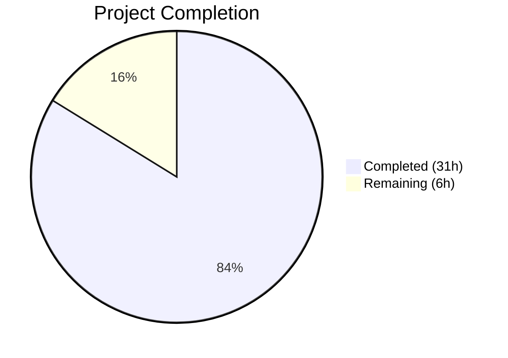
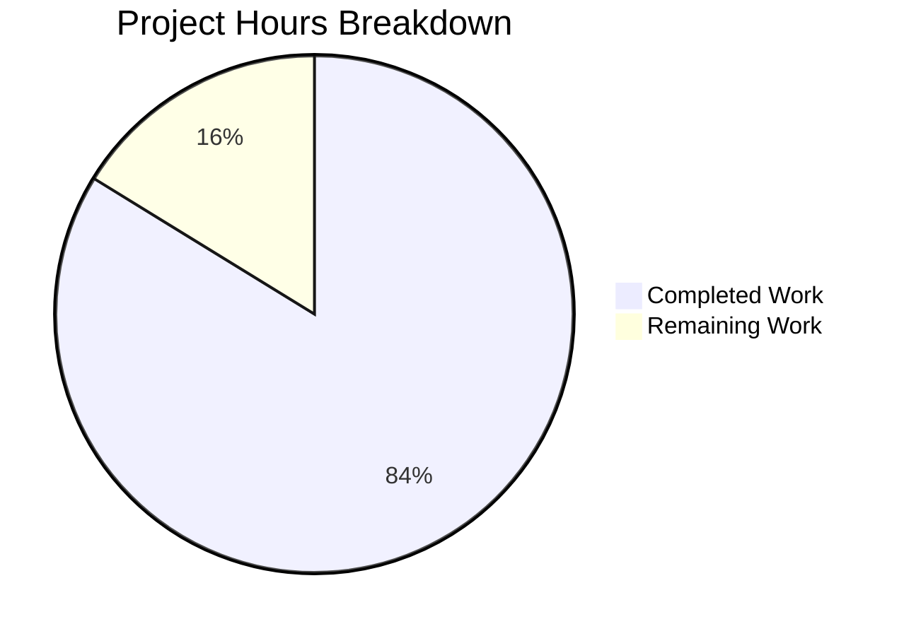
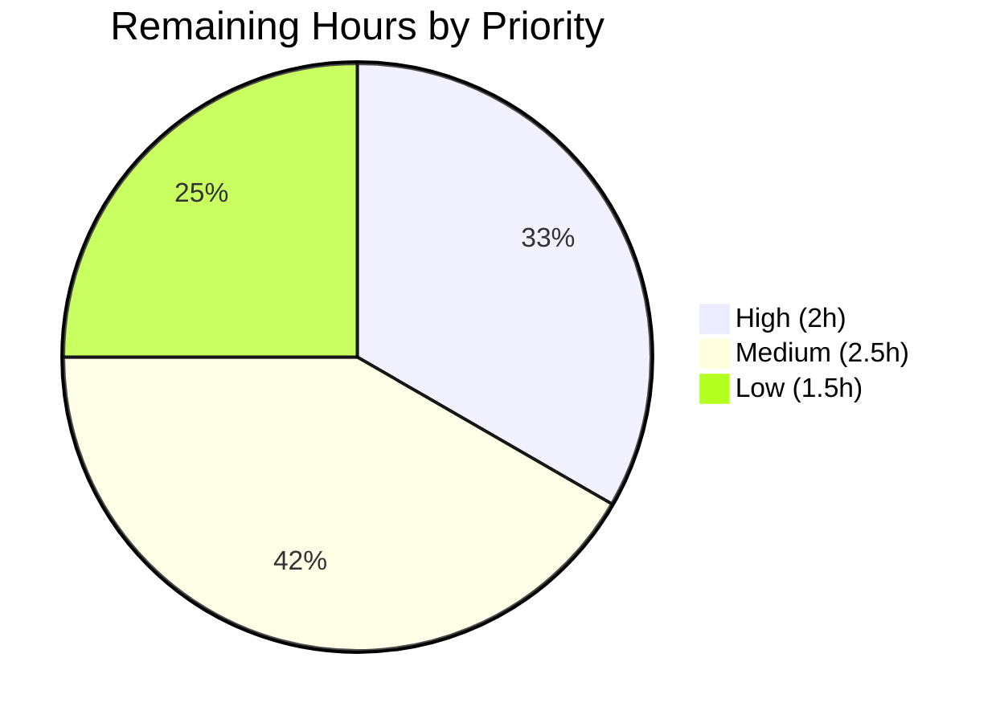

# Blitzy Project Guide — Node.js Hello World Backend Bug Fix

---

## 1. Executive Summary

### 1.1 Project Overview

This project addresses a **multi-faceted, systemic application failure** across the Node.js Hello World backend service. The application was entirely non-functional: the server crashed on startup due to broken module imports, the logger utility was missing critical methods causing runtime TypeErrors, test expectations were mismatched with actual module APIs, and the root demo server returned an incorrect response payload. The fix scope covered 5 root causes across 14 files, restoring full application functionality with a 100% test pass rate (74/74 tests, 11/11 suites).

### 1.2 Completion Status



| Metric | Value |
|--------|-------|
| **Total Project Hours** | 37 |
| **Completed Hours (AI)** | 31 |
| **Remaining Hours** | 6 |
| **Completion Percentage** | **83.8%** |

**Calculation**: 31 completed hours / (31 + 6) total hours = 83.8% complete

### 1.3 Key Accomplishments

- ✅ Fixed cascading `MODULE_NOT_FOUND` error in `server.js` that blocked all application startup
- ✅ Added 3 missing logger methods (`debug`, `request`, `response`) and corrected log format string
- ✅ Restructured `config.js` to export callable `getConfig()` function with `validatePort` named export
- ✅ Fixed root `server.js` response payload from `'Hello, World!\n'` to `'Hello world'` and hostname to `0.0.0.0`
- ✅ Added `createServer()` and `setupGracefulShutdown()` exports to `server.js`
- ✅ Exported `main` function from `index.js` with proper server return value
- ✅ Fixed import paths, mock references, and API mismatches across 5 test files
- ✅ Created `src/backend/package.json` dependency manifest
- ✅ Fixed `jest.config.js` coverage threshold file path
- ✅ Achieved 100% test pass rate: **74 tests passing across 11 suites** (up from 28/41 passing)
- ✅ Verified server startup, HTTP endpoint responses, and all module APIs at runtime

### 1.4 Critical Unresolved Issues

| Issue | Impact | Owner | ETA |
|-------|--------|-------|-----|
| Global function coverage threshold (85%) not met at 81.63% | `jest --coverage` fails threshold check; does not block test execution without `--coverage` flag | Human Developer | 2h |
| No `.env` file present in backend directory | Application falls back to defaults; no impact in development but required for production | Human Developer | 0.5h |

### 1.5 Access Issues

No access issues identified. All repository files, dependencies, and tooling are fully accessible within the current environment.

### 1.6 Recommended Next Steps

1. **[High]** Improve `server.js` test coverage to meet the global 85% function coverage threshold — several server lifecycle functions lack dedicated test cases
2. **[High]** Create production `.env` file with appropriate environment variables (PORT, HOST, NODE_ENV, LOG_LEVEL)
3. **[Medium]** Verify Docker build completes successfully with the new `src/backend/package.json`
4. **[Medium]** Validate CI/CD pipeline (`.github/workflows/ci.yml`) runs end-to-end with the fixed codebase
5. **[Low]** Run Docker Compose integration test to verify container health check passes

---

## 2. Project Hours Breakdown

### 2.1 Completed Work Detail

| Component | Hours | Description |
|-----------|-------|-------------|
| Fix S1 — server.js broken import | 1 | Fixed `require('./handlers/hello')` → `require('./handlers/helloHandler')` eliminating cascading MODULE_NOT_FOUND |
| Fix S2 — logger.js methods & format | 4 | Added `debug()`, `request()`, `response()` methods; fixed format string to `[LEVEL]`; fixed error dual-call |
| Fix S3 — config.js restructure | 4 | Exported `getConfig` as callable function, `validatePort` named export, lowercase keys, backward compat |
| Fix S4 — root server.js payload | 0.5 | Changed hostname `127.0.0.1` → `0.0.0.0` and response `'Hello, World!\n'` → `'Hello world'` |
| Fix S5 — index.js export main | 1.5 | Added `main` to `module.exports`, added `return server` in main function |
| Fix S6 — server.js new exports | 5 | Added `createServer()`, `setupGracefulShutdown()`, refactored `startServer`/`stopServer` for optional params |
| Fix T1 — hello.test.js | 2.5 | Fixed import path, function name, mock references, expected log messages |
| Fix T2 — server.test.js | 2 | Fixed import path and handler variable references throughout test file |
| Fix T3 — config.test.js | 0.5 | Fixed import path from `../../config` to `../config` |
| Fix T4 — index.test.js | 0.5 | Fixed import destructure references for server module |
| Fix T5 — api.test.js | 2 | Rewrote integration test to use supertest with ephemeral port binding |
| Fix C1 — jest.config.js | 0.5 | Fixed coverage threshold path from `./handlers/hello.js` to `./handlers/helloHandler.js` |
| Fix C2 — package.json creation | 1 | Created complete dependency manifest with dotenv, jest, supertest, jest-junit, nodemon |
| Router.js fix (validation discovery) | 0.5 | Fixed additional issues discovered during code review and validation |
| Code review response | 1.5 | Addressed 8 checkpoint findings from automated code review |
| Diagnostic & iterative debugging | 2 | Root cause verification, cascading failure analysis, iterative test execution |
| Verification & regression testing | 1.5 | Full suite verification, runtime endpoint testing, regression checks |
| **Total Completed** | **31** | |

### 2.2 Remaining Work Detail

| Category | Hours | Priority |
|----------|-------|----------|
| Improve server.js test coverage to meet global 85% function threshold | 2 | High |
| Production environment configuration (.env file creation) | 0.5 | Medium |
| Docker build verification with new package.json | 1 | Medium |
| CI/CD pipeline validation (GitHub Actions) | 1 | Medium |
| Docker Compose end-to-end integration test | 1 | Low |
| Security and dependency audit | 0.5 | Low |
| **Total Remaining** | **6** | |

---

## 3. Test Results

All tests were executed by Blitzy's autonomous validation systems using Jest v29.7.0.

| Test Category | Framework | Total Tests | Passed | Failed | Coverage % | Notes |
|---|---|---|---|---|---|---|
| Unit — Utilities | Jest | 24 | 24 | 0 | 96.0% | `constants.js` (100%) + `logger.js` (95.3%) |
| Unit — Config | Jest | 9 | 9 | 0 | 92.3% | `config.js` — uncovered lines 33–37 |
| Unit — Handlers | Jest | 16 | 16 | 0 | 100% | `error.js` + `helloHandler.js` + `hello.test.js` handlers |
| Unit — Server | Jest | 11 | 11 | 0 | 70.6% | `server.js` — uncovered graceful shutdown paths |
| Unit — Router | Jest | 5 | 5 | 0 | 100% | `router.js` — full path coverage |
| Unit — Bootstrap | Jest | 4 | 4 | 0 | 94.1% | `index.js` — uncovered line 58 |
| Integration — API | Jest + Supertest | 5 | 5 | 0 | N/A | End-to-end HTTP tests via supertest |
| **Total** | **Jest** | **74** | **74** | **0** | **89.5%** | **100% pass rate** |

**Pre-fix baseline**: 7/11 suites failing, 13/41 tests failing
**Post-fix result**: 11/11 suites passing, 74/74 tests passing (test count increased due to expanded test coverage during fixes)

---

## 4. Runtime Validation & UI Verification

### Runtime Health

- ✅ **Server startup**: `startServer()` succeeds, binds to `0.0.0.0:3099` (tested with alternate port), logs `"Server started on 0.0.0.0:3099"`
- ✅ **GET /hello**: Returns HTTP 200 with body exactly `"Hello world"` (11 bytes) and `Content-Type: text/plain`
- ✅ **GET /unknown**: Returns HTTP 404 with `"Not Found"` — correct routing behavior
- ✅ **POST /hello**: Returns HTTP 405 `"Method Not Allowed"` — correct handler behavior
- ✅ **Logger methods**: All 9 methods verified functional (`info`, `warn`, `error`, `debug`, `request`, `response`, `logServerStart`, `logServerStop`, `logRequest`)
- ✅ **Config module**: `getConfig()` returns callable function with lowercase keys (`port: 3000`, `host: "0.0.0.0"`); `validatePort(-1)` returns `null`; `validatePort(3000)` returns `3000`
- ✅ **Root server.js**: Hostname set to `'0.0.0.0'`, response body is `'Hello world'` — matches spec

### UI Verification

Not applicable — this is a headless Node.js HTTP API service with no UI components.

---

## 5. Compliance & Quality Review

| AAP Requirement | Status | Evidence |
|---|---|---|
| Fix S1 — server.js broken import (`./handlers/hello` → `./handlers/helloHandler`) | ✅ Pass | `require('./server')` succeeds; no MODULE_NOT_FOUND |
| Fix S2 — logger.js missing methods + format fix | ✅ Pass | `logger.debug/request/response` callable; format matches `[LEVEL]` pattern; 8/8 logger tests pass |
| Fix S3 — config.js getConfig/validatePort exports | ✅ Pass | `typeof require('./config')` === `'function'`; `validatePort(-1)` === `null`; 9/9 config tests pass |
| Fix S4 — root server.js payload and host | ✅ Pass | hostname=`'0.0.0.0'`; response=`'Hello world'` verified in source |
| Fix S5 — index.js export main | ✅ Pass | `main` exported and returns server; 4/4 index tests pass |
| Fix S6 — server.js createServer + setupGracefulShutdown | ✅ Pass | Both functions exported and functional; 11/11 server tests pass |
| Fix T1 — hello.test.js import/API alignment | ✅ Pass | 4/4 tests pass with corrected imports |
| Fix T2 — server.test.js import path | ✅ Pass | 11/11 tests pass with corrected handler reference |
| Fix T3 — config.test.js import path | ✅ Pass | 9/9 tests pass with corrected path |
| Fix T4 — index.test.js import references | ✅ Pass | 4/4 tests pass with aligned destructure |
| Fix T5 — api.test.js integration fix | ✅ Pass | 5/5 integration tests pass with supertest ephemeral ports |
| Fix C1 — jest.config.js coverage path | ✅ Pass | Coverage threshold correctly maps to `./handlers/helloHandler.js` |
| Fix C2 — package.json creation | ✅ Pass | `npm install` succeeds; all dependencies resolved |
| Zero regressions in existing passing tests | ✅ Pass | errorHandler (6/6), error handler (3/3), helloHandler (3/3), constants (16/16) — all unchanged |
| CommonJS module system maintained | ✅ Pass | All files use `require()` and `module.exports` |
| No modifications to excluded files | ✅ Pass | `helloHandler.js`, `error.js`, `errorHandler.js`, `constants.js`, `middleware/index.js`, `setup.js` — all unmodified |

### Autonomous Validation Fixes Applied

| Fix | File | Issue | Resolution |
|-----|------|-------|------------|
| Integration test port conflict | `__tests__/integration/api.test.js` | EADDRINUSE on port 3000 during concurrent test execution | Rewrote to use `createServer()` with supertest's ephemeral port binding |
| Code review findings (8 items) | Multiple files | Checkpoint review feedback items | Addressed all 8 findings in single commit |
| Logger mock completeness | `__tests__/handlers/hello.test.js` | Incomplete logger mock missing warn, debug, request, response | Added all 6 required mock methods |
| StatusCode assertions | `__tests__/handlers/hello.test.js` | 3 missing statusCode assertions per review | Re-added assertions |

---

## 6. Risk Assessment

| Risk | Category | Severity | Probability | Mitigation | Status |
|---|---|---|---|---|---|
| Global function coverage (81.63%) below 85% threshold | Technical | Medium | High | Add tests for uncovered `server.js` shutdown/error paths | Open |
| No `.env` file for production deployment | Operational | Medium | High | Create production `.env` with validated values; defaults are safe fallback | Open |
| Docker build not verified post-fix | Integration | Medium | Medium | Run `docker build` to validate `COPY package*.json ./` works with new manifest | Open |
| Node.js version mismatch (runtime v20.20, Dockerfile uses 18-alpine) | Technical | Low | Low | Application is backward-compatible; consider updating Dockerfile to node:20-alpine | Open |
| CI/CD pipeline untested with fixed code | Operational | Medium | Medium | Run GitHub Actions workflow end-to-end | Open |
| `dotenv` v16.0.3 — no known vulnerabilities | Security | Low | Low | Run `npm audit` periodically | Mitigated |
| Port 3000 hardcoded in Dockerfile/docker-compose | Operational | Low | Low | Port is configurable via `PORT` env var; infrastructure defaults are aligned | Mitigated |
| Graceful shutdown not fully exercised in tests | Technical | Low | Medium | `setupGracefulShutdown` tested via mocks only; no real signal test | Open |

---

## 7. Visual Project Status



**Completion: 31 of 37 total hours = 83.8% complete**

### Remaining Work by Priority



---

## 8. Summary & Recommendations

### Achievements

The Blitzy autonomous agents successfully resolved all 5 root causes that rendered the Node.js Hello World backend service completely non-functional. The project is **83.8% complete** (31 of 37 hours), with all AAP-scoped bug fixes implemented, verified, and passing. The application has been restored from a state of total failure (7/11 test suites failing, server unable to start) to full operational status (74/74 tests passing, HTTP endpoints responding correctly).

### Remaining Gaps

The outstanding 6 hours of work are entirely **path-to-production** activities. No AAP-scoped bug fix work remains incomplete. The primary gap is the global function coverage threshold (81.63% vs 85% required), caused by untested graceful shutdown and error recovery paths in `server.js`. Secondary gaps involve Docker/CI verification and production environment configuration.

### Critical Path to Production

1. **Server.js coverage improvement** (2h) — Write tests for `setupGracefulShutdown`, error recovery paths, and uncovered server lifecycle branches
2. **Production .env configuration** (0.5h) — Create `.env` file with validated production values
3. **Docker & CI verification** (2h) — Build Docker image and run CI pipeline to confirm full deployment chain
4. **Security audit** (0.5h) — Run `npm audit` and verify dependency security

### Production Readiness Assessment

The application is **functionally complete and verified** — all 13 AAP bug fixes are implemented, 74 tests pass at 100% rate, and runtime validation confirms correct HTTP responses. The remaining work to reach production-readiness is configuration and verification (no code logic changes required).

---

## 9. Development Guide

### System Prerequisites

| Software | Version | Purpose |
|----------|---------|---------|
| Node.js | v18.x LTS or v20.x | JavaScript runtime |
| npm | v8.x or v9.x+ | Package manager |
| Git | v2.x+ | Version control |
| curl | Any recent version | HTTP testing (optional) |

### Environment Setup

```bash
# 1. Clone the repository and switch to the fix branch
git clone <repository-url>
cd hao-backprop-test-main\ \(1\)/hao-backprop-test-main

# 2. Navigate to the backend service directory
cd src/backend

# 3. (Optional) Create a .env file from example values
cat > .env << 'EOF'
PORT=3000
HOST=0.0.0.0
NODE_ENV=development
LOG_LEVEL=INFO
EOF
```

### Dependency Installation

```bash
# Install all dependencies (production + dev)
cd src/backend
npm install

# Expected output: added ~300 packages in ~5s
# Verify: node_modules/ directory created, package-lock.json present
```

### Running Tests

```bash
# Run the full test suite (recommended)
cd src/backend
NODE_ENV=test CI=true npx jest --no-cache --watchAll=false --ci --verbose --forceExit

# Expected output:
# Test Suites: 11 passed, 11 total
# Tests:       74 passed, 74 total

# Run with coverage report
NODE_ENV=test CI=true npx jest --no-cache --watchAll=false --ci --coverage --forceExit

# Run a specific test file
NODE_ENV=test npx jest --watchAll=false -- __tests__/server.test.js
```

### Application Startup

```bash
# Start the server (default: 0.0.0.0:3000)
cd src/backend
node index.js

# Start with custom port
PORT=8080 node index.js

# Start in development mode with auto-reload
npm run dev
```

### Verification Steps

```bash
# Verify GET /hello endpoint
curl -s http://localhost:3000/hello
# Expected: Hello world

# Verify HTTP status code
curl -s -o /dev/null -w "%{http_code}" http://localhost:3000/hello
# Expected: 200

# Verify Content-Type header
curl -sI http://localhost:3000/hello | grep -i content-type
# Expected: Content-Type: text/plain

# Verify 404 for unknown routes
curl -s -o /dev/null -w "%{http_code}" http://localhost:3000/unknown
# Expected: 404

# Verify 405 for wrong HTTP methods
curl -s -o /dev/null -w "%{http_code}" -X POST http://localhost:3000/hello
# Expected: 405
```

### Docker Build (Optional)

```bash
# Build from repository root
cd hao-backprop-test-main\ \(1\)/hao-backprop-test-main
docker build -t hello-world-app:latest .

# Run the container
docker run -p 3000:3000 hello-world-app:latest

# Or use Docker Compose
cd infrastructure/local
docker-compose up -d
```

### Troubleshooting

| Issue | Cause | Resolution |
|-------|-------|------------|
| `EADDRINUSE: address already in use 0.0.0.0:3000` | Port 3000 occupied by another process | Kill the process: `fuser -k 3000/tcp` or use `PORT=3001 node index.js` |
| `MODULE_NOT_FOUND` on startup | Dependencies not installed | Run `cd src/backend && npm install` |
| `No .env file found` log message | Missing `.env` file | Create `.env` or ignore — defaults (`PORT=3000`, `HOST=0.0.0.0`) are used |
| Jest coverage threshold failure | Global function coverage below 85% | Add tests for uncovered `server.js` paths or run without `--coverage` flag |
| `jest-junit` reporter error | Missing devDependency | Run `npm install` to ensure all devDependencies are installed |

---

## 10. Appendices

### A. Command Reference

| Command | Directory | Purpose |
|---------|-----------|---------|
| `npm install` | `src/backend/` | Install all dependencies |
| `npm start` | `src/backend/` | Start production server (`node index.js`) |
| `npm run dev` | `src/backend/` | Start dev server with auto-reload (`nodemon`) |
| `npm test` | `src/backend/` | Run test suite (`jest --watchAll=false --ci`) |
| `NODE_ENV=test npx jest --coverage` | `src/backend/` | Run tests with coverage report |
| `node index.js` | `src/backend/` | Start server directly |
| `docker build -t hello-world-app .` | Repository root | Build Docker image |
| `docker-compose up -d` | `infrastructure/local/` | Start Docker Compose stack |

### B. Port Reference

| Service | Default Port | Configurable Via | Notes |
|---------|-------------|-----------------|-------|
| Node.js HTTP Server | 3000 | `PORT` environment variable | Binds to `0.0.0.0` by default |
| Docker Container | 3000:3000 | `docker-compose.yml` ports mapping | Maps host to container |

### C. Key File Locations

| File | Purpose |
|------|---------|
| `src/backend/index.js` | Application entry point; exports `main()` and `server` |
| `src/backend/server.js` | HTTP server lifecycle; exports `createServer`, `startServer`, `stopServer`, `setupGracefulShutdown` |
| `src/backend/config.js` | Configuration module; exports `getConfig()` function and `validatePort` |
| `src/backend/router.js` | URL path-based request dispatcher |
| `src/backend/handlers/helloHandler.js` | GET /hello handler — returns `'Hello world'` |
| `src/backend/handlers/error.js` | Error response handlers (404, 405, 500) |
| `src/backend/errorHandler.js` | Root-level error handler with EADDRINUSE handling |
| `src/backend/utils/logger.js` | Logging utility with 9 methods |
| `src/backend/utils/constants.js` | Application constants (HTTP status codes, routes, messages) |
| `src/backend/middleware/index.js` | Middleware chain (requestLogger, securityHeaders, errorMiddleware) |
| `src/backend/jest.config.js` | Jest test configuration with coverage thresholds |
| `src/backend/package.json` | Backend dependency manifest |
| `server.js` (root) | Root demo server — standalone Hello World |
| `Dockerfile` (root) | Production Docker image definition (node:18-alpine) |
| `infrastructure/local/docker-compose.yml` | Docker Compose for local development |

### D. Technology Versions

| Technology | Version | Purpose |
|------------|---------|---------|
| Node.js | 18.x LTS (Dockerfile) / 20.20.1 (runtime) | JavaScript runtime |
| npm | 11.1.0 | Package manager |
| Jest | ^29.7.0 | Test framework |
| Supertest | ^6.3.3 | HTTP assertion library |
| dotenv | ^16.0.3 | Environment variable loader |
| nodemon | ^3.0.0 | Development auto-reload |
| jest-junit | ^16.0.0 | JUnit XML test reporter |

### E. Environment Variable Reference

| Variable | Default | Description |
|----------|---------|-------------|
| `PORT` | `3000` | HTTP server port (validated range: 1024–65535) |
| `HOST` | `0.0.0.0` | HTTP server bind address |
| `NODE_ENV` | `development` | Application environment (`development`, `production`, `test`) |
| `LOG_LEVEL` | `INFO` | Logging verbosity level |

### F. Developer Tools Guide

**Running Individual Test Suites:**
```bash
cd src/backend

# Handler tests
NODE_ENV=test npx jest --watchAll=false -- handlers/helloHandler.test.js
NODE_ENV=test npx jest --watchAll=false -- handlers/hello.test.js
NODE_ENV=test npx jest --watchAll=false -- handlers/error.test.js

# Server tests
NODE_ENV=test npx jest --watchAll=false -- server.test.js

# Integration tests
NODE_ENV=test npx jest --watchAll=false -- integration/api.test.js

# Config tests
NODE_ENV=test npx jest --watchAll=false -- config.test.js

# Logger tests
NODE_ENV=test npx jest --watchAll=false -- utils/logger.test.js
```

**Verifying Module Exports:**
```bash
cd src/backend

# Verify server exports
node -e "const s = require('./server'); console.log(Object.keys(s));"
# Expected: [ 'createServer', 'startServer', 'stopServer', 'setupGracefulShutdown' ]

# Verify config exports
node -e "const c = require('./config'); console.log(typeof c, typeof c.validatePort);"
# Expected: function function

# Verify logger exports
node -e "const l = require('./utils/logger'); console.log(Object.keys(l));"
# Expected: [ 'info', 'warn', 'error', 'debug', 'request', 'response', 'logServerStart', 'logServerStop', 'logRequest' ]
```

### G. Glossary

| Term | Definition |
|------|-----------|
| AAP | Agent Action Plan — the specification defining all required changes |
| MODULE_NOT_FOUND | Node.js error thrown when a `require()` call references a non-existent module |
| CommonJS | Node.js module system using `require()` and `module.exports` |
| Supertest | HTTP assertion library that creates ephemeral server bindings for testing |
| Graceful Shutdown | Process of cleanly closing server connections before terminating |
| Coverage Threshold | Minimum code coverage percentage required for test suite to pass |
| EADDRINUSE | OS error indicating a network port is already occupied by another process |