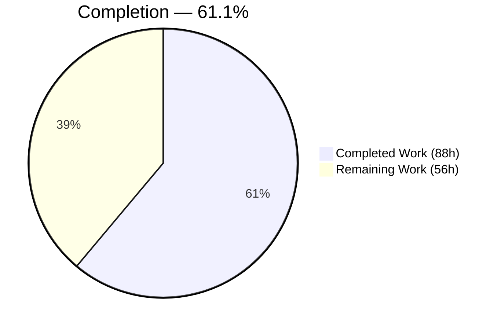
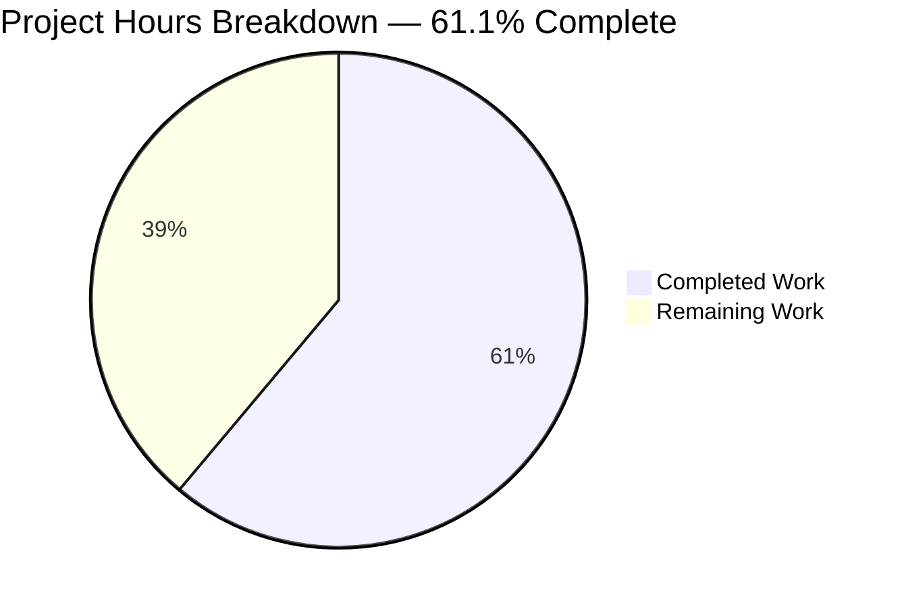
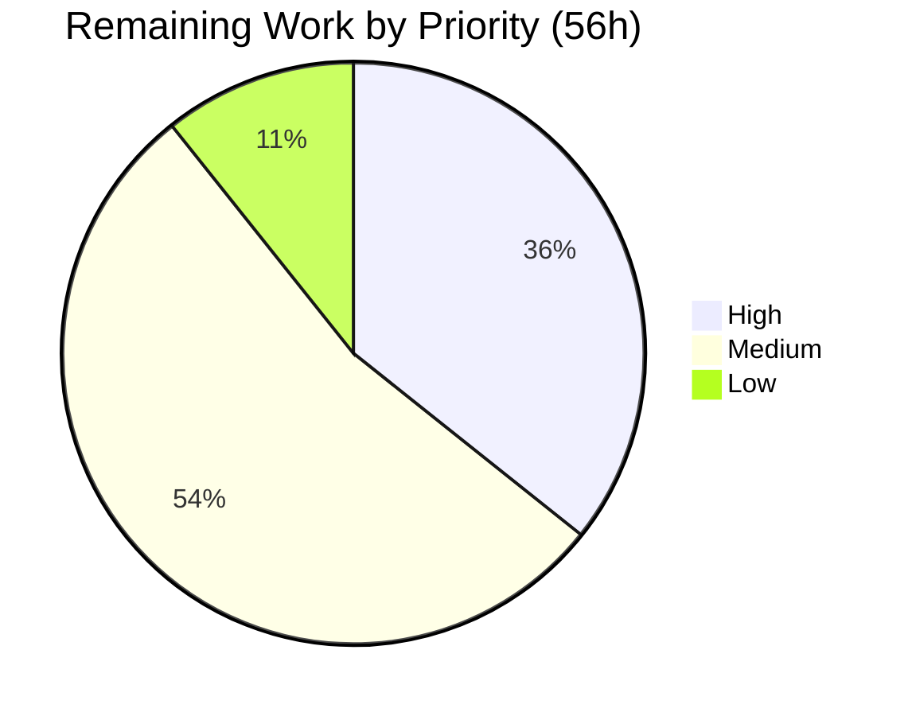

# 1. Executive Summary

## 1.1 Project Overview

The `/hello` endpoint of this Node.js native-`http` service is retired and replaced by `/welcome`, which serves a Welcome screen headed **Welcome to HelloGHES** with a one-sentence description. Path and copy come from the shared constants module, the GET-only restriction and its `405` response carry over unchanged, and the retired path now answers `404`. The superseded handler and two dead test modules are deleted. Every consumer of the old contract moves with it — route table, dispatchers, coverage gate, tests, health gate, container probe, operator scripts and documentation — with no new dependency or build step.

## 1.2 Completion Status



Completed = Dark Blue `#5B39F3`; Remaining = White `#FFFFFF`.

| Metric | Value |
|---|---|
| **Total Hours** | **144** |
| Completed Hours (AI + Manual) | 88 (88 AI + 0 Manual) |
| Remaining Hours | 56 |
| **Percent Complete** | **61.1%** (88 / 144) |

The 56 remaining hours are path-to-production activities the plan placed outside this change: the dependency manifest, the container build and its posture, the standing test failures, a pipeline and the monitoring contract.

## 1.3 Key Accomplishments

- `GET /welcome` serves the exact 236-byte document as `text/html; charset=utf-8`.
- Every non-GET method returns `405` with `Allow: GET`.
- `GET /hello` returns `404 Not Found`, no `Location`, no redirect.
- Route, heading, description and content type have one definition.
- The service starts and shuts down cleanly; both dispatchers resolve to the new handler.
- The superseded handler and two dead test modules are gone, with no surviving references.
- The endpoint gate exits 0 (5 suites, 41 tests); the handler's coverage gate is met at 100%.
- Health gate, container probe, operator scripts and three READMEs publish the new endpoint.

## 1.4 Critical Unresolved Issues

**0 of 5** requirements the request named are open; each is verified at runtime. Eight items remain open, every one a pre-existing platform gap the plan excluded.

| Issue | Impact | Owner | ETA |
|---|---|---|---|
| Container delivery unusable and unhardened (5 sub-items: no backend manifest for the image build, undefined `dev` script, no `curl` in the base image, no `.dockerignore`, root user on a floating tag with no `HEALTHCHECK`) | Container deployment cannot reach a healthy state; run directly with Node instead | Platform / DevOps | 12h |
| Runtime and verification dependencies undeclared in `package.json` (4 packages, `dotenv` among them) | A clean `npm ci` yields a checkout that cannot start or be tested | Backend | 4h |
| 18 standing test failures across 4 suites (`__tests__/utils/logger.test.js` 8, `__tests__/server.test.js` 5, `__tests__/index.test.js` 4, `__tests__/router.test.js` 1) | The full suite cannot serve as a release gate; the endpoint gate can | Backend / QA | 10h |
| 4 unmet global coverage thresholds (statements 80.22/85, branches 78.28/80, lines 80.44/85, functions 77.41/90) | The coverage command exits 1 on the global gate though both per-file gates pass | Backend / QA | 9h |
| Per-file coverage gates resolve against the process working directory | A pipeline run outside `src/backend` silently drops the only binding coverage criterion | DevOps | 1h |
| No application or edge request-rate control | An unauthenticated caller can drive request and log volume to the socket ceiling | Platform / Security | 3h |
| No `/health` or `/metrics` endpoint while the monitoring configuration scrapes those paths | Production observability is limited to stdout records | Platform | 6h |
| `src/backend/router.js` throws if invoked (`logger.request` is not exported; `url.parse` unguarded) | No effect today — no source module requires it — but a later wiring fails at the first request | Backend | 1h |

## 1.5 Access Issues

No access issues identified. The service needs no credentials, API keys or external endpoints — only optional `PORT`, `HOST`, `NODE_ENV` and `LOG_LEVEL` overrides, all with defaults. The toolchain installs from the public npm registry with no reported vulnerabilities.

## 1.6 Recommended Next Steps

1. **[High]** Declare the four packages, regenerate the lockfile, add the npm scripts.
2. **[High]** Repair the container build so container delivery can be verified.
3. **[High]** Close the 18 standing test failures so the full suite can gate a release.
4. **[Medium]** Add a pipeline running the endpoint gate and coverage from `src/backend`.
5. **[Medium]** Harden the container posture and settle the monitoring contract.

# 2. Project Hours Breakdown

## 2.1 Completed Work Detail

| Component | Hours | Description |
|---|---|---|
| Shared constants module | 2 | `ROUTES.WELCOME`, `MESSAGES.WELCOME_HEADING`, `MESSAGES.WELCOME_DESCRIPTION` and `HEADERS.CONTENT_TYPE_HTML` defined and the retired keys removed, with `CONTENT_TYPE_TEXT` retained for the error layers (`src/backend/utils/constants.js`) |
| Welcome screen handler | 8 | New `src/backend/handlers/welcomeHandler.js` (95 lines): GET guard, module-private document renderer built from the message constants, single named export, 405 delegation to the shared error handler |
| Live route table and dispatch | 5 | `src/backend/server.js` registers `[ROUTES.WELCOME]` as a computed key against the new handler and imports the constants module; the live stack now resolves its handler, so the service starts and serves the endpoint |
| Secondary dispatcher retarget | 2 | `src/backend/router.js` matches `ROUTES.WELCOME` and returns `handleWelcomeRequest` |
| Retired-file removal and reference hygiene | 3 | Three modules deleted; repository-wide sweep for the retired handler, symbol, module path and message key returns zero matches |
| Endpoint unit suite | 4 | New `src/backend/__tests__/handlers/welcomeHandler.test.js` — 4 tests covering the success path, markup inertness, the 405 delegation and every non-GET method; carries the 100% per-file gate |
| Existing suites updated | 10 | Constants (17 tests), dispatcher (5), server (31) and the Supertest contract suite (10, including the retired-path 404 case and the bootstrap it needs to start and stop the real server) |
| Coverage gate relocation | 1 | Per-file threshold key moved to `./handlers/welcomeHandler.js` at 100% ×4 in `src/backend/jest.config.js`, with the working-directory constraint documented at the keys |
| Infrastructure and operator updates | 5 | Deployment health gate endpoint and expected body, container probe URL, provisioning and launcher service URLs, infrastructure runbook |
| Documentation and changelog | 7 | `README.md`, `src/backend/README.md` and `src/backend/CHANGELOG.md` — new contract, HTML sample response, structure entries and measured suite/coverage record |
| Endpoint acceptance verification | 2 | Gate, coverage message set, live contract rows, deletion verification and the health gate proved both ways |
| Access-log hygiene | 7 | Request targets recorded with query and fragment redacted and the path length capped; the 404/405/500 records name the method alone, so a client-controlled target reaches the log once; nine regression tests |
| Request-boundary telemetry | 6 | Connection and parser failures classified and answered (`404`/`400`/`431`) with one bounded record each, no stack frames and no client bytes echoed (`src/backend/server.js`) |
| Configuration validation and notices | 8 | Strict `PORT` validation with a warned fallback, logger-routed startup notices and a queued notice drain (`src/backend/config.js`), covered by 15 tests |
| Operator script robustness | 9 | Health-gate CLI validation and help semantics, provisioning input validation and environment writing, launcher readiness verification with per-port pid/log artifacts, deployment-script documentation accuracy |
| Repository hygiene | 1 | `.gitignore` covering locally installed dependencies, coverage output, `.env`, logs and pid files |
| Cross-cutting verification | 8 | Security probes (injection, traversal, header and CRLF shapes), performance and concurrency measurements, browser rendering and accessibility checks, and repeated full-suite regression sweeps |
| **Total** | **88** | |

## 2.2 Remaining Work Detail

| Category | Hours | Priority |
|---|---|---|
| Dependency manifest and npm scripts — declare `dotenv` plus the three verification packages, regenerate the lockfile, add the documented scripts | 4 | High |
| Container build repair — backend manifest for the image build, the `dev` script Compose invokes, `curl` in the image | 6 | High |
| Standing test-failure closure — logger method contract, server module exports, lifecycle spies, dispatcher error handling | 10 | High |
| Global coverage to threshold plus a committed middleware suite | 9 | Medium |
| Continuous integration pipeline — endpoint gate, coverage from `src/backend`, audit, JUnit publication | 6 | Medium |
| Container and Compose security posture — `.dockerignore`, non-root user, pinned base image, `HEALTHCHECK`, capability and filesystem restrictions | 6 | Medium |
| Operational monitoring — expose `/health` and `/metrics`, or retire the scrape and dashboard configuration | 6 | Medium |
| Deployment rehearsal in a target environment and help-exit parity in the deployment script | 3 | Medium |
| Request-rate control at the edge or in the middleware chain | 3 | Low |
| Lint and format configuration wired into the pipeline | 2 | Low |
| Secondary dispatcher decision — consolidate or harden | 1 | Low |
| **Total** | **56** | |

## 2.3 Hours Reconciliation

- Completed (Section 2.1) = **88h** — 49h of plan-specified endpoint work and 39h of path-to-production hardening and verification.
- Remaining (Section 2.2) = **56h** — 20h High, 30h Medium, 6h Low.
- Total project hours = 88 + 56 = **144h**.
- Completion = 88 / 144 = **61.1%**, the figure used in Sections 1.2, 7 and 8.

# 3. Test Results

Every figure below was observed by running the suite in the delivered checkout on Node v22.23.2 with Jest 29.5.0, from `src/backend`, serialized with `--runInBand`. Full run: **10 suites (6 passed, 4 failed), 113 tests (95 passed, 18 failed)**. The endpoint acceptance gate — the five suites that carry the endpoint contract — **exits 0 with 41 of 41 tests passing**.

| Area / Category | Framework | Tests | Passed | Failed | Coverage | What This Proves |
|---|---|---|---|---|---|---|
| Endpoint contract, end to end | Jest + Supertest | 10 | 10 | 0 | `server.js` 91.7% stmts | `/welcome` answers 200 with both message constants and the HTML content type, every non-GET returns 405 with `Allow: GET`, and `/hello` returns 404 with no `Location` |
| Welcome screen handler | Jest (unit) | 4 | 4 | 0 | 100 / 100 / 100 / 100 | The served document carries the exact heading and description and no script, stylesheet, inline style or image; non-GET delegates to the shared 405 responder |
| Shared constants | Jest (unit) | 17 | 17 | 0 | 100 / 100 / 100 / 100 | The route, heading, description and content type have exactly one definition, and the retired values are gone |
| Error response layers (404 / 405 / 500) | Jest (unit) | 10 | 10 | 0 | 100 / 100 / 100 / 100 | Status, headers and bodies of all three error responses are fixed, and their log records carry no request target |
| Server lifecycle and request boundary | Jest (unit) | 31 | 26 | 5 | `server.js` 91.7% stmts | Route registration, dispatch, forced-error handling and connection/parser failure classification behave as specified; the 5 failures are standing lifecycle-spy cases listed below |
| Access logging | Jest (unit) | 17 | 9 | 8 | 100 / 95.8 / 100 / 100 | One four-field record per answered request with the level mapped from the status, query and fragment redacted, and the path length capped; the 8 failures assert logger methods that do not exist |
| Configuration | Jest (unit) | 15 | 15 | 0 | 78.3% stmts | `PORT` rejects every malformed form and falls back to the default with a warning; startup notices are delivered through the logger |
| Dispatch and entry point | Jest (unit) | 9 | 4 | 5 | `router.js` 100%, `index.js` 23.1% | The secondary dispatcher resolves the new route and handler; the 5 failures are standing cases against module exports that were never added |

Coverage gates: `handlers/welcomeHandler.js` and `handlers/error.js` both meet their per-file thresholds at 100% on all four metrics, no threshold message names either, and the stale key from the retired flow is gone. The four global thresholds remain unmet — statements 80.22% against 85, branches 78.28% against 80, lines 80.44% against 85, functions 77.41% against 90 — which is why the coverage command exits 1.

### Not Covered

- **`src/backend/middleware/index.js`** has no committed test suite of its own; it is exercised only indirectly through the server suites, reaching 90.6% statements and 66.7% branches. Its response-completion and abort branches should be covered directly before release.
- **`src/backend/index.js`** (the entry module) is 23.1% covered with 0% of its functions exercised, because its suite cannot load the module exports it imports. Start-up, signal handling and fatal-error paths are proven only by running the service.
- **The 500 response path** is unit-tested but unreachable from a request in this build, so its record and body have never been produced by a live request.
- **`handleMethodNotAllowed` in `src/backend/handlers/error.js`** is unit-tested but not on the live path — the served 405 comes from the shared error handler.
- **The container stack** (`docker compose up --build`) is covered by configuration parsing only; no test builds or runs the image.
- **The deployment script's full flow** is covered at its prerequisite guards and its health-gate invocation; the build-and-deploy sequence it orchestrates is untested.
- **The secondary dispatcher's `route()` function** is never invoked: it calls a logger method that is not exported, so execution would throw.

# 4. Runtime Validation & UI Verification

The service was started from the delivered checkout (`PORT=<port> node src/backend/index.js`) and driven directly; every line below reports an observed response.

- ✅ **Start-up** — Operational. Logs `Server started on 0.0.0.0:<port>` then `Application startup complete.`; a missing `.env` file is reported as an informational notice, not an error.
- ✅ **`GET /welcome`** — Operational. `200`, `Content-Type: text/html; charset=utf-8`, `Content-Length: 236` derived automatically with no `Transfer-Encoding`, body exactly the 11-line document with `<h1>Welcome to HelloGHES</h1>` and the description paragraph.
- ✅ **Welcome screen rendering** — Operational. The page renders with browser default styling, no stylesheet, script, inline style or image, no subresource requests, no console messages and no content-security-policy violations; no horizontal overflow from 375 px to 1920 px.
- ✅ **Accessibility of the screen** — Operational. One `h1` with a declared document language and a page title; zero interactive and zero focusable elements, so keyboard focus remains on the document body.
- ✅ **`POST`/`PUT`/`DELETE`/`PATCH`/`OPTIONS`/`TRACE`/`HEAD` on `/welcome`** — Operational. Each returns `405` with `Allow: GET`, `Content-Type: text/plain` and the body `Method Not Allowed`.
- ✅ **Retired path `GET /hello`** — Operational. `404`, `text/plain`, body `Not Found`, no `Location` header and no redirect; path variants (`/welcome/`, `/WELCOME`, `//welcome`, encoded forms, `/welcome.html`) all resolve to the same 404, and only the exact route is served.
- ✅ **Security headers** — Operational. `X-Content-Type-Options: nosniff`, `X-Frame-Options: DENY` and `Content-Security-Policy: default-src 'none'` present on the 200, the 405 and the 404; no server or framework version disclosed.
- ✅ **Access logging** — Operational. One record per answered request, `INFO` for the 200 and `WARN` for the 404 and 405; query strings are redacted to a fixed marker and a 7 000-character path produces a bounded 326-character record instead of echoing the target.
- ✅ **Deployment health gate and operator scripts** — Operational. `infrastructure/scripts/health-check.sh` reports `Health check passed! Service is responding correctly.` and exits 0 against the live service; the launcher verifies readiness, prints the working `/welcome` URL and writes owner-only pid artifacts.
- ⚠ **Container stack** — Partial. The Compose configuration parses and resolves its probe to `/welcome`, but the image build cannot complete and the stack was never started; container delivery is unverified at runtime.

Never exercised at runtime: the container image and the deployment script's build-and-deploy sequence; the `500` response path, which no request in this build reaches; the secondary dispatcher's `route()` function, which throws on an unexported logger method; and `/health` and `/metrics`, which the monitoring configuration scrapes but the service does not implement.

# 5. Compliance & Quality Review

## 5.1 Compliance Matrix

Each row states where the deliverable stands now in the delivered checkout.

| # | Deliverable | Benchmark | Status | Evidence |
|---|---|---|---|---|
| 1 | Route rename to `/welcome` | Old path unregistered, new path registered from the shared constant | ✅ Pass | `src/backend/server.js` registers `[ROUTES.WELCOME]`; live `200` on `/welcome`, `404` on `/hello` |
| 2 | Welcome screen content and framing | Exact heading and description; `text/html; charset=utf-8`, automatic `Content-Length`, no `Transfer-Encoding` | ✅ Pass | `src/backend/handlers/welcomeHandler.js`; 236-byte, 11-line document and headers observed live |
| 3 | GET-only restriction | `405` + `Allow: GET` + `text/plain` + `Method Not Allowed` | ✅ Pass | All seven non-GET methods exercised; `src/backend/errorHandler.js` |
| 4 | Retired-path behaviour | `404 Not Found`, no redirect, no `Location` | ✅ Pass | Live headers plus the contract test in `src/backend/__tests__/integration/api.test.js` |
| 5 | Single source of truth for literals | Path and copy read from the constants module by source and tests | ✅ Pass | `src/backend/utils/constants.js`; 17 constants tests |
| 6 | Secondary dispatcher consistency | Matches the new constant and returns the new handler | ✅ Pass | `src/backend/router.js`; module loads, 100% covered |
| 7 | Dead-code removal | Three modules absent, no surviving references | ✅ Pass | Repository-wide sweep returns zero matches |
| 8 | Test layer | Endpoint gate green; per-file coverage gate on the handler met | ✅ Pass | Gate exits 0 with 41 tests; handler at 100% on all four metrics |
| 9 | Operational consumers | Health gate, container probe and operator URLs name the new endpoint | ✅ Pass | Health gate exits 0 live; zero occurrences of the retired path under `infrastructure/` |
| 10 | Documentation | Published contract and sample reproduce against the running service | ✅ Pass | `README.md`, `src/backend/README.md`, `src/backend/CHANGELOG.md` |
| 11 | Minimalism and stack constraints | No dependency, framework, template engine or build step; CommonJS throughout | ✅ Pass | `package.json` and its lockfile byte-unchanged; no new configuration file |
| 12 | Package-level gates and container delivery | Global coverage 85 / 80 / 85 / 90; image builds and the stack reports healthy | ⚠ Partial / ❌ Not met | Coverage measured 80.22 / 78.28 / 80.44 / 77.41 with both per-file gates met; the image build cannot complete — both deliberately outside this change |

## 5.2 AAP & Rule Divergences and Gaps

No user-specified rules exist for this project, so every divergence below is against the delivery plan (AAP) itself.

| What the AAP/Rule Required | What Was Delivered Instead | Why It Diverged | Impact | Remediation |
|---|---|---|---|---|
| A change set of exactly 21 files (§0.8.1, §0.10.1) | 30 paths changed — the 21 plus nine more | Security and robustness work on shared surfaces reached files the plan had frozen | Wider review surface; endpoint contract unaffected | None required; note the wider surface in the release record |
| The access record carries the raw request URL (§0.3.5) | The record redacts query and fragment to `?[redacted]` and caps the path at 256 characters | Query strings, credentials included, were being persisted verbatim in the log | Records for the service's own endpoint are unchanged; only query-bearing targets differ | None required |
| `handlers/error.js` and `middleware/index.js` are reference-only, and error handling needs no change (§0.5.1, §0.8.1) | The error records name the request method alone; the middleware gained explanatory comments | Removing the duplicated raw target was the root-cause change for the same log exposure | Response status, headers and bodies are unchanged | None required |
| The configuration layer and its suite stay out of scope (§0.10.2) | `PORT` validation, logger-routed notices and a repaired configuration suite (15 tests) | Invalid port values were accepted silently and the suite could not load | Stricter start-up validation; one suite moved from failing-to-load to passing | None required |
| Gate of 5 suites / 37 tests and a full run of 66 tests, 48 passing, 18 failing (§0.9.2, §0.9.3) | Gate of 5 suites / 41 tests, exit 0; full run 113 tests, 95 passing, 18 failing | Regression tests were added alongside the hardening work | The binding criteria hold — exit 0 and an unchanged failing-name set | Read the measured figures as current |
| The handler logs the rejected method at error level (§0.8.2) | It logs at warning level | Routine client method misuse would otherwise manufacture error-rate volume | Alerting keyed to error volume stays meaningful | None required |
| One authorised line each in the provisioning and launcher scripts, three in the health gate (§0.8.1 Group 3) | Substantially more, and the deployment script joined the change set | Input validation, readiness verification and help semantics were hardened in the same pass | Operator scripts reject malformed input and verify readiness; the endpoint values are exactly as specified | None required |
| The documented toolchain pin, the unqualified non-GET contract and four authorised lines in the infrastructure runbook (§0.9.2, §0.3.1) | A later reporter version is published, the 405 contract is narrowed to recognised HTTP methods, and the runbook was rewritten more widely | The pinned reporter version carried a vulnerable transitive package; unknown method tokens are answered by the runtime before the application sees them | Documentation matches observed behaviour; the delivered code is unchanged by these edits | Adopt the published reporter version in any environment recipe |

**Change-set size.** The plan authorised 2 created, 16 updated and 3 deleted paths. The branch changes 30: the authorised 21 plus `src/backend/config.js`, `src/backend/utils/logger.js`, `src/backend/handlers/error.js`, `src/backend/middleware/index.js`, three of their test suites, `infrastructure/scripts/deploy.sh` and `.gitignore`. Each addition traces to hardening work on a shared surface rather than to the rename. What the plan protected most explicitly survives intact: `package.json` and `package-lock.json` are byte-unchanged, and both monitoring files are byte-unchanged, so no product name or metrics label was renamed. A reviewer comparing the branch against the plan's file list should expect the nine extra paths and read them as security and robustness work.

**Access-record shape.** The plan fixed the access record as `${method} ${url} ${statusCode} ${responseTime}ms`. `src/backend/utils/logger.js` now replaces everything from the first `?` or `#` with a fixed marker and caps the retained path at 256 characters with a truncation marker, and `src/backend/handlers/error.js` no longer interpolates the target at all. A request carrying `?token=…&password=…` is recorded as `GET /hello?[redacted] 404`, and a 7 000-character path produces a 326-character record. Because the service answers exactly one query-free endpoint, its own records are byte-identical to the plan's example. Anything parsing logs for full query strings will no longer find them — the intended outcome.

**Reference files modified.** `src/backend/handlers/error.js` was listed as read-only, and its three log records were nonetheless rewritten to name the request method alone, with tests added in `src/backend/__tests__/handlers/error.test.js` and the module now at 100% on all four metrics. `src/backend/middleware/index.js` changed in comments only; its request logger still wraps `res.end` exactly as the plan describes, and its coverage figures are unchanged. No response status, header or body moved, so the wire contract the plan pins is untouched.

**Configuration layer.** The plan excluded the configuration module and left its suite as a known non-loading suite. `src/backend/config.js` now validates `PORT` strictly — rejecting non-numeric, fractional, zero, negative, out-of-range, hexadecimal and control-character forms with a warning and a documented fallback — routes start-up notices through the logger, and drains queued notices safely. `src/backend/__tests__/config.test.js` now passes 15 tests. The trade-off is 414 lines of mostly defensive code in a 477-line module, which is the main reason the global coverage thresholds are unmet; the alternative was to keep silently accepting an invalid port.

**Test-count figures.** The plan's prototype measurements (37 gate tests, 66 registered tests) are superseded by the delivered suite: 41 gate tests, all passing, and 113 registered tests with 95 passing. The plan made the binding criteria an exit code of 0 and an unchanged set of failing test *names*, precisely so counts could not hide a substitution; both hold — the 18 failing names are the documented pre-existing set, with none added, removed or substituted. Anyone comparing against the plan's numbers should use the measured figures, which the repository's own documentation publishes.

**Handler log level.** The plan's handler shape mirrored the retired module, which logged the rejected method at error level. `src/backend/handlers/welcomeHandler.js` logs it at warning level, with the reasoning recorded inline: the access record for the same request is already mapped to warning by its 4xx status, and the shared error layer logs the rejection at warning too, so an error-level record would let ordinary client method misuse trip server error-rate alerts. Nothing on the wire changes. If error-level records for rejected methods are wanted, it is a one-line change in that handler.

**Operator and infrastructure scripts.** The plan authorised the endpoint values in the health gate plus one operator URL in each of two scripts. Delivered: the health gate validates `--port` (1–65535) and `--timeout` (1–300) and exits 0 for a requested help screen; the provisioning script validates its environment and port arguments, writes `.env` values safely and prints a command that exists; the launcher verifies readiness before reporting success, publishes the URL in both modes and writes per-port pid and log files with owner-only permissions; and the deployment script's help text and comments were corrected. The endpoint and expected-body values are exactly as specified, and the gate passes against the live service. One rough edge is untouched: the deployment script's help screen still exits 1 where its three siblings exit 0.

**Documentation departures.** Three published statements deliberately depart from the plan's text. The READMEs pin a later test-reporter version, because the pinned one resolved a package with a published advisory; both were verified working. The 405 contract is documented as applying to methods the runtime recognises, because unknown method tokens are rejected by the HTTP parser with a 400 before the application is reached — the documentation now matches the wire. The infrastructure runbook was rewritten beyond its four authorised lines to disclose which of its published commands cannot run today. No delivered code changed for any of the three, and the published sample response remains byte-identical to the live one.

# 6. Risk Assessment

| Risk | Category | Severity | Probability | Mitigation | Status |
|---|---|---|---|---|---|
| The container image cannot be built or started — the image build expects a backend manifest that does not exist, the Compose service invokes an undefined `dev` script, and the base image has no `curl` for its probe | Integration / Operational | High | High (if container delivery is the target) | Repair the build, or deploy with `node src/backend/index.js` and gate on `infrastructure/scripts/health-check.sh`, which passes against the live service | Open — outside this change by design |
| A clean checkout cannot start or be tested: `dotenv` is required at run time and the three verification packages are needed for the gate, yet none is declared, so `npm ci` installs nothing | Technical / Integration | High | High | Declare and pin the four packages, or carry the documented `npm install --no-save` recipe into every environment | Open |
| Container runtime posture — root user, full default capabilities, writable root filesystem, floating base-image tag, no `HEALTHCHECK`, and no build-context exclusions, so `.env` or the dependency tree can enter an image layer | Security | High | Medium | Add `.dockerignore`, a non-root user, a pinned base-image digest, a `HEALTHCHECK`, and capability and filesystem restrictions in Compose | Open |
| No application or edge request-rate control: one unauthenticated caller can drive request volume, and stdout log volume, up to the socket ceiling | Security / Operational | Medium | Medium | Place a rate-limiting reverse proxy in front of the service, or add a control in the middleware chain with a documented response class | Open |
| The per-file coverage gates resolve against the process working directory, so a job launching the coverage command elsewhere silently drops the only binding coverage criterion | Technical / Operational | Medium | High once a pipeline is added | Pin the working directory to `src/backend` in the pipeline; the constraint is documented at the threshold keys in `src/backend/jest.config.js` | Open — mitigated by documentation |
| The full suite cannot act as a release gate while 18 tests fail and four global thresholds are unmet, so a genuine regression could hide in the standing noise | Technical | Medium | Medium | Gate on the endpoint pattern, which exits 0, until the standing failures are closed and coverage reaches threshold | Open — endpoint gate green |
| No `/health` or `/metrics` endpoint exists while the monitoring configuration scrapes exactly those paths, leaving production observability to stdout records | Operational | Medium | High | Expose the two endpoints, or retire the scrape jobs and the dashboard panels that select metrics with no producer | Open |
| `src/backend/router.js` is live code that throws when invoked — it calls a logger method that is not exported and parses the request target unguarded — so wiring it in later would fail at the first request | Technical | Low | Low | Delete the module with its suite, or harden and cover `route()` | Open — no source module requires it |

# 7. Visual Project Status

Brand colours: Completed work = Dark Blue `#5B39F3`; Remaining work = White `#FFFFFF`; headings and accents = Violet-Black `#B23AF2`; highlight = Mint `#A8FDD9`.





Remaining hours by category, matching Section 2.2 exactly:

| Category | Hours |
|---|---|
| Standing test-failure closure | 10 |
| Global coverage plus a committed middleware suite | 9 |
| Container build repair | 6 |
| Continuous integration pipeline | 6 |
| Container and Compose security posture | 6 |
| Operational monitoring | 6 |
| Dependency manifest and npm scripts | 4 |
| Deployment rehearsal and CLI parity | 3 |
| Request-rate control | 3 |
| Lint and format gate | 2 |
| Secondary dispatcher decision | 1 |
| **Total** | **56** |

# 8. Summary & Recommendations

The endpoint change this project set out to make is delivered and verified. `GET /welcome` serves the specified Welcome screen as a 236-byte, self-contained HTML document with the correct content type and an automatic content length; every non-GET method receives `405` with `Allow: GET`; and the retired `/hello` path answers `404 Not Found` with no redirect, exactly as any other unregistered path does. The route and the response copy have a single definition in `src/backend/utils/constants.js`, which both the source and the tests read, and the superseded handler and its two dead test modules are gone with no surviving reference anywhere in the repository. The service also starts for the first time in this codebase's history: the live route table previously required a handler module that did not exist, and repointing it at the new handler is what made the endpoint reachable.

Verification is anchored in runs against the delivered checkout rather than inference. The endpoint acceptance gate exits 0 with 41 of 41 tests passing across the five suites that carry the contract, and the per-file coverage gate measures the new handler at 100% of statements, branches, functions and lines. The full suite registers 113 tests, 95 passing, with 18 failures that are the documented pre-existing set — none added, none substituted. The live service was driven through all four contract rows, the deployment health gate passed against it and exited 0, and the sample response published in the READMEs is byte-identical to what the service returns. Beyond the endpoint, the request path was hardened: log records no longer carry client-supplied query values or unbounded targets, connection and parser failures are classified and answered without stack traces, and `PORT` is validated strictly with a warned fallback.

The project stands at **61.1% complete — 88 of 144 hours** — and the 56 remaining hours are almost entirely platform plumbing rather than feature work. Four gaps define the critical path to production. First, the dependency manifest declares neither the runtime dependency the configuration module loads nor the three packages the test gate needs, so a clean checkout cannot start or be verified. Second, the container build cannot complete, which leaves container delivery unverified; running the service directly with Node and gating on the shell health check is the working path today. Third, 18 standing test failures and four unmet global coverage thresholds mean the full suite cannot serve as a release gate, though the endpoint gate can. Fourth, there is no pipeline, and any pipeline must run the coverage command from `src/backend`, because the per-file gates resolve against the working directory.

Production readiness by domain: the HTTP contract, the served page and the error layers are ready — exact on the wire, inert in the browser, and correct under method and path fuzzing. Backend dispatch, start-up and shutdown are ready. Configuration and the test layer are ready with caveats, namely the global coverage shortfall and the working-directory constraint on the coverage gates. Observability is adequate for stdout-based operations but has no metrics or health endpoint. Infrastructure is partially ready: every endpoint reference and the shell gate are correct, while container delivery is not exercisable. Nothing in the delivered endpoint blocks release; what blocks a repeatable, containerised release is the platform work listed above.

Recommended sequence: declare and pin the four packages and add the documented scripts (4h); repair the container build and then harden its posture (12h); close the standing test failures and lift coverage to threshold (19h); add the pipeline with the working directory pinned (6h); settle the monitoring contract and rehearse a deployment end to end (9h); then the optional items — rate control, a lint gate and the secondary dispatcher decision (6h). Suggested success metrics for sign-off: the endpoint gate exits 0 on every commit, the full suite reaches zero failures, global coverage meets 85 / 80 / 85 / 90, a built image reports healthy through its own probe, and the deployment script completes a rehearsal against a real target.

# 9. Development Guide

Every command below was executed in the delivered checkout and reports its observed behaviour.

## 9.1 System Prerequisites

- **Node.js** — verified on v22.23.2. The project is CommonJS (`require`/`module.exports`, no `"type": "module"`) and has no compiler, bundler or build step.
- **npm** — verified on 11.18.0.
- **bash, curl, git** — required by the scripts under `infrastructure/scripts/`; verified on bash 5.2.x, curl 8.x.
- **Operating system** — any Linux or macOS host. No database, cache, queue or external service is involved: the service is a stateless single-endpoint HTTP server.
- **Hardware** — negligible; the response is a 236-byte static document.

## 9.2 Environment Setup

The project root contains `package.json` and its path contains a space and parentheses, so always quote it:

```bash
cd "$(git rev-parse --show-toplevel)/hao-backprop-test-main (1)/hao-backprop-test-main"
```

All environment variables are optional and have defaults — `PORT=3000`, `HOST=0.0.0.0`, `NODE_ENV=development`, `LOG_LEVEL=INFO`. No `.env` file exists and none is needed; the configuration module logs a benign notice when it does not find one. `NODE_ENV=test` suppresses the entry module's auto-start.

The configuration module reads `process.env.PORT` when it loads, so `PORT` must be on the same command line as the process it configures:

```bash
PORT=3100 node src/backend/index.js     # correct
export PORT=3100                        # also fine within one shell session
```

## 9.3 Dependency Installation

`node_modules` is not committed, and `package.json` declares no dependencies — a plain `npm install` or `npm ci` installs nothing. Install the four packages the code and the test configuration require, without touching the manifest:

```bash
cd "$(git rev-parse --show-toplevel)/hao-backprop-test-main (1)/hao-backprop-test-main"
npm install --no-save --no-audit --no-fund jest@29.5.0 supertest@6.3.3 dotenv@16.0.3 jest-junit@17.0.0
```

Expected: exit 0 in roughly ten seconds, producing about 43 MB under `node_modules/` at the project root, which Node's upward resolution serves to `src/backend` as well. `dotenv` is a **runtime** requirement (`src/backend/config.js`), not only a test one — the service will not start without it.

Static check, the equivalent of a build step for this project:

```bash
for f in $(find src -name '*.js' -not -path '*/coverage/*'); do node --check "$f" || echo "SYNTAX FAIL $f"; done
```

Expected: no output beyond the loop finishing — every source and test file parses.

## 9.4 Application Startup

Direct start (foreground):

```bash
PORT=3100 node src/backend/index.js
```

Expected log lines:

```text
[<ISO timestamp>] INFO: No .env file found or unable to read it. Using default values and environment variables.
[<ISO timestamp>] INFO: Starting Node.js Hello World application...
[<ISO timestamp>] INFO: Server started on 0.0.0.0:3100
[<ISO timestamp>] INFO: Application startup complete.
```

Via the launcher script, which validates its arguments, waits for readiness and prints the URL:

```bash
bash infrastructure/scripts/start-server.sh -p 3100 -d     # detached
bash infrastructure/scripts/start-server.sh -p 3100        # foreground
bash infrastructure/scripts/start-server.sh --help         # exits 0
```

Expected (detached): `Server is ready and responding on port 3100.`, then `To access the Welcome endpoint, visit: http://localhost:3100/welcome`, then the stop command. It writes `logs/server-3100.log` and `logs/server-3100.pid` (pid file owner-only). Stop it with:

```bash
kill "$(cat logs/server-3100.pid)"
```

A foreground process stops with `Ctrl-C`, or `SIGTERM`, which logs `Shutting down server...` and `Server stopped` before freeing the port.

## 9.5 Verification Steps

```bash
curl -i "http://127.0.0.1:3100/welcome"
curl -i -X POST "http://127.0.0.1:3100/welcome"
curl -i "http://127.0.0.1:3100/hello"
bash infrastructure/scripts/health-check.sh --host 127.0.0.1 --port 3100 --timeout 5 --verbose
```

Expected, in order:

1. `200 OK` with `Content-Type: text/html; charset=utf-8`, `Content-Length: 236`, the three security headers, and the 11-line Welcome document.
2. `405 Method Not Allowed` with `Allow: GET`, `Content-Type: text/plain`, body `Method Not Allowed`.
3. `404 Not Found` with `Content-Type: text/plain`, body `Not Found`, and no `Location` header.
4. `Health check passed! Service is responding correctly.` and exit 0. The gate accepts `--host`, `--port` (1–65535), `--timeout` (1–300), `--verbose` and `--help`; it has no override for the endpoint or the expected body, both of which are set in the script.

Test suites run from `src/backend`. `--runInBand` is mandatory: two suites bind the configured port and the configuration sets no worker limit, so parallel runs are nondeterministic.

Endpoint acceptance gate — must exit 0:

```bash
cd src/backend
PORT=3100 npx --no-install jest --config jest.config.js --rootDir . --ci --watchAll=false --runInBand \
  --testPathPattern "(handlers/welcomeHandler|integration/api|utils/constants|errorHandler|handlers/error)"
```

Full suite — exits 1 on the 18 standing failures:

```bash
PORT=3100 npx --no-install jest --config jest.config.js --rootDir . --ci --watchAll=false --runInBand
```

Coverage — exits 1 on the four global thresholds, so judge it by the message set rather than the exit code:

```bash
PORT=3100 npx --no-install jest --config jest.config.js --rootDir . --ci --watchAll=false --runInBand --coverage
```

Expected: the gate reports `Test Suites: 5 passed`, `Tests: 41 passed` and exits 0. The full suite reports 10 suites (6 passed, 4 failed) and 113 tests (95 passed, 18 failed). The coverage run shows `handlers/welcomeHandler.js` and `handlers/error.js` at 100% on all four metrics, prints no threshold message naming either, and prints exactly four global messages (statements 80.22%, branches 78.28%, lines 80.44%, functions 77.41%). Supply-chain check, from the project root: `npm audit` reports `found 0 vulnerabilities`.

## 9.6 Example Usage

```bash
$ curl -s "http://127.0.0.1:3100/welcome"
<!DOCTYPE html>
<html lang="en">
<head>
<meta charset="utf-8">
<title>Welcome to HelloGHES</title>
</head>
<body>
<h1>Welcome to HelloGHES</h1>
<p>A simple Node.js service that greets you from the /welcome endpoint.</p>
</body>
</html>
```

Opening `http://localhost:3100/welcome` in a browser renders the heading and the paragraph with default browser styling; the page loads no stylesheet, script or image, which is deliberate — the service sends `Content-Security-Policy: default-src 'none'` on every response.

## 9.7 Troubleshooting

- **`Error: Cannot find module 'dotenv'`** — the `npm install --no-save` step in §9.3 has not been run in this checkout. `npm ci` will not fix it; the manifest declares nothing.
- **`EADDRINUSE`** — the port is taken. Check with `lsof -ti :3100` and choose another; leave 3000 free if you are sharing the host.
- **`Coverage data for ./handlers/... was not found.`** — the coverage command was launched outside `src/backend`. The per-file threshold keys resolve against the process working directory, and outside it both gates are silently dropped. This is documented at the keys in `src/backend/jest.config.js`.
- **`npx jest` rejecting `--testPathPattern`** — a single-package `npm install` pruned the undeclared toolchain and a different Jest resolved. Re-run the full four-package install command.
- **18 failing tests and four unmet global thresholds** — the standing, documented set. Gate releases on the endpoint pattern until they are closed; Section 2.2 carries the work.
- **`npm test`, `npm start`, `npm run dev`, `npm run lint`** — none of these exists. The manifest defines only a placeholder `test` script that fails deliberately; use the direct commands above.
- **`docker compose up --build`** — do not expect it to work. The image build looks for a backend manifest that does not exist, the service invokes an undefined `dev` script, and the base image has no `curl` for its health probe. The Compose file also hard-codes a container name and host port 3000. Verify the probe's endpoint through the shell health gate instead.
- **A start-up failure logs multi-line output** — the logger appends the underlying error's stack for failures such as a port bind, so those records fall outside the single-line `[<ISO>] LEVEL: message` grammar. Line-oriented log consumers should tolerate it.

# 10. Appendices

## A. Command Reference

| Purpose | Command | Directory |
|---|---|---|
| Enter the project root | `cd "$(git rev-parse --show-toplevel)/hao-backprop-test-main (1)/hao-backprop-test-main"` | repository root |
| Install the toolchain and runtime dependency | `npm install --no-save --no-audit --no-fund jest@29.5.0 supertest@6.3.3 dotenv@16.0.3 jest-junit@17.0.0` | project root |
| Static check (build-step equivalent) | `for f in $(find src -name '*.js' -not -path '*/coverage/*'); do node --check "$f" \|\| echo "SYNTAX FAIL $f"; done` | project root |
| Start the service | `PORT=3100 node src/backend/index.js` | project root |
| Start detached via the launcher | `bash infrastructure/scripts/start-server.sh -p 3100 -d` | project root |
| Stop a detached instance | `kill "$(cat logs/server-3100.pid)"` | project root |
| Endpoint acceptance gate | `PORT=3100 npx --no-install jest --config jest.config.js --rootDir . --ci --watchAll=false --runInBand --testPathPattern "(handlers/welcomeHandler\|integration/api\|utils/constants\|errorHandler\|handlers/error)"` | `src/backend` |
| Full suite | `PORT=3100 npx --no-install jest --config jest.config.js --rootDir . --ci --watchAll=false --runInBand` | `src/backend` |
| Coverage run | same as above plus `--coverage` | `src/backend` |
| Deployment health gate | `bash infrastructure/scripts/health-check.sh --host 127.0.0.1 --port 3100 --timeout 5 --verbose` | project root |
| Supply-chain check | `npm audit` | project root |
| Retired-reference sweep | `grep -rn -e "helloHandler" -e "handleHelloRequest" -e "HELLO_RESPONSE" -e "ROUTES.HELLO" . --exclude-dir=node_modules --exclude-dir=coverage --exclude-dir=.git --exclude-dir=blitzy` | project root |

## B. Port Reference

| Port | Used by | Notes |
|---|---|---|
| 3000 | Documentation default, Compose host mapping and container probe | The configuration default when `PORT` is unset; the Compose file hard-codes it |
| Any 1024–65535 | `PORT` environment variable, launcher `-p`, health gate `--port` | The launcher rejects values below 1024; the health gate accepts 1–65535 because it connects rather than binds |
| 9090 / 3001 | Prometheus and Grafana as published in the infrastructure runbook | No such services are defined in the Compose file |

## C. Key File Locations

| Path | Role |
|---|---|
| `src/backend/index.js` | Entry point; starts the server and installs signal handlers |
| `src/backend/server.js` | Route table, request dispatch, lifecycle and request-boundary telemetry |
| `src/backend/handlers/welcomeHandler.js` | The `/welcome` handler and the Welcome document renderer |
| `src/backend/handlers/error.js` | 404, 405 and 500 responses used by the dispatcher |
| `src/backend/errorHandler.js` | Shared constants-driven 404/405/500 responses; source of the live 405 |
| `src/backend/middleware/index.js` | Request logging and the three security headers |
| `src/backend/utils/constants.js` | Route, message, header, status and method constants |
| `src/backend/utils/logger.js` | Log emitter, level mapping and access-record sanitising |
| `src/backend/config.js` | Environment resolution and `PORT` validation |
| `src/backend/router.js` | Secondary dispatcher; no source module requires it |
| `src/backend/jest.config.js` | Test match, coverage collection, thresholds and the JUnit reporter |
| `src/backend/__tests__/` | Ten suites: handler, integration, constants, error layers, server, logger, config, dispatcher, entry point |
| `infrastructure/scripts/health-check.sh` | Deployment health gate — endpoint and expected body live here |
| `infrastructure/scripts/start-server.sh`, `setup.sh`, `deploy.sh` | Launcher, provisioning and deployment driver |
| `infrastructure/local/docker-compose.yml` | Single-service stack with the `/welcome` health probe |
| `README.md`, `src/backend/README.md`, `infrastructure/README.md`, `src/backend/CHANGELOG.md` | Published contract, backend guide, operator runbook and release history |

## D. Technology Versions

| Component | Version | Source |
|---|---|---|
| Node.js | v22.23.2 (verified); READMEs state 18.x LTS or higher | Host runtime |
| npm | 11.18.0 (verified) | Host runtime |
| Jest | 29.5.0 | Installed with `--no-save`; undeclared in the manifest |
| Supertest | 6.3.3 | Installed with `--no-save`; undeclared |
| dotenv | 16.0.3 | Runtime requirement of `src/backend/config.js`; undeclared |
| jest-junit | 17.0.0 published in the READMEs; 16.0.0 also verified working | Reporter named in `src/backend/jest.config.js` |
| Container base image | `node:18-alpine` (floating tag, no digest) | Both Dockerfiles |
| Runtime dependencies of the service itself | None beyond `dotenv` and the Node standard library | `package.json` declares no dependency block |

## E. Environment Variable Reference

| Variable | Default | Effect |
|---|---|---|
| `PORT` | 3000 | Listen port. Non-numeric, fractional, zero, negative, out-of-range, hexadecimal and control-character values are rejected with a warning and the default is used |
| `HOST` | 0.0.0.0 | Bind address |
| `NODE_ENV` | development | `test` suppresses the entry module's auto-start; `production` and `development` are the other recognised values |
| `LOG_LEVEL` | INFO | Log verbosity |

No secret, credential or API key is required. A `.env` file is optional and, if present, is loaded by `dotenv`; the launcher and provisioning script create it with owner-only permissions.

## F. Developer Tools Guide

- **Test runner** — Jest 29.5.0 with the configuration at `src/backend/jest.config.js`: test match `**/__tests__/**/*.test.js`, coverage from `**/*.js`, global thresholds 85 / 80 / 85 / 90, and two per-file thresholds (`./handlers/welcomeHandler.js` at 100% on all four metrics, `./handlers/error.js` at 90 / 100 / 90 / 90). Always run from `src/backend` — the per-file keys resolve against the working directory.
- **JUnit output** — the `jest-junit` reporter writes `src/backend/coverage/junit/junit.xml` on every run; the package must be installed or the run fails outright.
- **Coverage output** — the HTML view is written to `src/backend/coverage/lcov-report/index.html`, alongside `lcov.info` and `clover.xml`; `coverage/` is git-ignored.
- **Linting** — none. The repository contains no ESLint or Prettier configuration and declares no lint dependency; `node --check` is the available static check.
- **Serialisation** — pass `--runInBand` on every Jest invocation; the server and integration suites both bind the configured port.
- **Ignored paths** — `.gitignore` covers `node_modules/`, `coverage/`, `.env`, `*.log`, `logs/` and `*.pid`, so a locally installed toolchain and launcher artifacts cannot be committed.

## G. Glossary

| Term | Meaning in this project |
|---|---|
| Welcome screen | The 236-byte, self-contained HTML5 document served on `GET /welcome`, carrying one heading and one paragraph |
| Endpoint acceptance gate | The five-suite Jest invocation that must exit 0: the handler unit suite, the Supertest contract suite, the constants suite and the two error-layer suites |
| Per-file coverage gate | A `coverageThreshold` entry naming a single file; the endpoint handler's is 100% on all four metrics |
| Live route table | `createRoutes()` in `src/backend/server.js`, which maps exact pathnames to handlers with no prefix or wildcard matching |
| Secondary dispatcher | `src/backend/router.js`, a parallel route matcher no source module requires |
| Retired path | `/hello`, no longer registered; it falls through to the not-found handler |
| Deployment health gate | `infrastructure/scripts/health-check.sh`, which requests the endpoint, compares the status exactly and matches the expected body as a substring |
| Standing failures | The 18 test failures that predate this change and are documented as out of scope; their names are unchanged |
