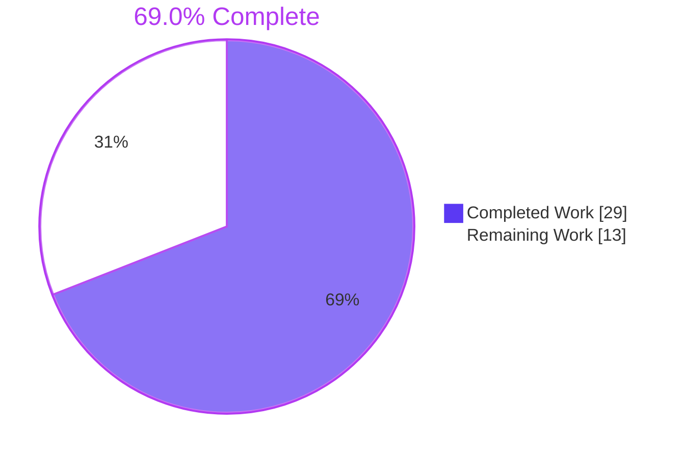
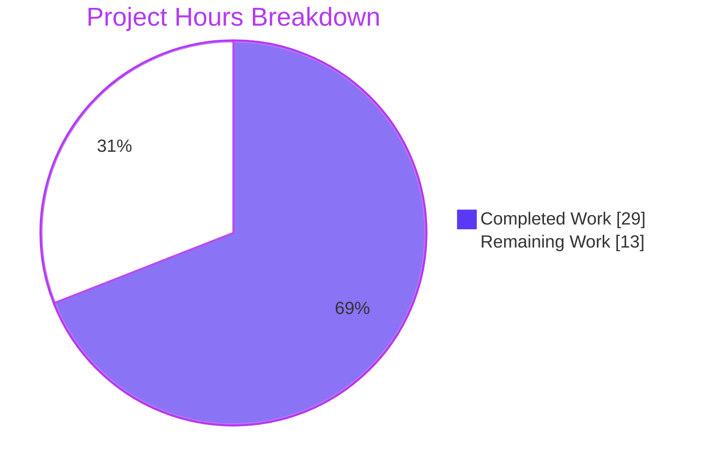
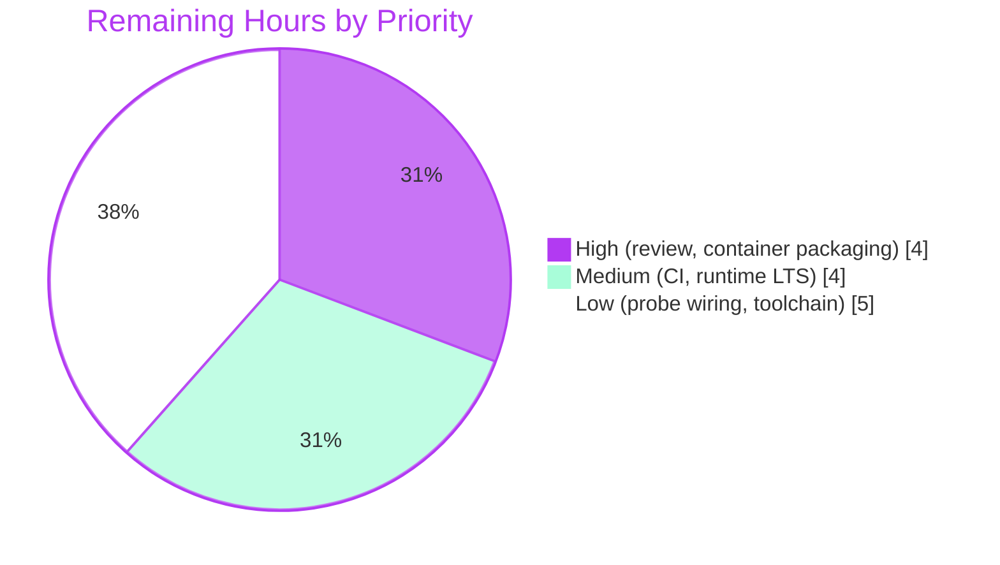

# 1. Executive Summary

Paths are relative to the project root `hao-backprop-test-main (1)/hao-backprop-test-main/`.

## 1.1 Project Overview

This project adds a `GET /health` liveness endpoint to the Node.js Hello World service in `src/backend`, which is built on the native `http` module. Operators, container orchestrators and uptime monitors can now confirm the process is alive and receive `200 OK` with `{"status":"up"}`. The service also starts again: `server.js` previously required a missing handler module and exited before binding a port. The change spans nine files and adds no dependencies: a new handler, two constants, route wiring, unit and live-pipeline tests, both READMEs and the CHANGELOG.

## 1.2 Completion Status


```mermaid
%%{init: {'theme':'base','themeVariables':{'pie1':'#5B39F3','pie2':'#FFFFFF','pieStrokeColor':'#B23AF2','pieOuterStrokeColor':'#B23AF2','pieTitleTextColor':'#B23AF2'}}}%%
pie showData title 69.0% Complete
    "Completed Work" : 29
    "Remaining Work" : 13
```

| Metric | Value |
|---|---|
| Total Hours | 42 |
| Completed Hours (AI + Manual) | 29 (29 AI + 0 manual) |
| Remaining Hours | 13 |
| Percent Complete | 69.0% |

29 hours completed out of 42 total hours = 69.0% complete. All 22 AAP requirements are delivered and verified. The 13 remaining hours are path-to-production work: review, container packaging, CI, the runtime lifecycle and probe wiring.

## 1.3 Key Accomplishments

- [x] `GET /health` returns 200 `application/json` `{"status":"up"}` with the three security headers, on a live server and in 14 new tests
- [x] Every non-GET method on `/health` gets the shared 405 with `Allow: GET`; `/health/` stays 404
- [x] The service starts, and `/hello` serves `Hello world` through `handlers/helloHandler.js`
- [x] A handler that throws before responding yields a 500, and the process keeps serving
- [x] `handlers/healthHandler.js` has 100% statement, branch, function and line coverage
- [x] No regression: all 28 baseline passes are kept, and the 22 failures are confined to 7 suites that already failed
- [x] Behaviour is identical on Node 18.20.8 and 20.20.2; about 1.04 million load-test requests produced zero errors
- [x] Both READMEs and the CHANGELOG document the endpoint; no dependency or manifest changed

## 1.4 Critical Unresolved Issues

0 of 22 AAP requirements are open. Three release caveats remain, all outside the delivered code and each a sanctioned divergence in Section 5.2:

| Issue | Impact | Owner | ETA |
|---|---|---|---|
| The backend container has never been built and cannot build as written: `src/backend/Dockerfile` copies `package*.json` and runs `npm ci`, but `src/backend` has no manifest and `dotenv` is declared nowhere (D7) | The endpoint cannot ship through the repository's container path | DevOps | 3 h |
| The full Jest run exits 1: 7 suites already failed and the global coverage thresholds are unmet (D1) | A CI job that runs the whole suite stays red and can hide real regressions | Backend / DevOps | 2 h |
| The container target `node:18-alpine` has been end of life since 2025-04-30 (D2) | The production runtime receives no security fixes | Platform owner | 2 h |

## 1.5 Access Issues

No access issues identified. Tests and runtime checks need no credentials, secrets or external services, only a one-time install of pinned test packages from the public npm registry.

## 1.6 Recommended Next Steps

1. [High] Review and merge the nine-file change.
2. [High] Add `src/backend/package.json` declaring `dotenv@16.0.3`, build the image, and probe `GET /health` inside it.
3. [Medium] Add a CI job running `node --check` and the four feature suites on Node 18 and Node 20.
4. [Medium] Move the container target to Node 22.x or 24.x LTS and re-run the suites.
5. [Low] Point the Compose healthcheck, `infrastructure/scripts/health-check.sh` and the monitoring stack at `/health`.

# 2. Project Hours Breakdown

## 2.1 Completed Work Detail

| Component | Hours | Description |
|---|---|---|
| Liveness handler (`src/backend/handlers/healthHandler.js`) | 2.0 | `handleHealthRequest(req, res)`: GET → 200 with `HEADERS.CONTENT_TYPE_JSON` and `{"status":"up"}`; any other method → `logger.error` then `handle405(res)`. Entry and success logs, no try/catch, a single export (AAP R1, R2, R4, 0.6.3) |
| Route wiring and startup fix (`src/backend/server.js`) | 2.0 | `/hello` rebound to `handleHelloRequest` from `./handlers/helloHandler`, so the server starts. `'/health'` added to `createRoutes()`. The header comment now names both endpoints. Exports unchanged (IR1, 0.4.1) |
| Response constants and assertions | 1.0 | `MESSAGES.HEALTH_STATUS_UP` and `HEADERS.CONTENT_TYPE_JSON`, each with its JSDoc, in `src/backend/utils/constants.js`, plus two `toBe` tests in `__tests__/utils/constants.test.js` (IR2) |
| Unit suite (`__tests__/handlers/healthHandler.test.js`) | 4.0 | 7 tests for B1–B4: single header and body writes, 405 delegation identity and count, ordered log assertions, error propagation. JSDoc on every callback |
| Live-pipeline integration suite (`__tests__/integration/health.test.js`) | 7.0 | 7 tests against real servers on ports 3101 and 3102: 200, query string, 405, `/health/` 404, `/hello` preserved, 500 then recovery. Security headers are checked on 200, 405, 404 and 500, and a request-log observer is installed. Teardown never hangs |
| Documentation | 1.5 | The summary, Features bullets and a `GET /health` API block in `README.md` and `src/backend/README.md`. CHANGELOG `[Unreleased]` Added and Fixed entries (IR3) |
| Regression gate, coverage and acceptance | 3.0 | No-regression gate (66 tests: 44 pass, 22 already failing), 100% coverage on the four target files, the AAP reviewer check, and identical results on Node 18.20.8 and 20.20.2 |
| Runtime, load and security verification | 6.0 | HTTP surface and raw-socket probes, about 1.04 million requests at concurrency 1–500, two 120 s sustained-stability runs, hostile-input and browser reflection checks, and log-content checks |
| Supply-chain and header-guidance assessment | 1.5 | Advisory and lifecycle review of the installed test toolchain, `dotenv` and `node:18-alpine`. The served security headers were checked against OWASP and RFC 6797 guidance |
| Code-quality conformance | 1.0 | File headers and JSDoc, comments that explain why, lines of at most 100 characters, and confirmation that only the nine planned files changed |
| **Total** | **29.0** | |

## 2.2 Remaining Work Detail

| Category | Hours | Priority |
|---|---|---|
| Code review and merge of the nine-file change | 1.0 | High |
| Backend packaging and container verification: add `src/backend/package.json` declaring `dotenv@16.0.3`, build `src/backend/Dockerfile`, probe `GET /health` in the image (D7) | 3.0 | High |
| CI job: `node --check` plus the four feature suites in an isolated network on Node 18 and 20, with the full gate run for information only until the legacy suites are repaired (D1) | 2.0 | Medium |
| Move the container runtime from end-of-life Node 18 to Node 22.x or 24.x LTS, then re-run the gate and reviewer check (D2) | 2.0 | Medium |
| Probe and monitoring wiring to `/health`: Compose healthcheck, `infrastructure/scripts/health-check.sh` and `deploy.sh`, the orchestrator liveness probe, and a blackbox HTTP probe replacing the `hello-world-health` scrape (D4) | 3.0 | Low |
| Test-toolchain upgrade (jest 30.x, jest-junit 17.x, supertest 7.1.3) to clear test-only advisories, then re-run the suites (D2) | 2.0 | Low |
| **Total** | **13.0** | |

Calculation: 29.0 completed + 13.0 remaining = 42.0 total hours, and 29.0 / 42.0 = 69.0% complete. Confidence is high for the completed hours. It is medium for the remaining hours, because the packaging and probe-wiring work depends on the deployment target.

# 3. Test Results

All results below come from runs on the delivered tree (commit `e39ab1e`) with Node v20.20.2, jest 29.5.0 (CLI 29.7.0) and supertest 6.3.3. Each run used its own network namespace.

| Area / Category | Framework | Tests | Passed | Failed | Coverage | What This Proves |
|---|---|---|---|---|---|---|
| Health handler unit (`__tests__/handlers/healthHandler.test.js`) | Jest | 7 | 7 | 0 | `handlers/healthHandler.js` 100% statements, branches, functions and lines | GET writes the JSON liveness document exactly once, every other method hands the same `res` to `handle405` once, and thrown errors propagate |
| Live-pipeline integration (`__tests__/integration/health.test.js`) | Jest + Supertest | 7 | 7 | 0 | End-to-end (not instrumented separately) | A real server returns 200, 405, 404 and 500 with the security headers, logs the original URL, keeps `/hello` working and recovers after a handler throws |
| Shared constants (`__tests__/utils/constants.test.js`) | Jest | 18 | 18 | 0 | `utils/constants.js` 100% | `HEALTH_STATUS_UP` is `'up'`, `CONTENT_TYPE_JSON` is `'application/json'`, and all 16 existing constants are unchanged |
| Preserved baseline suites (`helloHandler` 3, `errorHandler` 6, `handlers/error` 3) | Jest | 12 | 12 | 0 | `helloHandler.js`, `errorHandler.js` and `handlers/error.js` each 100% | The `/hello` handler and the shared 405, 404 and 500 helpers behave as they did before the change |
| Legacy suites outside scope (`utils/logger` 8, `router` 5, `integration/api` 5, `index` 4; `config`, `server` and `handlers/hello` fail to load) | Jest | 22 | 0 | 22 | — | These failures predate the feature, and none involves the new code (Section 5.2, D1) |
| Acceptance check (AAP reviewer script) | bash + curl | 1 | 1 | 0 | — | The running server answers `/health`, `POST /health`, `/health?probe=1` and `/hello` as documented, and shuts down cleanly on SIGTERM |

Whole-package run: 13 suites (6 pass, 7 fail) and 66 tests (44 pass, 22 fail). All 28 baseline passes are kept and all 16 new tests pass. Jest's global thresholds (85/80/85/90) are not met, at 69.2% statements, 61.76% branches, 69.46% lines and 67.92% functions. That shortfall predates this work. `node --check` passes on all 26 `.js` files under `src/backend`.

**Not Covered**

- PATCH and OPTIONS on `/health` return 405 on the live server, but no automated test sends them. The unit suite covers POST, PUT, DELETE and HEAD, and the integration suite covers POST.
- The container image (`src/backend/Dockerfile`, `node:18-alpine`) and the Compose stack were never built or run. Build the image and probe `GET /health` in it before release.
- No CI matrix exists. Node 18.20.8 parity (66 tests: 44 pass, 22 fail) was confirmed once, by hand.
- Nothing that consumes the endpoint is tested: no orchestrator liveness probe, no `infrastructure/scripts/health-check.sh` and no Prometheus `hello-world-health` job points at `/health`.
- Exceptions raised after the response is sent have no test. The AAP leaves that inherited path unchanged.
- Load and stability were measured once. The suite contains no automated performance test.

# 4. Runtime Validation & UI Verification

The service was started with `node index.js` from `src/backend` on Node v20.20.2 and probed with `curl` and raw HTTP clients. The AAP reviewer check ran on 127.0.0.1:3900 and printed `PASS`.

- ✅ **Startup**: the server binds 0.0.0.0:3000 by default, or `HOST`/`PORT` when set, and logs `Server started on …`. With `NODE_ENV=test` it skips listening and exits 0.
- ✅ **GET /health**: `HTTP/1.1 200 OK`, `Content-Type: application/json`, `Content-Length: 15`, `{"status":"up"}`, with `X-Content-Type-Options: nosniff`, `X-Frame-Options: DENY` and `Content-Security-Policy: default-src 'none'`. `/health?probe=1` returns the identical response.
- ✅ **Non-GET /health**: POST, PUT, DELETE, PATCH, OPTIONS and HEAD each return 405 `text/plain` with `Allow: GET` and `Method Not Allowed` (HEAD sends no body).
- ✅ **Preserved routes**: `GET /hello` → 200 `Hello world`, `POST /hello` → 405. `/health/`, `//health` and `/nope` → 404 `Not Found`.
- ✅ **Failure path**: with the health handler replaced by one that throws, `GET /health` → 500 `text/plain` `Internal Server Error`, and the next `GET /hello` on the same process → 200.
- ✅ **Logging and shutdown**: each request logs `Handling GET request to /health endpoint`, the request line with the original URL (for example `GET /health?probe=1 200 0ms`) and a success line. Unsupported methods log ERROR plus WARN. SIGTERM logs `Server stopped`.
- ✅ **Load and stability**: about 1.04 million requests at concurrency 1–500 produced zero errors or timeouts. p99 was 57.6 ms at c200. Two 120 s sustained runs showed bounded heap use and no file-descriptor leak.
- ✅ **Browser input check (no UI exists)**: 7 crafted URLs carrying script, event-handler and SQL payloads, loaded in Chrome, reflected nothing executable.
- ⚠ **Monitoring integration**: never exercised against a live Prometheus. The `hello-world-health` job would still record `up = 0`, because the JSON body is not exposition format. The Compose healthcheck and `infrastructure/scripts/health-check.sh` still probe `/hello`.
- ⚠ **Container deployment**: never exercised. Neither `Dockerfile` nor `src/backend/Dockerfile` can build as written, because `src/backend` has no `package.json` (D7).

# 5. Compliance & Quality Review

## 5.1 Compliance Matrix

| Deliverable | Benchmark | Status | Progress |
|---|---|---|---|
| Liveness handler (`src/backend/handlers/healthHandler.js`) | AAP 0.6.3 contract: imports, logs, constants-based response, `handle405` delegation, no try/catch; 100% coverage | ✅ Pass | ██████████ 100% |
| Route wiring and startup (`src/backend/server.js`) | AAP 0.4.1: exactly four edits; `{ startServer, stopServer }` and routing code unchanged | ✅ Pass | ██████████ 100% |
| Response constants (`src/backend/utils/constants.js`) | AAP 0.6.3: two keys with their exact JSDoc; existing keys, values and exports untouched | ✅ Pass | ██████████ 100% |
| Unit suite | AAP 0.5.4 B1–B4 rows; `toHaveBeenNthCalledWith` log assertions; inline mocks and `resetAllMocks` | ✅ Pass (7/7) | ██████████ 100% |
| Integration suite | AAP 0.5.4 rows on ports 3101/3102; isolated module for B4; clean exit with no open handles | ✅ Pass (7/7) | ██████████ 100% |
| Documentation | AAP IR3; `CONTRIBUTING.md:100,110`; both README diffs identical; CHANGELOG Added and Fixed | ✅ Pass | ██████████ 100% |
| Scope control | AAP 0.7.1 (exactly 9 files: 3 created, 6 updated); 0.7.2 exclusions untouched | ✅ Pass | ██████████ 100% |
| Dependency constraint | AAP 0.1.2 and 0.3.1: no package, manifest or `node_modules` added | ✅ Pass | ██████████ 100% |
| Regression gate | AAP 0.5.4 no-regression: 66 tests, 44 pass, 22 fail in the same 7 suites | ✅ Pass (full run exits 1 for reasons that predate this work) | ██████████ 100% |
| Style and inline documentation | AAP 0.2.2 and `CONTRIBUTING.md:157-170`: 2-space indent, single quotes, lines ≤ 100 characters, file header and JSDoc, "should …" titles | ✅ Pass (checked by hand; the repository has no lint tooling) | ██████████ 100% |
| Response format and security headers | AAP R3 and 0.4.2: unchanged middleware; 405, 404 and 500 in the existing `text/plain` format | ✅ Pass | ██████████ 100% |
| Runtime acceptance | AAP 0.5.4 reviewer check on 127.0.0.1:3900 | ✅ PASS (exit 0) | ██████████ 100% |

## 5.2 AAP & Rule Divergences and Gaps

| # | What the AAP/Rule Required | What Was Delivered Instead | Why It Diverged | Impact | Remediation |
|---|---|---|---|---|---|
| D1 | Request success criterion: "the existing test suite still passes" | The full Jest run exits 1 (7 suites and 22 tests fail; global coverage thresholds unmet). The gate applied is "no regression" | **Sanctioned.** AAP 0.5.4 replaced an all-green gate with no regression, because those suites already failed and repairing them needs changes AAP 0.7.2 forbids | A CI job that runs the full suite stays red | Scope CI to the feature suites (Section 2.2); repair the legacy suites as separate work |
| D2 | Enterprise practice: a supported runtime and dependencies with no open advisories | `node:18-alpine` (end of life 2025-04-30) kept. jest 29.5, jest-junit 16 and supertest 6.3.3 kept despite advisories and deprecations, all test-only | **Sanctioned.** AAP 0.1.2, 0.3.1 and 0.7.2 forbid dependency and Dockerfile changes | The production runtime is unpatched; the test toolchain carries advisories | Move to Node 22/24 LTS and upgrade the test toolchain (Section 2.2) |
| D3 | OWASP REST guidance: `Cache-Control: no-store` and CSP `frame-ancestors 'none'` | Responses carry `nosniff`, `DENY` and `default-src 'none'` only | **Sanctioned.** AAP 0.7.2 excludes caching headers, and R3 keeps the middleware unchanged | Low: the body is a non-sensitive status read by probes, not browsers | None before release; optional hardening later |
| D4 | Liveness consumers already in the repository: the Prometheus `/health` scrape, the Compose healthcheck and `health-check.sh` | Unchanged. The scrape would record `up = 0`, and the probes still call `/hello` | **Sanctioned.** AAP 0.7.2 and Assumption A3 defer these; AAP 0.2.3 established that a JSON body never satisfies the scrape | The Grafana health panel stays unhealthy, and orchestration does not use `/health` yet | Wire the probes and add a blackbox job (Section 2.2) |
| D5 | Enterprise practice: a robust shared error path and log hygiene | Error handler and logger unchanged: no `res.headersSent` guard; a malformed absolute-form URL causes a 500; the raw URL is logged; `LOG_LEVEL` is ignored | **Sanctioned.** AAP 0.6.1 rejects a guard that would change every route; AAP 0.7.2 excludes logger changes and refactors | Low to medium: secrets in query strings can reach logs; errors after the response are not recovered | Separately authorised hardening; nothing needed for release |
| D6 | AAP 0.6.3 integration-test skeleton: `afterAll` awaits `stopServer()`, covering the listed cases | Adds a `logger.logRequest` observer and `server.closeAllConnections()` in teardown, plus extra header and content-type assertions | A decision taken during delivery: R3 logging needed an automated check, and an unanswered request must fail the run rather than stall it, while `server.js` and `jest.config.js` had to stay unchanged | Positive and test-only. Requires Node ≥ 18.2 | None; keep the observer aligned with `middleware/index.js` |
| D7 | AAP 0.1.1 names "a container orchestrator" as a caller; enterprise practice expects a deployable image | `Dockerfile` and `src/backend/Dockerfile` unchanged. Both install from a `src/backend` manifest that does not exist, and `dotenv` is declared nowhere, so neither image builds | **Sanctioned.** AAP 0.7.2 leaves the absent `src/backend/package.json` and any dependency declaration as pre-existing defects; AAP 0.3.1 forbids Dockerfile changes | The endpoint cannot reach an orchestrator through the repository's container path | Add a backend manifest, build the image and probe `GET /health` in it (Section 2.2) |

**D1. Test-suite success criterion.** The request asked that the existing suite still pass. On the unmodified baseline, however, 7 of 11 suites already failed (13 of 41 tests). AAP 0.5.4 recorded the conflict and adopted a no-regression gate instead: every baseline pass is kept, both new suites pass, and the same 7 suites fail for their original causes. The delivered tree meets that gate exactly: 66 tests, 44 passing and 22 failing, with the `src/backend/jest.config.js:31-38` thresholds unmet. Because `server.js` now loads, `index.test.js` and `integration/api.test.js` get past module loading and show 9 mismatches that were already there. The owner must decide whether CI should gate on the four feature suites until the legacy suites are repaired.

**D2. Runtime lifecycle and test-toolchain advisories.** Enterprise practice calls for a supported runtime and dependencies with no open advisories. `src/backend/Dockerfile:3` stays on `node:18-alpine`, which reached end of life on 2025-04-30, and the tag has not been rebuilt since 2025-03-27. The test toolchain carries three advisory roots: braces 3.0.3 (high, no fixed version), sprintf-js 1.0.3 (moderate, no fixed version) and uuid 8.3.2 through jest-junit, whose vulnerable code path is unused. supertest 6.3.3 and superagent 8.1.2 are deprecated. The only third-party package the service loads at runtime, `dotenv` 16.0.3, has no advisories. AAP 0.1.2, 0.3.1 and 0.7.2 forbid dependency and Dockerfile changes, so any upgrade needs separate authorisation.

**D3. Additional OWASP response headers.** Current OWASP REST guidance also recommends `Cache-Control: no-store` and CSP `frame-ancestors 'none'` for API responses that browsers may read. `/health` returns exactly the set that `src/backend/middleware/index.js:53-61` produces: `nosniff`, `DENY` and `default-src 'none'`. `X-Frame-Options: DENY` is the only framing control, because `frame-ancestors` does not fall back to `default-src`. HSTS is correctly absent on plain HTTP. AAP 0.7.2 excludes caching headers, and R3 keeps the middleware unchanged. The body is a non-sensitive status read by probes rather than browsers, so nothing is needed before release. Add both headers in a later hardening change if browsers will reach the endpoint.

**D4. Probe and monitoring consumers.** The repository already expects a health endpoint: the Prometheus job `hello-world-health` scrapes `metrics_path: '/health'` (`infrastructure/monitoring/prometheus.yml:36-47`). A Prometheus scrape accepts only the exposition format, though, so a JSON body would still record `up = 0`, and the Grafana health panel stays unhealthy. The Compose healthcheck (`infrastructure/local/docker-compose.yml:25-30`) and `infrastructure/scripts/health-check.sh:10-11` still probe `/hello`. AAP 0.7.2 deferred all of these under Assumption A3, because repointing them would change existing behaviour. To get value from the endpoint, point the orchestrator and Compose probes at `GET /health` and replace the scrape with a blackbox HTTP probe.

**D5. Shared error path and logging limitations.** Several weaknesses in the shared request path predate this work and were deliberately left unchanged. `handleServerError` sets headers without checking `res.headersSent` (`src/backend/handlers/error.js:65-76`), so an exception after `res.end` surfaces as `ERR_HTTP_HEADERS_SENT`. A malformed absolute-form request target makes `url.parse` throw in `routeRequest` (`src/backend/server.js:53`), which returns 500 and writes a stack trace to the log. The request log records the raw URL, query strings included, and `LOG_LEVEL` has no effect. AAP 0.6.1 rejects a guard because it would change the shared handler for every route, and AAP 0.7.2 excludes changes to the logger and refactors. None of this blocks release. Schedule hardening if the logs may receive secrets.

**D6. Integration-test structure beyond the AAP skeleton.** AAP 0.6.3 sets out the integration file's structure, including `afterAll` hooks that await `stopServer()`. `src/backend/__tests__/integration/health.test.js` goes further in two ways. It installs a pass-through observer on `logger.logRequest` before requiring the server (lines 25-74), so the R3 request log is asserted. Both teardown hooks also call `server.closeAllConnections()` before `stopServer()` (lines 101 and 282), so a handler that never responds fails the run in about 5 seconds rather than stalling it. These safeguards sit in the test because `server.js` and `jest.config.js` had to stay unchanged (AAP 0.6.3, 0.4.2, 0.7.1). Production code is unaffected. Keep the observer in step with how `src/backend/middleware/index.js` captures `logRequest`.

**D7. Container packaging.** AAP 0.1.1 names container orchestrators among the endpoint's callers, and enterprise practice expects a deployable image. Both container definitions install from a backend manifest that does not exist. The root `Dockerfile:9-12`, which Compose builds, copies `src/backend/package*.json` and runs `npm install --production`. `src/backend/Dockerfile:9-13` copies `package*.json` and runs `npm ci --only=production`. `dotenv` 16.0.3, which `src/backend/config.js:11` loads at startup, is declared nowhere, and Compose runs `npm run dev`, which no manifest defines. AAP 0.7.2 keeps these pre-existing defects unchanged, and AAP 0.3.1 forbids Dockerfile changes. Before release, add the manifest, build the image and probe `GET /health` inside it.

# 6. Risk Assessment

| Risk | Category | Severity | Probability | Mitigation | Status |
|---|---|---|---|---|---|
| The backend container cannot build: `Dockerfile` and `src/backend/Dockerfile` both install from a `src/backend/package*.json` that does not exist, and `dotenv` is undeclared. Compose runs `npm run dev`, which no script defines (D7) | Operational | High | High | Add a backend manifest declaring `dotenv@16.0.3`, build the image, and probe `GET /health` inside it | Open |
| The full Jest run exits 1 (7 legacy suites; global thresholds at 69.2/61.76/69.46/67.92% against 85/80/85/90%). A red gate trains reviewers to ignore it (D1) | Technical | Medium | High | Gate CI on `node --check` and the four feature suites; repair the legacy suites as separate work | Open |
| `node:18-alpine` has been end of life since 2025-04-30 and gets no security fixes. The validation runtime, Node 20, reached end of life on 2026-04-30 (D2) | Security | High | Medium | Move the container and CI to Node 22.x or 24.x LTS, then re-run the suites and reviewer check | Accepted (AAP 0.3.1) |
| Monitoring and probes do not use `/health`. The Prometheus `hello-world-health` scrape would record `up = 0`, and Compose and `health-check.sh` still probe `/hello` (D4) | Integration | Medium | High | Point the probes at `GET /health` and switch the scrape to a blackbox HTTP probe | Deferred (AAP 0.7.2) |
| The request log records the raw URL, including query strings and userinfo, and a 500 writes a stack trace with absolute paths to the server log (D5) | Security | Medium | Medium | Restrict log access; plan query redaction in the logger as a follow-up | Accepted (AAP 0.5.3, 0.7.2) |
| Test-only advisories: braces 3.0.3 (high, no fixed version), sprintf-js 1.0.3 (moderate), uuid 8.3.2. supertest 6 and superagent 8 are deprecated. The runtime dependency `dotenv` is clean (D2) | Security | Low | Low | Upgrade to jest 30.x, jest-junit 17.x and supertest 7.1.3, then re-run the suites | Accepted (AAP 0.7.2) |
| Shared error path: an exception after `res.end` is not recovered (no `headersSent` guard), a falsy `throw` recurses through the middleware chain, and a malformed absolute-form URL makes `url.parse` return 500 (D5) | Technical | Medium | Low | Harden `handlers/error.js` and `middleware/index.js` in a separately authorised change | Accepted (AAP 0.6.1) |
| HEAD-based probes fail, because `HEAD /health` returns 405. `/health/` returns 404. On SIGTERM the server waits for in-flight and keep-alive connections (up to 5 s on Node 18) | Operational | Low | Medium | Configure probes for `GET` on the exact path `/health`; set the termination grace period above the keep-alive timeout | Accepted (AAP 0.5.3, 0.7.2) |

# 7. Visual Project Status


```mermaid
%%{init: {'theme':'base','themeVariables':{'pie1':'#5B39F3','pie2':'#FFFFFF','pieStrokeColor':'#B23AF2','pieOuterStrokeColor':'#B23AF2','pieTitleTextColor':'#B23AF2'}}}%%
pie showData title Project Hours Breakdown
    "Completed Work" : 29
    "Remaining Work" : 13
```

Remaining work by priority (13 hours, matching Section 2.2):


```mermaid
%%{init: {'theme':'base','themeVariables':{'pie1':'#B23AF2','pie2':'#A8FDD9','pie3':'#FFFFFF','pieStrokeColor':'#B23AF2','pieOuterStrokeColor':'#B23AF2','pieTitleTextColor':'#B23AF2'}}}%%
pie showData title Remaining Hours by Priority
    "High (review, container packaging)" : 4
    "Medium (CI, runtime LTS)" : 4
    "Low (probe wiring, toolchain)" : 5
```

| Priority | Hours | Items |
|---|---|---|
| High | 4.0 | Code review and merge; backend packaging and container verification |
| Medium | 4.0 | CI job for the feature suites; move to a supported Node LTS |
| Low | 5.0 | Probe and monitoring wiring; test-toolchain upgrade |
| **Total** | **13.0** | |

# 8. Summary & Recommendations

The project is 69.0% complete: 29 of 42 hours. Every AAP requirement is delivered and verified. `GET /health` returns `200 application/json {"status":"up"}` through the unchanged middleware, so it carries the same logging and security headers as `/hello`. Other methods get the shared 405 response, exact-path routing keeps `/health/` at 404, and a handler that throws before responding produces a 500 without taking the process down. The service starts again because `/hello` now binds to the existing `handlers/helloHandler.js`. The change touches exactly nine files and adds no dependencies.

Verification is thorough for a change of this size. Fourteen new tests and two new constant assertions pass. `handlers/healthHandler.js` is fully covered, and all 28 baseline passes are kept. The AAP reviewer check passes on a live server. Behaviour is identical on Node 18.20.8 and 20.20.2. About 1.04 million requests under load and two sustained-stability runs produced no errors and no leaks. What has not been exercised: the container image, any orchestrator or monitoring consumer of `/health`, and automated tests for PATCH and OPTIONS.

The 13 remaining hours are path-to-production work, not feature work. The critical path is review and merge (1 h), then container packaging (3 h), because neither `Dockerfile` nor `src/backend/Dockerfile` can build without a backend manifest declaring `dotenv`. Next come a CI job on the four feature suites (2 h), needed because the full Jest run exits 1 for legacy reasons, and a move off end-of-life Node 18 (2 h). Probe and monitoring wiring (3 h) and a test-toolchain upgrade (2 h) can follow the first release.

Success metrics for release:
- The container image builds and answers `GET /health` with 200 inside the target environment.
- CI runs the feature suites green on every push.
- The orchestrator's liveness probe is configured with `GET /health`.
- The Grafana health panel reports healthy once a blackbox probe replaces the exposition-format scrape.

Production readiness: the endpoint is ready for code review and can run anywhere `node index.js` runs with `dotenv` resolvable. It is not ready for container deployment until the packaging gap (D7) and the Node 18 lifecycle decision (D2) are settled. All seven divergences in Section 5.2 are deliberate, and six are sanctioned by the AAP. Four of them (D1, D2, D4, D7) need the human work listed in Section 2.2.

# 9. Development Guide

## 9.1 System Prerequisites

- Linux or macOS shell (bash). Optional on Linux: `unshare` and `ip` (util-linux, iproute2) to run tests in a private network namespace.
- Node.js 20.x LTS (validated on v20.20.2 with npm 10.8.2). Node 18.2 or later also works, and the container target is `node:18-alpine`.
- `curl` for the runtime checks, and network access to the public npm registry for the one-time package install.
- No database, cache, queue or credentials are needed.

## 9.2 Environment Setup

The backend has no `package.json`, and the AAP forbids adding dependencies to the repository. Install the pinned runtime and test packages in a directory **outside the checkout**, then expose them through `NODE_PATH`:

```bash
export DEPS="$HOME/.cache/hello-health-deps"
mkdir -p "$DEPS"
printf '{"name":"health-validation-deps","version":"0.0.0","private":true}\n' > "$DEPS/package.json"
npm install --prefix "$DEPS" --no-audit --no-fund --save-exact dotenv@16.0.3 jest@29.5.0 supertest@6.3.3
export NODE_PATH="$DEPS/node_modules"
export JEST="$DEPS/node_modules/.bin/jest"
```

To use the JUnit output configured in `src/backend/jest.config.js`, also install `jest-junit@16.0.0` into `$DEPS`. Otherwise pass `--reporters=default`, as every command below does.

Optional environment variables (no `.env` file is needed):

```bash
export PORT=3000            # default 3000
export HOST=0.0.0.0         # default 0.0.0.0
export NODE_ENV=development # "test" skips server startup in index.js
```

## 9.3 Build and Static Checks

There is no build step. Check syntax from the backend directory:

```bash
cd "hao-backprop-test-main (1)/hao-backprop-test-main/src/backend"
for f in $(git ls-files '*.js'); do node --check "$f" || echo "FAIL $f"; done
```

Expected: no `FAIL` lines (26 files).

## 9.4 Running the Tests

Feature suites. This is the gate to use in CI:

```bash
cd "hao-backprop-test-main (1)/hao-backprop-test-main/src/backend"
CI=true "$JEST" --ci --watchAll=false --maxWorkers=2 --reporters=default \
  __tests__/handlers/healthHandler.test.js __tests__/integration/health.test.js \
  __tests__/utils/constants.test.js __tests__/handlers/helloHandler.test.js
```

Expected: `Test Suites: 4 passed, 4 total` and `Tests: 35 passed, 35 total`.

Whole package with coverage, keeping the output out of the checkout:

```bash
cd "hao-backprop-test-main (1)/hao-backprop-test-main/src/backend"
CI=true "$JEST" --ci --watchAll=false --maxWorkers=2 --reporters=default \
  --coverage --coverageDirectory "$DEPS/coverage"
```

Expected: exit 1, with `Test Suites: 7 failed, 6 passed, 13 total` and `Tests: 22 failed, 44 passed, 66 total`. `healthHandler.js`, `helloHandler.js`, `errorHandler.js` and `constants.js` show 100%. The failures and unmet global thresholds predate this work.

The integration suite binds ports 3101 and 3102. To keep them private on Linux, wrap any command like this:

```bash
unshare -n sh -c 'ip link set lo up && CI=true "$JEST" --ci --watchAll=false --reporters=default __tests__/integration/health.test.js'
```

## 9.5 Application Startup

Default settings (0.0.0.0:3000):

```bash
cd "hao-backprop-test-main (1)/hao-backprop-test-main/src/backend"
node index.js
```

Explicit settings:

```bash
cd "hao-backprop-test-main (1)/hao-backprop-test-main/src/backend"
HOST=127.0.0.1 PORT=3900 NODE_ENV=development node index.js
```

Expected log: `INFO: Server started on 0.0.0.0:3000` (or `127.0.0.1:3900`), followed by `Application startup complete.` Stop it with Ctrl+C or `kill -TERM <pid>`, which logs `SIGTERM signal received. Shutting down server...` and then `Server stopped`.

## 9.6 Verification and Example Usage

```bash
curl -i http://localhost:3000/health
curl -i -X POST http://localhost:3000/health
curl -s "http://localhost:3000/health?probe=1"
curl -s http://localhost:3000/hello
```

Expected:
- `/health`: `HTTP/1.1 200 OK`, `Content-Type: application/json`, `Content-Length: 15`, the three security headers, and body `{"status":"up"}`.
- `POST /health`: `HTTP/1.1 405 Method Not Allowed`, `Allow: GET`, body `Method Not Allowed`.
- The query-string request returns `{"status":"up"}`, and `/hello` returns `Hello world`.

For a liveness probe, use `GET` on the exact path `/health`. HEAD returns 405, and `/health/` returns 404.

## 9.7 Troubleshooting

| Symptom | Cause | Fix |
|---|---|---|
| `Error: Cannot find module 'dotenv'` on startup | `NODE_PATH` is not set in this shell | `export NODE_PATH="$DEPS/node_modules"` |
| Jest stops with `Could not resolve a module … Module name: jest-junit` | `jest.config.js` lists the jest-junit output plugin | Add `--reporters=default`, or install `jest-junit@16.0.0` into `$DEPS` |
| `EADDRINUSE` on 3101, 3102 or 3000 | Another test run or server holds the port | Stop it, or run inside `unshare -n` as shown in 9.4 |
| `node index.js` exits at once without listening | `NODE_ENV=test` deliberately skips startup | Unset `NODE_ENV` or set it to `development` |
| `No .env file found or unable to read it…` | Informational message from `config.js` | None; defaults apply |
| A `coverage/` directory appears in `src/backend` | Jest's default coverage directory | Pass `--coverageDirectory "$DEPS/coverage"` |
| `npm test` at the project root exits 1 | The root `package.json` test script is a placeholder | Run Jest directly as in 9.4 |
| `curl -I http://localhost:3000/health` fails | HEAD is not supported (405) | Probe with `GET` |
| `docker build` fails at `COPY package*.json` or `npm ci` | `src/backend` has no `package.json` (D7) | Add the backend manifest first (Section 2.2) |

# 10. Appendices

## A. Command Reference

| Purpose | Command (run from `src/backend`) |
|---|---|
| Install pinned packages outside the checkout | `npm install --prefix "$DEPS" --no-audit --no-fund --save-exact dotenv@16.0.3 jest@29.5.0 supertest@6.3.3` |
| Syntax check | `for f in $(git ls-files '*.js'); do node --check "$f" \|\| echo "FAIL $f"; done` |
| Feature suites | `CI=true "$JEST" --ci --watchAll=false --maxWorkers=2 --reporters=default __tests__/handlers/healthHandler.test.js __tests__/integration/health.test.js __tests__/utils/constants.test.js __tests__/handlers/helloHandler.test.js` |
| Whole package with coverage | `CI=true "$JEST" --ci --watchAll=false --maxWorkers=2 --reporters=default --coverage --coverageDirectory "$DEPS/coverage"` |
| Isolated network run (Linux) | `unshare -n sh -c 'ip link set lo up && <command>'` |
| Start the server | `HOST=127.0.0.1 PORT=3900 NODE_ENV=development node index.js` |
| Probe liveness | `curl -i http://127.0.0.1:3900/health` |
| Review the change set | `git diff --stat origin/main...HEAD` |

## B. Port Reference

| Port | Used by |
|---|---|
| 3000 | Default server port (`PORT`); Compose maps `3000:3000` |
| 3101 | `__tests__/integration/health.test.js` live-pipeline server |
| 3102 | `__tests__/integration/health.test.js` isolated server for the 500 case |
| 3900 | AAP reviewer check (`HOST=127.0.0.1 PORT=3900`) |

## C. Key File Locations

| File | Role |
|---|---|
| `src/backend/handlers/healthHandler.js` | New `GET /health` handler |
| `src/backend/server.js` | Route table (`createRoutes()`), middleware composition, `startServer` / `stopServer` |
| `src/backend/utils/constants.js` | `HTTP_STATUS`, `MESSAGES` (incl. `HEALTH_STATUS_UP`), `HEADERS` (incl. `CONTENT_TYPE_JSON`), `HTTP_METHODS` |
| `src/backend/errorHandler.js` | Shared `handle405` (405, `Allow: GET`) |
| `src/backend/handlers/error.js` | 404 and 500 responses |
| `src/backend/middleware/index.js` | Request logging and security headers |
| `src/backend/__tests__/handlers/healthHandler.test.js` | Unit suite (7 tests) |
| `src/backend/__tests__/integration/health.test.js` | Live-pipeline suite (7 tests) |
| `src/backend/jest.config.js` | Test discovery, coverage thresholds, reporters |
| `Dockerfile`, `src/backend/Dockerfile`, `infrastructure/local/docker-compose.yml` | Container definitions and local stack (unchanged; see D7) |
| `infrastructure/monitoring/prometheus.yml`, `infrastructure/scripts/health-check.sh` | Existing health consumers (unchanged; see D4) |
| `README.md`, `src/backend/README.md`, `src/backend/CHANGELOG.md` | API documentation and change log |

## D. Technology Versions

| Technology | Version |
|---|---|
| Node.js (validation) | 20.20.2, with parity confirmed on 18.20.8 |
| Node.js (container target) | `node:18-alpine` (end of life 2025-04-30) |
| npm | 10.8.2 |
| jest | 29.5.0 (jest-cli / @jest/core 29.7.0) |
| supertest | 6.3.3 |
| dotenv | 16.0.3 (the only runtime third-party package) |
| jest-junit | 16.0.0 (optional output plugin) |

## E. Environment Variable Reference

| Variable | Default | Effect |
|---|---|---|
| `PORT` | 3000 | Listening port; read once when `config.js` loads |
| `HOST` | 0.0.0.0 | Bind address |
| `NODE_ENV` | development | `test` skips startup in `index.js` and suppresses logger output |
| `LOG_LEVEL` | INFO | Documented, but the logger currently ignores it |
| `NODE_PATH` | — | Must point at the external `node_modules` so `dotenv`, `jest` and `supertest` resolve |

## F. Developer Tools Guide

- **No lint tooling exists.** `npm run lint`, `.eslintrc.js` and `.prettierrc` are documented in `CONTRIBUTING.md` but absent. Check style by hand: 2-space indent, single quotes, semicolons, lines of at most 100 characters, a file header and JSDoc.
- **Test conventions:** unit tests mock `../../errorHandler` and `../../utils/logger` inline and call `jest.resetAllMocks()` in `afterEach`. `jest.config.js` sets `resetMocks`/`restoreMocks`, so a long-lived stand-in must be a plain function rather than a `jest.fn()` implementation.
- **Live-server tests** use Supertest against `startServer()`. Set `process.env.PORT` before requiring any module that loads `config.js`, including `utils/logger.js`.

## G. Glossary

| Term | Meaning |
|---|---|
| Liveness endpoint | A route that reports the process is alive and serving; here `GET /health` → `{"status":"up"}` |
| B1–B4 | AAP behaviour cases: normal, empty/absent input, invalid method, failure before the response is written |
| No-regression gate | Pass criterion: all baseline passes kept, new suites green, the same pre-existing suites failing |
| Exposition format | The Prometheus text metrics format; a JSON body does not satisfy a Prometheus scrape |
| Blackbox probe | A Prometheus exporter that checks HTTP status instead of scraping metrics |
