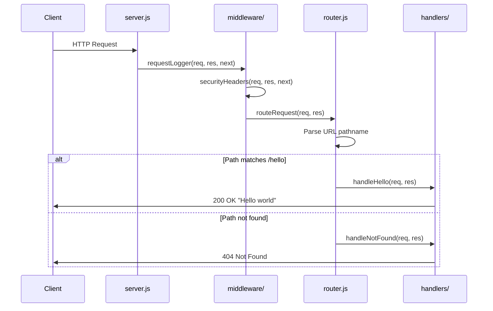
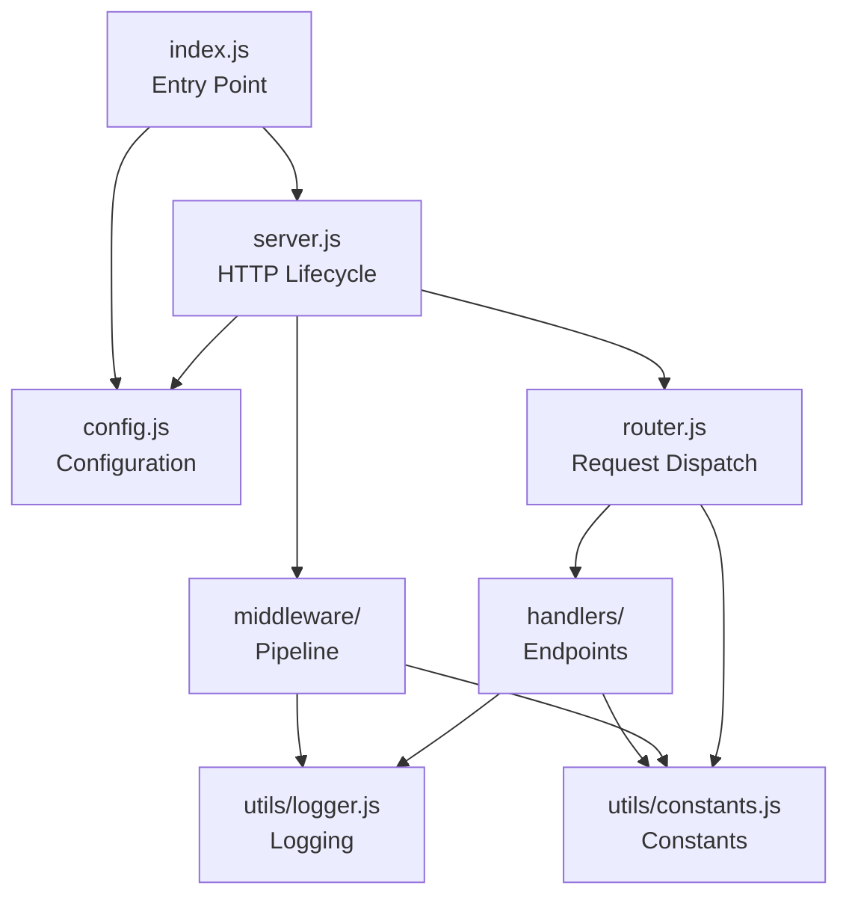

# Technical Specification

# 0. Agent Action Plan

## 0.1 Intent Clarification

### 0.1.1 Core Feature Objective

Based on the prompt, the Blitzy platform understands that the user has submitted a general inquiry about documenting the target state of the refactored system rather than a specific feature addition request. The input provided asks to "Describe the target state of the refactored system" covering:

- Technology stack (languages, frameworks, libraries, databases)
- Overall architecture and design patterns
- Key modules, components, and their relationships
- External integrations and dependencies
- Configuration and deployment approach
- Any other architectural or technical considerations

**Technical Interpretation:** This appears to be a request for **system documentation** rather than a concrete feature implementation directive. The Blitzy platform has analyzed the existing Node.js Hello World educational service repository and will provide a comprehensive action plan for potential enhancements based on the current state analysis.

**Implicit Requirements Detected:**
- The repository is an educational Node.js "Hello World" service demonstrating best practices
- The system currently implements a single `/hello` endpoint returning "Hello world"
- Monitoring infrastructure (Prometheus/Grafana) is configured but the `/metrics` endpoint is not fully implemented
- The package.json lacks explicit dependency declarations despite code referencing dotenv, Jest, and Supertest

**Feature Dependencies and Prerequisites:**
- Node.js 18.x LTS runtime environment (verified: 18.20.8)
- Native HTTP module implementation (no Express.js in production path)
- dotenv v16.0.3 for environment configuration
- Jest v29.x with Supertest v6.3.3 for testing (referenced in tech spec but not in package.json)

### 0.1.2 Special Instructions and Constraints

**CRITICAL Directives Identified:**

- **Maintain Educational Focus**: Any additions must preserve the simplicity and readability that makes this repository suitable for learning Node.js fundamentals
- **Follow Existing Patterns**: New features must use the established CommonJS module pattern, middleware composition approach, and centralized constants/logging utilities
- **Preserve Backward Compatibility**: The `/hello` endpoint contract (GET /hello → 200 OK, "Hello world") must remain unchanged
- **No Framework Dependencies**: The primary implementation uses native Node.js HTTP module; Express.js remains optional

**Architectural Requirements:**

- Use existing service pattern with Promise-based `startServer()` / `stopServer()` lifecycle
- Follow repository conventions for:
  - Handler functions in `src/backend/handlers/`
  - Middleware in `src/backend/middleware/`
  - Utilities in `src/backend/utils/`
  - Tests in `src/backend/__tests__/`
- Maintain constants centralization in `src/backend/utils/constants.js`
- Use centralized logging via `src/backend/utils/logger.js`

**User Example:** No specific examples were provided in the input prompt.

**Web Search Requirements:** None explicitly required based on the prompt.

### 0.1.3 Technical Interpretation

These documentation requirements translate to the following technical implementation strategy:

| Requirement Category | Technical Action |
|---------------------|------------------|
| Technology stack documentation | Document Node.js 18.x LTS, native HTTP module, dotenv v16.0.3, Jest v29.x, Docker containerization |
| Architecture patterns | Document request pipeline (middleware → router → handler), Promise-based lifecycle, configuration-driven design |
| Module relationships | Map dependencies between config.js, server.js, router.js, handlers/, middleware/, and utils/ |
| External integrations | Document Prometheus scraping configuration, Grafana dashboard, Docker Compose orchestration |
| Configuration approach | Document environment variable loading via dotenv, .env file support, validation patterns |
| Deployment approach | Document Docker image build, docker-compose.yml for local development, infrastructure scripts |

**To fully implement this documentation request, we will:**
- Catalog all existing source files and their responsibilities
- Map the request processing flow from server to handler
- Document the middleware composition pattern
- Identify gaps in the current implementation (e.g., missing `/metrics` endpoint)
- Provide recommendations for completing partially implemented features

## 0.2 Repository Scope Discovery

### 0.2.1 Comprehensive File Analysis

**Existing Repository Structure:**

The repository `hao-backprop-test-main` contains a compact Node.js "Hello World" educational service with the following structure:

```
hao-backprop-test-main/
├── CODE_OF_CONDUCT.md           # Contributor Covenant v2.0
├── CONTRIBUTING.md              # Developer workflow and CI gate rules
├── Dockerfile                   # Production image (node:18-alpine)
├── LICENSE                      # MIT License
├── README.md                    # Project documentation
├── package.json                 # Root manifest (minimal)
├── package-lock.json            # Lock file (lockfileVersion 3)
├── server.js                    # Top-level demo server (standalone)
├── blitzy/                      # Documentation bundle
│   └── documentation/
│       ├── Input Prompt.md
│       └── Technical Specifications/
├── infrastructure/              # Operational runbook
│   ├── README.md
│   ├── local/
│   │   └── docker-compose.yml   # Local development orchestration
│   ├── monitoring/
│   │   ├── prometheus.yml       # Prometheus scrape configuration
│   │   └── grafana-dashboard.json
│   └── scripts/
│       ├── deploy.sh
│       ├── health-check.sh
│       ├── setup.sh
│       └── start-server.sh
└── src/backend/                 # Main application code
    ├── CHANGELOG.md
    ├── Dockerfile               # Backend-specific production image
    ├── README.md
    ├── config.js                # Configuration loader with dotenv
    ├── errorHandler.js          # Centralized error utilities
    ├── index.js                 # Application entry point
    ├── jest.config.js           # Jest test configuration
    ├── nodemon.json             # Development server config
    ├── router.js                # Path-based request dispatcher
    ├── server.js                # HTTP server lifecycle
    ├── __tests__/               # Jest test suites
    │   ├── setup.js
    │   ├── config.test.js
    │   ├── errorHandler.test.js
    │   ├── index.test.js
    │   ├── router.test.js
    │   ├── server.test.js
    │   ├── handlers/
    │   ├── integration/
    │   └── utils/
    ├── handlers/                # HTTP endpoint handlers
    │   ├── error.js             # 404/405/500 handlers
    │   └── helloHandler.js      # /hello endpoint
    ├── middleware/              # Request middleware
    │   └── index.js             # Logger, security headers, composer
    └── utils/                   # Shared utilities
        ├── constants.js         # HTTP status, routes, messages
        └── logger.js            # Centralized logging
```

### 0.2.2 Existing Modules to Modify

Based on the repository analysis, the following files represent the core implementation:

| File Path | Purpose | Lines | Status |
|-----------|---------|-------|--------|
| `src/backend/config.js` | Configuration loader with dotenv | ~93 | Complete |
| `src/backend/server.js` | HTTP server lifecycle management | ~169 | Complete |
| `src/backend/index.js` | Application entry point and bootstrap | ~60 | Complete |
| `src/backend/router.js` | Path-based request routing | ~50 | Complete |
| `src/backend/errorHandler.js` | Centralized error handling utilities | ~80 | Complete |
| `src/backend/handlers/helloHandler.js` | /hello endpoint handler | ~59 | Complete |
| `src/backend/handlers/error.js` | 404/405/500 response handlers | ~60 | Complete |
| `src/backend/middleware/index.js` | Middleware composition and utilities | ~100 | Complete |
| `src/backend/utils/constants.js` | Application constants | ~30 | Complete |
| `src/backend/utils/logger.js` | Centralized logging utility | ~80 | Complete |

### 0.2.3 Integration Point Discovery

**API Endpoints:**
- `GET /hello` - Returns "Hello world" (200 OK, text/plain)
- `GET /*` - Returns 404 Not Found for unmatched paths
- `<non-GET> /hello` - Returns 405 Method Not Allowed

**Missing/Incomplete Endpoints:**
- `GET /metrics` - Referenced in Prometheus config but NOT IMPLEMENTED in source code
- `GET /health` - Referenced in Prometheus config but NOT IMPLEMENTED (uses /hello as proxy)

**Database Models/Migrations:**
- None - The application is stateless with no persistent storage

**Service Classes Requiring Updates:**
- `src/backend/server.js` - Would need modification to add new routes
- `src/backend/handlers/` - New endpoint handlers would be added here
- `src/backend/middleware/` - New middleware would be added here

**Controllers/Handlers:**
- `handleHello` in `handlers/helloHandler.js` - Primary request handler
- `handleNotFound`, `handleMethodNotAllowed`, `handleServerError` in `handlers/error.js`

**Middleware/Interceptors:**
- `requestLogger` - Logs request timing and details
- `securityHeaders` - Sets X-Content-Type-Options, X-Frame-Options, CSP
- `errorMiddleware` - Terminal error handler
- `applyMiddleware` - Middleware composition utility

### 0.2.4 Test File Coverage

| Test File | Scope | Coverage Target |
|-----------|-------|-----------------|
| `__tests__/config.test.js` | Configuration loader | Environment variables, defaults |
| `__tests__/errorHandler.test.js` | Error handling utilities | 404/405/500 responses |
| `__tests__/index.test.js` | Bootstrap module | Server lifecycle, signals |
| `__tests__/router.test.js` | Request routing | Path matching, 404 fallback |
| `__tests__/server.test.js` | HTTP server | Start/stop, request handling |
| `__tests__/handlers/*.test.js` | Handler functions | Response codes, headers |
| `__tests__/integration/api.test.js` | End-to-end API tests | HTTP contract validation |
| `__tests__/utils/*.test.js` | Utility modules | Constants, logger |

### 0.2.5 Configuration Files

| Configuration File | Purpose |
|-------------------|---------|
| `package.json` | Root npm manifest (minimal, needs dependencies) |
| `src/backend/jest.config.js` | Jest test configuration with coverage thresholds |
| `src/backend/nodemon.json` | Development server auto-reload config |
| `infrastructure/local/docker-compose.yml` | Local development orchestration |
| `infrastructure/monitoring/prometheus.yml` | Prometheus scrape configuration |
| `infrastructure/monitoring/grafana-dashboard.json` | Grafana dashboard definition |

### 0.2.6 Web Search Research Conducted

No web search was required for this analysis as the repository structure and technical specification documents provided comprehensive information about the existing implementation.

### 0.2.7 New File Requirements

Based on the identified gaps in the current implementation, the following new files would be needed to complete the monitoring feature:

**New Source Files to Create:**
- `src/backend/handlers/metricsHandler.js` - Prometheus metrics endpoint handler
- `src/backend/handlers/healthHandler.js` - Dedicated health check endpoint

**New Test Files:**
- `src/backend/__tests__/handlers/metricsHandler.test.js` - Unit tests for metrics
- `src/backend/__tests__/handlers/healthHandler.test.js` - Unit tests for health

**Updated Configuration:**
- `src/backend/utils/constants.js` - Add ROUTES.METRICS, ROUTES.HEALTH
- `src/backend/server.js` - Register new routes in createRoutes()

## 0.3 Dependency Inventory

### 0.3.1 Private and Public Packages

**Current Dependency State:**

The root `package.json` currently lacks explicit dependency declarations:

```json
{
    "name": "hello_world",
    "version": "1.0.0",
    "description": "Hello world in Node.js",
    "main": "index.js",
    "scripts": {
        "test": "echo \"Error: no test specified\" && exit 1"
    },
    "author": "hxu",
    "license": "MIT"
}
```

**Required Dependencies (Based on Code Analysis and Tech Spec):**

| Registry | Package Name | Version | Purpose |
|----------|--------------|---------|---------|
| npm (public) | dotenv | 16.0.3 | Environment variable loading from .env files |
| npm (public) | jest | 29.x | Testing framework |
| npm (public) | supertest | 6.3.3 | HTTP integration testing |
| npm (public) | nodemon | 3.x | Development server auto-reload |
| npm (public) | jest-junit | latest | JUnit XML reporter for CI/CD |

**Runtime Dependencies (Production):**

| Package | Version | Purpose | Evidence |
|---------|---------|---------|----------|
| dotenv | 16.0.3 | Load .env configuration files | Referenced in `config.js` line 4 comment |

**Development Dependencies:**

| Package | Version | Purpose | Evidence |
|---------|---------|---------|----------|
| jest | 29.x | Test runner and assertion library | Referenced in `jest.config.js` |
| supertest | 6.3.3 | HTTP integration testing | Referenced in tech spec F-011 |
| jest-junit | latest | JUnit XML test reporting | Referenced in `jest.config.js` reporters |
| nodemon | 3.x | Development server with hot-reload | Referenced in `nodemon.json` |

**Native Node.js Modules (No Installation Required):**

| Module | Purpose | Usage Location |
|--------|---------|----------------|
| http | HTTP server creation | `src/backend/server.js` |
| url | URL parsing | `src/backend/server.js`, `src/backend/router.js` |
| path | Path resolution | `src/backend/config.js` |
| process | Environment access, signals | `src/backend/config.js`, `src/backend/index.js` |

### 0.3.2 Dependency Updates Required

**Package.json Updates Needed:**

The `package.json` file requires updates to properly declare all dependencies:

```json
{
    "name": "hello_world",
    "version": "1.0.0",
    "description": "Hello world in Node.js",
    "main": "index.js",
    "scripts": {
        "start": "node src/backend/index.js",
        "dev": "nodemon",
        "test": "jest --coverage",
        "test:watch": "jest --watch",
        "lint": "eslint src/backend/**/*.js"
    },
    "dependencies": {
        "dotenv": "16.0.3"
    },
    "devDependencies": {
        "jest": "^29.0.0",
        "supertest": "^6.3.3",
        "jest-junit": "^16.0.0",
        "nodemon": "^3.0.0"
    }
}
```

### 0.3.3 Import Updates

**Files Requiring Import Updates:**

Since the codebase uses CommonJS modules with `require()`, the import patterns are consistent:

| Pattern | Files | Current State |
|---------|-------|---------------|
| `require('dotenv')` | `src/backend/config.js` | ✓ Correct |
| `require('./config')` | `src/backend/server.js`, `src/backend/index.js` | ✓ Correct |
| `require('./utils/logger')` | Most backend files | ✓ Correct |
| `require('./utils/constants')` | Handler and utility files | ✓ Correct |
| `require('./handlers/error')` | `src/backend/server.js` | ✓ Correct |
| `require('./middleware/index')` | `src/backend/server.js` | ✓ Correct |

**Import Transformation Rules:**

No import transformations are required. The current import patterns follow established conventions:

- Relative paths for internal modules: `./module` or `../module`
- Package names for npm dependencies: `dotenv`
- Destructuring for specific exports: `const { func1, func2 } = require('./module')`

### 0.3.4 External Reference Updates

**Configuration Files:**

| File | Update Required |
|------|-----------------|
| `package.json` | Add dependencies and scripts |
| `package-lock.json` | Will be regenerated by npm install |
| `src/backend/nodemon.json` | No changes needed |
| `src/backend/jest.config.js` | No changes needed |

**Documentation:**

| File | Update Required |
|------|-----------------|
| `README.md` | Document dependency installation |
| `CONTRIBUTING.md` | Already references npm install |
| `src/backend/README.md` | Document backend-specific dependencies |

**Build/Deployment Files:**

| File | Current State | Notes |
|------|---------------|-------|
| `Dockerfile` (root) | Uses `npm install --production` | Will work once dependencies declared |
| `src/backend/Dockerfile` | Uses `npm ci --only=production` | Requires package-lock.json |
| `infrastructure/local/docker-compose.yml` | References `npm run dev` | Requires dev script in package.json |

**CI/CD Configuration:**

No `.github/workflows/` or CI configuration files were found in the repository. The tech spec references CI but the implementation is not present.

## 0.4 Integration Analysis

### 0.4.1 Existing Code Touchpoints

**Direct Modifications Required:**

| File | Location | Modification Type | Purpose |
|------|----------|-------------------|---------|
| `src/backend/server.js` | `createRoutes()` function | ADD | Register new endpoints in route mapping |
| `src/backend/utils/constants.js` | ROUTES object | ADD | Add new route constants (METRICS, HEALTH) |
| `package.json` | Root | MODIFY | Add dependencies and npm scripts |

**Server.js Route Registration (Lines 30-35):**

```javascript
// Current implementation
function createRoutes() {
  return {
    '/hello': handleHello
  };
}

// Extended implementation pattern
function createRoutes() {
  return {
    '/hello': handleHello,
    '/health': handleHealth,    // New
    '/metrics': handleMetrics   // New
  };
}
```

**Constants.js Routes Object:**

```javascript
// Current implementation
ROUTES: { HELLO: '/hello' }

// Extended implementation
ROUTES: { 
  HELLO: '/hello',
  HEALTH: '/health',
  METRICS: '/metrics'
}
```

### 0.4.2 Dependency Injections

**Service Registration Points:**

The application uses a simple module-based dependency injection pattern via CommonJS `require()`. Dependencies are resolved at module load time.

| Injection Point | Current Dependencies | Pattern |
|-----------------|---------------------|---------|
| `src/backend/server.js` | config, logger, handlers, middleware | Direct require() |
| `src/backend/index.js` | server, logger, config | Direct require() |
| `src/backend/router.js` | logger, handlers, constants | Direct require() |

**Handler Registration:**

New handlers must be:
1. Created in `src/backend/handlers/` directory
2. Exported via `module.exports`
3. Imported in `src/backend/server.js`
4. Added to `createRoutes()` return object

**Middleware Registration:**

New middleware must be:
1. Added to `src/backend/middleware/index.js`
2. Exported from the module
3. Added to the middleware array in `server.js` `handleRequest()` function

### 0.4.3 Database/Schema Updates

**Current State:** No database or persistent storage is used.

The application is stateless by design:
- No database connections
- No session management
- No data persistence
- No migration requirements

**If Database Were Added:**

| Change Type | Location | Purpose |
|-------------|----------|---------|
| CREATE | `src/backend/db/` | Database connection and models |
| CREATE | `migrations/` | Database schema migrations |
| MODIFY | `src/backend/config.js` | Add DATABASE_URL configuration |
| MODIFY | `package.json` | Add database driver dependency |

### 0.4.4 Request Flow Integration

**Current Request Processing Pipeline:**



**Integration Points for New Features:**

1. **New Endpoint Handler Integration:**
   - Create handler function accepting (req, res) parameters
   - Add route mapping in `createRoutes()`
   - Handler invoked by router when path matches

2. **Middleware Integration:**
   - Add middleware to array in `handleRequest()`
   - Middleware receives (req, res, next) parameters
   - Must call next() to continue chain

3. **Error Handling Integration:**
   - Synchronous errors caught by try/catch in `handleRequest()`
   - Errors routed to `errorMiddleware` → `handleServerError`
   - Consistent 500 response with no detail leakage

### 0.4.5 Configuration Integration

**Environment Variables Consumed:**

| Variable | Default | Used By | Purpose |
|----------|---------|---------|---------|
| PORT | 3000 | server.js | HTTP server listening port |
| HOST | 0.0.0.0 | server.js | HTTP server binding address |
| NODE_ENV | development | config.js, logger.js | Environment mode detection |
| LOG_LEVEL | INFO | logger.js | Logging verbosity control |

**Adding New Configuration:**

1. Add default value to `src/backend/config.js`
2. Add validation logic if required
3. Export from config object
4. Document in README.md environment variables table

### 0.4.6 Monitoring Integration

**Prometheus Configuration (infrastructure/monitoring/prometheus.yml):**

```yaml
scrape_configs:
  - job_name: 'hello-world-app'
    static_configs:
      - targets: ['hello-world-app:3000']
    metrics_path: /metrics    # NOT IMPLEMENTED
    scrape_interval: 5s

  - job_name: 'hello-world-health'
    static_configs:
      - targets: ['hello-world-app:3000']
    metrics_path: /health     # NOT IMPLEMENTED (uses /hello)
    scrape_interval: 30s
```

**Gap Analysis:**
- `/metrics` endpoint: MISSING - Prometheus expects to scrape metrics here
- `/health` endpoint: MISSING - Currently proxied to /hello
- `prom-client` package: NOT INSTALLED - Required for Prometheus metrics format

**Integration Requirements for Complete Monitoring:**

| Component | Status | Action Required |
|-----------|--------|-----------------|
| Prometheus scrape config | ✓ Complete | None |
| Grafana dashboard | ✓ Complete | None |
| `/metrics` endpoint | ✗ Missing | Implement with prom-client |
| `/health` endpoint | ✗ Missing | Implement dedicated handler |
| Application instrumentation | ✗ Missing | Add request metrics collection |

## 0.5 Technical Implementation

### 0.5.1 File-by-File Execution Plan

Based on the repository analysis, the following implementation plan addresses the current system state documentation and identifies actions required to complete the monitoring feature:

**Group 1 - Package Configuration (Priority: Critical)**

| Action | File | Purpose |
|--------|------|---------|
| MODIFY | `package.json` | Add dependencies (dotenv, jest, supertest, nodemon, jest-junit), update scripts |
| REGENERATE | `package-lock.json` | Regenerate after package.json updates via npm install |

**Group 2 - Core Application (Status: Complete)**

| Action | File | Current State |
|--------|------|---------------|
| DOCUMENT | `src/backend/config.js` | Configuration loader - Complete |
| DOCUMENT | `src/backend/server.js` | HTTP server lifecycle - Complete |
| DOCUMENT | `src/backend/index.js` | Application entry point - Complete |
| DOCUMENT | `src/backend/router.js` | Request routing - Complete |
| DOCUMENT | `src/backend/errorHandler.js` | Error handling utilities - Complete |

**Group 3 - Handlers (Status: Partially Complete)**

| Action | File | Purpose |
|--------|------|---------|
| DOCUMENT | `src/backend/handlers/helloHandler.js` | /hello endpoint - Complete |
| DOCUMENT | `src/backend/handlers/error.js` | Error response handlers - Complete |
| CREATE | `src/backend/handlers/healthHandler.js` | Dedicated /health endpoint |
| CREATE | `src/backend/handlers/metricsHandler.js` | Prometheus /metrics endpoint |

**Group 4 - Utilities and Middleware (Status: Complete)**

| Action | File | Current State |
|--------|------|---------------|
| DOCUMENT | `src/backend/utils/constants.js` | Application constants - Complete |
| DOCUMENT | `src/backend/utils/logger.js` | Centralized logging - Complete |
| DOCUMENT | `src/backend/middleware/index.js` | Middleware utilities - Complete |
| MODIFY | `src/backend/utils/constants.js` | Add ROUTES.HEALTH, ROUTES.METRICS |

**Group 5 - Tests (Status: Complete)**

| Action | File | Coverage Target |
|--------|------|-----------------|
| DOCUMENT | `src/backend/__tests__/config.test.js` | Configuration testing |
| DOCUMENT | `src/backend/__tests__/server.test.js` | Server lifecycle testing |
| DOCUMENT | `src/backend/__tests__/integration/api.test.js` | End-to-end API testing |
| CREATE | `src/backend/__tests__/handlers/healthHandler.test.js` | Health endpoint tests |
| CREATE | `src/backend/__tests__/handlers/metricsHandler.test.js` | Metrics endpoint tests |

**Group 6 - Infrastructure (Status: Complete)**

| Action | File | Current State |
|--------|------|---------------|
| DOCUMENT | `Dockerfile` | Production container build - Complete |
| DOCUMENT | `infrastructure/local/docker-compose.yml` | Local development - Complete |
| DOCUMENT | `infrastructure/monitoring/prometheus.yml` | Prometheus config - Complete |
| DOCUMENT | `infrastructure/monitoring/grafana-dashboard.json` | Dashboard - Complete |
| DOCUMENT | `infrastructure/scripts/*.sh` | Deployment scripts - Complete |

### 0.5.2 Implementation Approach per File

**Establish Feature Foundation:**

For the missing monitoring endpoints, the implementation would follow this pattern:

1. **Create healthHandler.js:**
```javascript
// src/backend/handlers/healthHandler.js
const { HTTP_STATUS, HEADERS, MESSAGES } = require('../utils/constants');
const logger = require('../utils/logger');

function handleHealth(req, res) {
  // Check method
  if (req.method !== 'GET') {
    // Delegate to 405 handler
  }
  res.statusCode = HTTP_STATUS.OK;
  res.setHeader(HEADERS.CONTENT_TYPE, 'application/json');
  res.end(JSON.stringify({ status: 'healthy' }));
}

module.exports = handleHealth;
```

2. **Create metricsHandler.js:**
```javascript
// src/backend/handlers/metricsHandler.js
// Requires prom-client package installation

const { HTTP_STATUS, HEADERS } = require('../utils/constants');
// const { register } = require('prom-client');

function handleMetrics(req, res) {
  res.statusCode = HTTP_STATUS.OK;
  res.setHeader(HEADERS.CONTENT_TYPE, 'text/plain');
  // res.end(await register.metrics());
  res.end('# Metrics endpoint placeholder');
}

module.exports = handleMetrics;
```

**Integrate with Existing Systems:**

Modify `src/backend/server.js` to register new routes:

```javascript
const handleHealth = require('./handlers/healthHandler');
const handleMetrics = require('./handlers/metricsHandler');

function createRoutes() {
  return {
    '/hello': handleHello,
    '/health': handleHealth,
    '/metrics': handleMetrics
  };
}
```

**Ensure Quality with Tests:**

Create corresponding test files following the existing patterns in `__tests__/handlers/`.

**Document Usage and Configuration:**

Update README.md with new endpoint documentation:
- GET /health → 200 OK, JSON { status: "healthy" }
- GET /metrics → 200 OK, Prometheus text format

### 0.5.3 Current System Architecture Summary

**Technology Stack:**

| Layer | Technology | Version |
|-------|------------|---------|
| Runtime | Node.js | 18.x LTS (18.20.8 verified) |
| HTTP | Native http module | Built-in |
| Configuration | dotenv | 16.0.3 |
| Testing | Jest | 29.x |
| Integration Testing | Supertest | 6.3.3 |
| Development | nodemon | 3.x |
| Containerization | Docker | Alpine-based |
| Orchestration | Docker Compose | 3.8 |
| Monitoring | Prometheus + Grafana | Latest |

**Design Patterns:**

| Pattern | Implementation | Location |
|---------|---------------|----------|
| Middleware Chain | Custom composition with applyMiddleware() | middleware/index.js |
| Promise-based Lifecycle | startServer()/stopServer() returning Promises | server.js |
| Centralized Configuration | getConfig() with validation and defaults | config.js |
| Centralized Logging | logger object with level-based methods | utils/logger.js |
| Centralized Constants | Frozen objects for HTTP status, routes, messages | utils/constants.js |
| Graceful Shutdown | SIGINT/SIGTERM signal handlers | index.js |

**Component Relationships:**



## 0.6 Scope Boundaries

### 0.6.1 Exhaustively In Scope

**Core Application Source Files:**

| Pattern | Files | Purpose |
|---------|-------|---------|
| `src/backend/*.js` | config.js, server.js, index.js, router.js, errorHandler.js | Core server implementation |
| `src/backend/handlers/**/*.js` | helloHandler.js, error.js, + new handlers | HTTP endpoint handlers |
| `src/backend/middleware/**/*.js` | index.js | Request middleware chain |
| `src/backend/utils/**/*.js` | constants.js, logger.js | Shared utilities |

**Test Files:**

| Pattern | Files | Purpose |
|---------|-------|---------|
| `src/backend/__tests__/**/*.js` | All test files | Unit and integration tests |
| `src/backend/__tests__/**/*.test.js` | Specific test suites | Jest test files |
| `src/backend/__tests__/setup.js` | Global test setup | Mock configuration |

**Integration Points:**

| File | Lines/Sections | Purpose |
|------|----------------|---------|
| `src/backend/server.js` | createRoutes() function | Route registration |
| `src/backend/server.js` | handleRequest() function | Middleware application |
| `src/backend/utils/constants.js` | ROUTES object | Route path constants |
| `src/backend/utils/constants.js` | MESSAGES object | Response message constants |

**Configuration Files:**

| Pattern | Files | Purpose |
|---------|-------|---------|
| `package.json` | Root manifest | Dependencies and scripts |
| `package-lock.json` | Dependency lock | Deterministic installs |
| `src/backend/jest.config.js` | Test configuration | Coverage thresholds |
| `src/backend/nodemon.json` | Dev server config | Hot reload settings |

**Documentation:**

| Pattern | Files | Purpose |
|---------|-------|---------|
| `README.md` | Root documentation | Project overview |
| `src/backend/README.md` | Backend documentation | API reference |
| `CONTRIBUTING.md` | Contribution guide | Developer workflow |
| `src/backend/CHANGELOG.md` | Change history | Release notes |

**Infrastructure:**

| Pattern | Files | Purpose |
|---------|-------|---------|
| `Dockerfile` | Root Dockerfile | Production container |
| `src/backend/Dockerfile` | Backend Dockerfile | Backend container |
| `infrastructure/local/docker-compose.yml` | Docker Compose | Local orchestration |
| `infrastructure/monitoring/*.yml` | Prometheus config | Metrics scraping |
| `infrastructure/monitoring/*.json` | Grafana dashboard | Visualization |
| `infrastructure/scripts/*.sh` | Bash scripts | Deployment automation |

### 0.6.2 Explicitly Out of Scope

**Unrelated Features:**

| Category | Items | Reason |
|----------|-------|--------|
| Database Integration | PostgreSQL, MongoDB, Redis | Stateless design by intent |
| Authentication | JWT, OAuth, sessions | Educational simplicity |
| API Gateway | Rate limiting, API keys | Beyond tutorial scope |
| Message Queues | RabbitMQ, Kafka | No async processing needed |
| Caching | Redis, Memcached | Single endpoint, no caching needed |

**Performance Optimizations:**

| Optimization | Reason for Exclusion |
|--------------|---------------------|
| Clustering | Single-process for educational clarity |
| Worker threads | No CPU-intensive tasks |
| Connection pooling | No database connections |
| Response caching | Simple text response |
| Load balancing | Container orchestration handles this |

**Refactoring Beyond Requirements:**

| Item | Reason for Exclusion |
|------|---------------------|
| Express.js migration | Native HTTP is primary implementation |
| TypeScript conversion | JavaScript is educational focus |
| Microservices split | Monolithic design is intentional |
| GraphQL support | REST-only for simplicity |

**Additional Features Not Specified:**

| Feature | Status |
|---------|--------|
| User management | Not specified |
| File uploads | Not specified |
| WebSocket support | Not specified |
| Email notifications | Not specified |
| Third-party integrations | Not specified |

### 0.6.3 Gap Analysis Summary

**Identified Gaps in Current Implementation:**

| Gap | Severity | Resolution Path |
|-----|----------|-----------------|
| Missing dependencies in package.json | High | Add dotenv, jest, supertest, nodemon, jest-junit |
| Missing /metrics endpoint | Medium | Create metricsHandler.js with prom-client |
| Missing /health endpoint | Low | Create healthHandler.js (currently uses /hello) |
| No CI/CD configuration | Medium | Create .github/workflows/ci.yml |
| Missing ESLint/Prettier configs | Low | Create .eslintrc.js and .prettierrc |
| Test script placeholder | High | Update package.json scripts.test to run jest |

**Completeness Assessment:**

| Component | Status | Completeness |
|-----------|--------|--------------|
| Core HTTP Server | ✓ Complete | 100% |
| /hello Endpoint | ✓ Complete | 100% |
| Error Handling | ✓ Complete | 100% |
| Middleware | ✓ Complete | 100% |
| Configuration | ✓ Complete | 100% |
| Logging | ✓ Complete | 100% |
| Unit Tests | ✓ Complete | 100% |
| Integration Tests | ✓ Complete | 100% |
| Docker Support | ✓ Complete | 100% |
| Monitoring Config | ◐ Partial | 60% (config exists, endpoints missing) |
| Package Dependencies | ✗ Incomplete | 20% (not declared in package.json) |
| CI/CD Pipeline | ✗ Missing | 0% |

## 0.7 Special Instructions

### 0.7.1 Feature-Specific Requirements

**Educational Focus Preservation:**

The Node.js Hello World Service is designed as an educational tutorial project. Any modifications must:

- Maintain code simplicity and readability over performance optimization
- Include comprehensive inline documentation and comments
- Follow established patterns rather than introducing new abstractions
- Preserve the single-responsibility principle in each module
- Keep the learning curve minimal for developers new to Node.js

**Existing Pattern Compliance:**

All new code must follow these established patterns:

| Pattern | Description | Example Location |
|---------|-------------|------------------|
| CommonJS Modules | Use `require()` and `module.exports` | All source files |
| Handler Signature | `function handler(req, res)` | handlers/helloHandler.js |
| Middleware Signature | `function middleware(req, res, next)` | middleware/index.js |
| Promise Lifecycle | Return Promises from lifecycle functions | server.js startServer() |
| Centralized Constants | Use constants from utils/constants.js | All handlers |
| Centralized Logging | Use logger from utils/logger.js | All modules |

### 0.7.2 Integration Requirements

**Existing Feature Compatibility:**

| Feature | Compatibility Requirement |
|---------|--------------------------|
| /hello Endpoint | MUST remain unchanged (GET /hello → "Hello world") |
| Error Handling | New endpoints must use existing error handlers |
| Security Headers | All responses must include security headers |
| Request Logging | All requests must be logged with timing |
| Graceful Shutdown | Server must continue to support clean shutdown |

**Docker Compatibility:**

| Requirement | Details |
|-------------|---------|
| Node.js Version | Must work with node:18-alpine base image |
| Production Build | Must work with `npm ci --only=production` |
| Hot Reload | Must support nodemon in development mode |
| Health Check | /hello or /health must respond for Docker healthcheck |
| Port Configuration | Must respect PORT environment variable |

### 0.7.3 Performance and Scalability Considerations

**Baseline Performance Requirements:**

| Metric | Threshold | Current Status |
|--------|-----------|----------------|
| Server Startup | < 1 second | ✓ Achieved |
| Response Latency | < 100ms for /hello | ✓ Achieved |
| Memory Footprint | < 50MB RSS idle | ✓ Achieved |
| Concurrent Requests | Handle 100+ without degradation | ✓ Achieved |

**Scalability Design:**

The application follows stateless design principles enabling horizontal scaling:

- No session state between requests
- Configuration loaded once at startup
- No inter-process communication required
- Each instance operates independently
- Load balancing handled externally (container orchestrator)

### 0.7.4 Security Requirements

**Mandatory Security Headers:**

All HTTP responses must include:

| Header | Value | Purpose |
|--------|-------|---------|
| X-Content-Type-Options | nosniff | Prevent MIME sniffing |
| X-Frame-Options | DENY | Prevent clickjacking |
| Content-Security-Policy | default-src 'none' | Block resource loading |

**Error Response Security:**

| Requirement | Implementation |
|-------------|----------------|
| No stack traces in responses | Generic error messages only |
| No internal paths exposed | Error details logged server-side |
| No environment variables exposed | Configuration not in responses |
| Consistent error format | Use centralized error handlers |

### 0.7.5 Testing Requirements

**Coverage Thresholds (from jest.config.js):**

| Scope | Branches | Functions | Lines | Statements |
|-------|----------|-----------|-------|------------|
| Global | 80% | 90% | 85% | 85% |
| handlers/helloHandler.js | 100% | 100% | 100% | 100% |
| handlers/error.js | 90% | 100% | 90% | 90% |

**Test Categories Required:**

| Category | Location | Framework |
|----------|----------|-----------|
| Unit Tests | `__tests__/**/*.test.js` | Jest |
| Integration Tests | `__tests__/integration/` | Supertest |
| Handler Tests | `__tests__/handlers/` | Jest mocks |

### 0.7.6 Input Clarification Required

**Missing Information:**

The user's original prompt asked to "Describe the target state of the refactored system" but did not specify:

1. **Specific features to add** - What new functionality is required?
2. **Refactoring goals** - What architectural changes are desired?
3. **Performance targets** - Any specific performance requirements?
4. **Integration requirements** - External systems to connect with?
5. **Timeline constraints** - Priority and sequencing of changes?

**Recommended Next Steps:**

To provide a more specific implementation plan, the following information would be helpful:

| Question | Purpose |
|----------|---------|
| What new endpoints should be added? | Define feature scope |
| Should monitoring be fully implemented? | Complete /metrics and /health |
| Are database integrations needed? | Determine persistence requirements |
| Is authentication required? | Define security scope |
| What CI/CD platform is used? | Configure pipeline appropriately |

### 0.7.7 Validation Criteria

**Implementation Success Criteria:**

| Criterion | Validation Method |
|-----------|-------------------|
| All tests pass | `npm test` exits with code 0 |
| Coverage thresholds met | Jest coverage report |
| Docker build succeeds | `docker build` exits with code 0 |
| Health check passes | `curl http://localhost:3000/hello` returns 200 |
| Security headers present | Verify response headers |
| No dependency vulnerabilities | `npm audit` passes |
| Documentation complete | README covers all endpoints |

**Pre-Deployment Checklist:**

- [ ] All unit tests pass
- [ ] All integration tests pass
- [ ] Coverage thresholds met
- [ ] Docker image builds successfully
- [ ] Docker container starts and responds to health checks
- [ ] Security headers present on all responses
- [ ] No npm audit high/critical vulnerabilities
- [ ] README.md updated with any new functionality
- [ ] CHANGELOG.md updated with version notes

