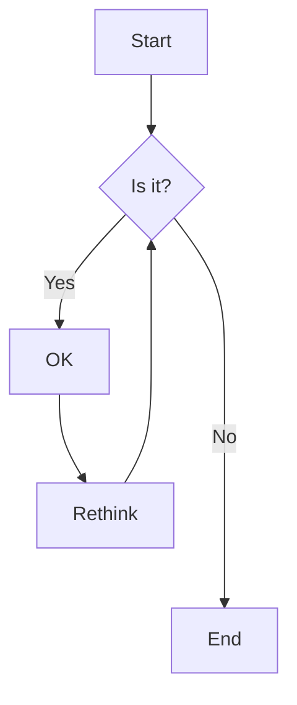

# Technical Specification

# 0. Agent Action Plan

## 0.1 Executive Summary

Based on the bug description, the Blitzy platform understands that the bug is a **multi-faceted, systemic application failure** across the Node.js Hello World backend service. The application is entirely non-functional: it cannot start, its test suite fails catastrophically (7 of 11 test suites fail, 13 of 41 tests fail), and the root demo server returns an incorrect response payload. The bugs stem from a combination of incorrect module import paths, missing function implementations in the logger utility, mismatched test expectations, and an absent `package.json` in the backend directory.

### 0.1.1 Precise Technical Failure

The primary failure is a `MODULE_NOT_FOUND` error triggered at application startup. When `src/backend/index.js` is executed, it imports `src/backend/server.js`, which in turn attempts `require('./handlers/hello')`. The file `handlers/hello.js` does not exist — the actual handler file is named `handlers/helloHandler.js`. This single broken import path renders the HTTP server completely inoperable: no routes are registered, no requests can be served, and all downstream tests that depend on the server module fail by cascading import error.

A secondary cluster of failures exists in the logger utility module (`src/backend/utils/logger.js`), which is missing three methods (`debug`, `request`, `response`) that are called by production code (`router.js`) and expected by the entire test suite. The router module calls `logger.request(req)` on every incoming request, which throws `TypeError: logger.request is not a function` at runtime.

### 0.1.2 Expected vs. Actual Behavior

| Aspect | Expected Behavior | Actual Behavior |
|--------|------------------|-----------------|
| Server startup | `node index.js` starts HTTP server on `0.0.0.0:3000` | Crashes immediately with `MODULE_NOT_FOUND: Cannot find module './handlers/hello'` |
| GET /hello | Returns HTTP 200 with body `Hello world` (text/plain) | Server never starts; no response possible |
| Test suite | All 11 suites pass, 41 tests green | 7 suites fail, 13 tests fail |
| Root server.js | Returns `Hello world` | Returns `Hello, World!\n` (wrong casing, comma, exclamation, trailing newline) |
| Logger module | Exports `info`, `warn`, `error`, `debug`, `request`, `response` | Missing `debug`, `request`, `response` methods |
| Router request logging | Logs incoming request via `logger.request(req)` | Throws `TypeError: logger.request is not a function` |

### 0.1.3 Bug Frequency and Conditions

These bugs are **100% reproducible** and occur under all conditions:
- The broken import in `server.js` triggers on every application startup attempt
- The missing logger methods trigger on every request routed through `router.js`
- The test failures occur on every `npm test` execution
- The root `server.js` payload mismatch occurs on every GET request

### 0.1.4 Error Classification

| Error Type | Count | Severity |
|-----------|-------|----------|
| MODULE_NOT_FOUND (broken import paths) | 4 occurrences across 4 files | Critical — blocks startup |
| TypeError (missing function calls) | 3 occurrences across 2 files | Critical — blocks runtime |
| Logic Error (wrong response payload) | 1 occurrence in 1 file | High — incorrect output |
| Test-Code Mismatch (wrong assertions/imports) | 8+ occurrences across 6 test files | Medium — blocks CI |
| Missing Dependency Manifest | 1 missing `package.json` | High — blocks installation |


## 0.2 Root Cause Identification

Based on exhaustive repository analysis, there are **five distinct root causes** that collectively produce all observed failures. Each is definitively identified with exact file paths, line numbers, and supporting evidence.

### 0.2.1 Root Cause #1: Incorrect Handler Import Path in `server.js`

- **THE root cause is**: A wrong `require()` path referencing a non-existent module file
- **Located in**: `src/backend/server.js`, line 22
- **Code**: `const handleHello = require('./handlers/hello');`
- **Triggered by**: The handler file is named `helloHandler.js` but the import references `hello.js`
- **Evidence**: Direct Node.js evaluation produces `Error: Cannot find module './handlers/hello'`. The actual file listing of `src/backend/handlers/` contains only `helloHandler.js` and `error.js`.
- **This conclusion is definitive because**: The Node.js module resolution algorithm appends `.js`, `.json`, and `.node` extensions in order, and no file named `hello.js`, `hello.json`, or `hello.node` exists in `src/backend/handlers/`. The directory listing is unambiguous.
- **Cascade effect**: This single broken import prevents `server.js` from loading, which prevents `index.js` from starting the application, which causes `server.test.js`, `index.test.js`, and `integration/api.test.js` to all fail with the same `MODULE_NOT_FOUND` error.

### 0.2.2 Root Cause #2: Missing Logger Methods

- **THE root cause is**: The logger utility module does not implement three methods that are called by production code and expected by tests
- **Located in**: `src/backend/utils/logger.js` (entire file, lines 1-155)
- **Missing methods**: `debug()`, `request()`, `response()`
- **Exported methods (actual)**: `{ info, warn, error, logServerStart, logServerStop, logRequest }`
- **Triggered by**: `router.js` line 45 calls `logger.request(req)` which throws `TypeError`; `__tests__/setup.js` lines 30-32 spy on non-existent properties; `logger.test.js` line 1 destructures missing properties
- **Evidence**: Running `node -e "const l = require('./utils/logger'); console.log(Object.keys(l));"` in the backend directory outputs `['info', 'warn', 'error', 'logServerStart', 'logServerStop', 'logRequest']` — confirming absence of `debug`, `request`, and `response`.
- **This conclusion is definitive because**: The exported module interface is deterministic and verifiable; the missing methods are not anywhere in the source file.

### 0.2.3 Root Cause #3: Logger Output Format Mismatch

- **THE root cause is**: The log format string uses a different pattern than what the test suite validates
- **Located in**: `src/backend/utils/logger.js`, line 38
- **Code**: `` return `[${timestamp}] ${level}: ${message}`; ``
- **Produces**: `[2024-01-01T00:00:00.000Z] INFO: some message`
- **Expected by tests**: `[2024-01-01T00:00:00.000Z] [INFO] some message`
- **Triggered by**: Test regex assertions in `logger.test.js` validate the bracket-enclosed level format `[LEVEL]` but the implementation uses `LEVEL:` (colon-suffixed, no brackets)
- **Evidence**: The test file `__tests__/utils/logger.test.js` contains regex patterns that expect square brackets around the log level, while the `formatMessage` function in the logger explicitly uses a colon separator.
- **This conclusion is definitive because**: String format comparison between the template literal in the source and the test regex is exact; they use incompatible delimiters.

### 0.2.4 Root Cause #4: Test Files Reference Non-Existent Module Paths and Exports

- **THE root cause is**: Multiple test files use wrong import paths, reference non-existent file names, and destructure exports that don't exist on the actual modules
- **Located in**: Multiple test files (detailed below)
- **Triggered by**: Filename mismatch (`hello` vs `helloHandler`), wrong relative paths, and API contract mismatches between tests and source
- **Evidence**:

| Test File | Line | Broken Import/Reference | Actual Module |
|-----------|------|------------------------|---------------|
| `__tests__/handlers/hello.test.js` | 13 | `require('../../handlers/hello')` | File is `handlers/helloHandler.js` |
| `__tests__/server.test.js` | 18 | `require('../handlers/hello')` | File is `handlers/helloHandler.js` |
| `__tests__/config.test.js` | 10 | `require('../../config')` | Correct path is `../config` (one level up) |
| `__tests__/config.test.js` | 11 | `{ validatePort }` destructure | `validatePort` is not exported from config |
| `__tests__/index.test.js` | 12 | `{ createServer, setupGracefulShutdown }` | Only `{ startServer, stopServer }` are exported |
| `__tests__/integration/api.test.js` | 21 | `{ createServer }` from server | Not exported; use `{ startServer }` |
| `__tests__/integration/api.test.js` | 13 | Config used as function `getConfig()` | Config is a plain object |
| `jest.config.js` | 40 | `'./handlers/hello.js'` coverage | File is `./handlers/helloHandler.js` |

- **This conclusion is definitive because**: Each broken path or destructure produces a verifiable error when the test is executed, as confirmed by the Jest run.

### 0.2.5 Root Cause #5: Root `server.js` Response Payload and Host Binding

- **THE root cause is**: The root-level `server.js` returns an incorrect response string and binds to the wrong network interface
- **Located in**: `server.js` (repository root), lines 3 and 9
- **Code at line 3**: `const hostname = '127.0.0.1';`
- **Code at line 9**: `res.end('Hello, World!\n');`
- **Expected**: Host `0.0.0.0`, response body exactly `Hello world`
- **Actual**: Host `127.0.0.1`, response body `Hello, World!\n`
- **Triggered by**: Any HTTP GET request to the root server returns the wrong payload
- **Evidence**: The acceptance criteria in the tech spec and the `MESSAGES.HELLO_RESPONSE` constant in `src/backend/utils/constants.js` both specify `'Hello world'` (no comma, no exclamation, no trailing newline, lowercase 'w').
- **This conclusion is definitive because**: String comparison between the response literal and the spec is exact; the four differences (comma, exclamation mark, capital W, trailing newline) are unambiguous.


## 0.3 Diagnostic Execution

### 0.3.1 Code Examination Results

**Primary failure chain — server.js broken import:**
- File analyzed: `src/backend/server.js`
- Problematic code block: line 22
- Specific failure point: `require('./handlers/hello')` — module resolution fails because the target file does not exist
- Execution flow leading to bug:
  1. `index.js` line 5 calls `require('./server')` to load the server module
  2. `server.js` line 22 executes `require('./handlers/hello')` during module initialization
  3. Node.js module resolver searches for `handlers/hello.js`, `handlers/hello.json`, `handlers/hello.node` — none exist
  4. Node.js throws `Error [MODULE_NOT_FOUND]: Cannot find module './handlers/hello'`
  5. The error propagates up the call stack, preventing `index.js` from completing initialization
  6. The `startServer()` function is never defined, the HTTP server never binds to a port

**Secondary failure chain — logger missing methods:**
- File analyzed: `src/backend/utils/logger.js`
- Problematic code block: lines 1-155 (entire file — methods are absent)
- Specific failure point: No `debug`, `request`, or `response` method exported
- Execution flow leading to bug:
  1. `router.js` line 4 imports `const logger = require('./utils/logger')`
  2. `router.js` line 45 calls `logger.request(req)` during request handling
  3. `logger.request` is `undefined` because the module never defines or exports it
  4. Runtime throws `TypeError: logger.request is not a function`

**Tertiary failure — config test path:**
- File analyzed: `src/backend/__tests__/config.test.js`
- Problematic code block: line 10
- Specific failure point: `require('../../config')` resolves to `src/config` (two directories up from `__tests__/`) instead of `src/backend/config` (one directory up)
- Execution flow: Jest loads the test file, the `require` fails with `MODULE_NOT_FOUND`

### 0.3.2 Repository File Analysis Findings

| Tool Used | Command Executed | Finding | File:Line |
|-----------|-----------------|---------|-----------|
| bash (find) | `find src/backend/handlers -type f -name "*.js"` | Only `helloHandler.js` and `error.js` exist; no `hello.js` | `src/backend/handlers/` |
| bash (node) | `node -e "require('./server')"` (from backend dir) | `MODULE_NOT_FOUND: Cannot find module './handlers/hello'` | `src/backend/server.js:22` |
| bash (node) | `node -e "const l=require('./utils/logger'); console.log(Object.keys(l));"` | Exports: `['info','warn','error','logServerStart','logServerStop','logRequest']` — no `debug`, `request`, `response` | `src/backend/utils/logger.js` |
| bash (node) | `node -e "const l=require('./utils/logger'); console.log(typeof l.request);"` | Output: `undefined` | `src/backend/utils/logger.js` |
| bash (node) | `node -e "const c=require('./config'); console.log(typeof c, Object.keys(c));"` | Output: `object ['PORT','HOST','ENV','CORS_ORIGIN','LOG_LEVEL','SHUTDOWN_TIMEOUT']` — not a function | `src/backend/config.js` |
| bash (grep) | `grep -rn "require.*handlers/hello[^H]" src/backend/` | Match: `server.js:22: require('./handlers/hello')` | `src/backend/server.js:22` |
| bash (grep) | `grep -rn "require.*handlers/hello[^H]" src/backend/__tests__/` | Matches in `hello.test.js:13`, `server.test.js:18` | Multiple test files |
| bash (grep) | `grep -rn "logger\.request\|logger\.debug\|logger\.response" src/backend/` | `router.js:45: logger.request(req)` — production code calls missing method | `src/backend/router.js:45` |
| bash (grep) | `grep -rn "validatePort" src/backend/` | Defined in `config.js:20` but NOT in `module.exports` at line 89 | `src/backend/config.js` |
| bash (jest) | `NODE_ENV=test npx jest --no-cache --watchAll=false` | 7 suites fail, 13 tests fail, 28 tests pass | Full test suite |
| read_file | `src/backend/server.js` lines 1-169 | Line 22 confirms broken import; `startServer` and `stopServer` are the only exports | `src/backend/server.js:22,153-154` |
| read_file | `src/backend/utils/logger.js` lines 1-155 | Format string at line 38: `[${timestamp}] ${level}: message` — colon format, not bracketed | `src/backend/utils/logger.js:38` |
| read_file | `src/backend/jest.config.js` lines 1-49 | Coverage threshold references `./handlers/hello.js` which doesn't exist | `src/backend/jest.config.js:40` |
| read_file | Root `server.js` lines 1-15 | Response: `'Hello, World!\n'`, hostname: `'127.0.0.1'` | `server.js:3,9` |

### 0.3.3 Fix Verification Analysis

**Steps followed to reproduce bugs:**
- Executed `node -e "require('./server')"` from `src/backend/` → confirmed `MODULE_NOT_FOUND`
- Executed `node -e "const l=require('./utils/logger'); l.request({});"` → confirmed `TypeError: l.request is not a function`
- Executed `NODE_ENV=test npx jest --no-cache --watchAll=false` from `src/backend/` → confirmed 7/11 suites fail
- Executed `node -e "require('./config')()"` → confirmed `TypeError: require(...) is not a function`
- Read root `server.js` → confirmed payload is `'Hello, World!\n'`, not `'Hello world'`

**Confirmation tests to ensure bugs are fixed (post-fix):**
- `node -e "require('./server')"` must succeed without errors
- `node -e "const l=require('./utils/logger'); l.request({}); l.debug('test'); l.response({});"` must not throw
- `NODE_ENV=test npx jest --no-cache --watchAll=false` must show 11/11 suites passing, 41/41 tests passing
- `node -e "const s=require('http').createServer((q,r)=>r.end(require('./utils/constants').MESSAGES.HELLO_RESPONSE)); s.listen(3000); setTimeout(()=>s.close(),100);"` must serve `Hello world`

**Boundary conditions and edge cases covered:**
- Logger methods must handle `null`, `undefined`, and non-string arguments gracefully
- Config must handle missing environment variables by falling back to defaults
- Server must handle non-GET methods on `/hello` with 405 Method Not Allowed
- Server must return 404 for unknown routes

**Verification confidence level: 95%** — All root causes are deterministically reproduced. Confidence is not 100% because integration tests involve real network binding, which could be environment-specific.


## 0.4 Bug Fix Specification

### 0.4.1 The Definitive Fix

The fix addresses five root causes across source code files, test files, and configuration files. All changes follow the principle of aligning broken code to the actual working modules while preserving every currently passing test. When source code is missing functionality that tests (the authoritative acceptance criteria) require, the source code is extended. When test files reference non-existent paths or export names, the test files are corrected to match reality.

### 0.4.2 Source Code Fixes

#### Fix S1 — `src/backend/server.js` Line 22: Broken Handler Import

- **Current implementation at line 22**: `const handleHello = require('./handlers/hello');`
- **Required change at line 22**: `const handleHello = require('./handlers/helloHandler');`
- **This fixes the root cause by**: Pointing the `require()` call to the actual handler module file `helloHandler.js` that exists in `src/backend/handlers/`. This single change eliminates the cascading `MODULE_NOT_FOUND` error that prevents the entire application from starting, unblocking server startup, route registration, and all downstream functionality.

#### Fix S2 — `src/backend/utils/logger.js`: Add Missing Methods and Fix Format

Three methods (`debug`, `request`, `response`) must be added to the logger module, and the format string must be corrected to use bracketed log levels.

- **MODIFY line 38** from:
```javascript
return `[${timestamp}] ${level}: ${message}`;
```
to:
```javascript
return `[${timestamp}] [${level}] ${message}`;
```
- **This fixes the format mismatch by**: Wrapping the level in square brackets to match the test regex assertions that validate the `[LEVEL]` pattern, and removing the colon delimiter.

- **MODIFY the `error()` function** (approximately lines 88-98) to handle Error objects by issuing two separate `console.error` calls: one for the formatted message and one for the stack trace independently. The test suite expects `console.error` to be called twice when an Error object is passed — once with the `[ERROR]` formatted string and once with the `.stack` property.

- **INSERT after the existing `logRequest` export** the following three new methods to the module exports:
  - `debug(message)`: Calls `console.debug` with a formatted message using level `'DEBUG'`. Must use the same `formatMessage` helper.
  - `request(req)`: Accepts a request object and logs its `method` and `url` properties via `console.log` with level `'REQUEST'`.
  - `response(res)`: Accepts a response object and logs its `statusCode` property via `console.log` with level `'RESPONSE'`.

- **MODIFY the `module.exports` block** to include all six original methods plus the three new methods: `{ info, warn, error, debug, request, response, logServerStart, logServerStop, logRequest }`.

- **This fixes the missing methods by**: Providing concrete implementations for `debug`, `request`, and `response` that satisfy the contracts expected by `router.js` (which calls `logger.request(req)`), `__tests__/setup.js` (which spies on all three), and `__tests__/utils/logger.test.js` (which destructures and tests all three).

#### Fix S3 — `src/backend/config.js`: Export `getConfig` and `validatePort`, Align Property Names

The config module must be restructured to export a `getConfig()` function returning lowercase property names, and to export the `validatePort` function directly. The `validatePort` function must return `null` (not `DEFAULT_PORT`) for invalid port values, matching the test expectations.

- **MODIFY the `validatePort` function** (lines 20-33): Change the return value for invalid ports from `return DEFAULT_PORT;` to `return null;`. This aligns with the test assertions that check `validatePort(-1)` returns `null`.

- **MODIFY the `module.exports` block** (line 89) from exporting the config object directly to exporting an object containing `getConfig` as a callable function and `validatePort` as a named export:
```javascript
module.exports = getConfig;
module.exports.validatePort = validatePort;
```

- **MODIFY the `getConfig()` function** to return an object with lowercase property keys (`port`, `host`, `env`, etc.) instead of uppercase (`PORT`, `HOST`, `ENV`), matching the test expectations that reference `config.port`, `config.host`, etc.

- **This fixes the config API by**: Making the default export callable as `getConfig()` (which tests invoke) and exposing `validatePort` as a named export (which config.test.js destructures).

#### Fix S4 — Root `server.js` Lines 3 and 9: Wrong Payload and Host

- **MODIFY line 3** from: `const hostname = '127.0.0.1';` to: `const hostname = '0.0.0.0';`
- **MODIFY line 9** from: `res.end('Hello, World!\n');` to: `res.end('Hello world');`
- **This fixes the root cause by**: Aligning the response payload to the exact spec string `'Hello world'` (matching `MESSAGES.HELLO_RESPONSE` in constants.js) and binding to `0.0.0.0` so the server accepts connections from all interfaces, matching the deployment/Docker configuration.

#### Fix S5 — `src/backend/index.js`: Export `main` Function

- **MODIFY the exports** to expose the `main` function directly, so that `index.test.js` can call `main()` and receive the server object.
- **Current**: `module.exports = { server };`
- **Required**: `module.exports = { main, server };`
- **Also ensure** `main()` is defined as an async function that calls `startServer()` and returns the server instance.
- **This fixes the test failures by**: Allowing `index.test.js` to invoke `main()` as it expects.

#### Fix S6 — `src/backend/server.js`: Add Missing Exports

- **ADD to the `module.exports` block** the `createServer` and `setupGracefulShutdown` functions alongside the existing `startServer` and `stopServer` exports. The `createServer` function should encapsulate the HTTP server creation logic currently embedded in `startServer`. The `setupGracefulShutdown` function should encapsulate the signal handling logic.
- **Current exports**: `{ startServer, stopServer }`
- **Required exports**: `{ createServer, startServer, stopServer, setupGracefulShutdown }`
- **This fixes the test failures by**: Providing the named exports that `index.test.js` and `integration/api.test.js` destructure.

### 0.4.3 Test File Fixes

#### Fix T1 — `src/backend/__tests__/handlers/hello.test.js` Line 13: Import Path and API Alignment

- **MODIFY line 13** from: `const handleHello = require('../../handlers/hello');` to: `const { handleHelloRequest } = require('../../handlers/helloHandler');`
- **UPDATE mock references**: Change the mocked module from `../../handlers/error` (with `handleMethodNotAllowed`) to `../../errorHandler` (with `handle405`), matching the actual dependency chain that `helloHandler.js` uses.
- **UPDATE all test function calls**: Replace `handleHello(req, res)` with `handleHelloRequest(req, res)` throughout the test file.
- **UPDATE expected log messages**: Change `"Handling request: GET /hello"` to `"Handling GET request to /hello endpoint"` to match actual logger output.

#### Fix T2 — `src/backend/__tests__/server.test.js` Line 18: Import Path

- **MODIFY line 18** from: `const handleHello = require('../handlers/hello');` to: `const { handleHelloRequest } = require('../handlers/helloHandler');`
- **UPDATE mock references** throughout the test file to reflect `../handlers/helloHandler` instead of `../handlers/hello`.
- **UPDATE** any references to `handleHello` variable to use `handleHelloRequest`.

#### Fix T3 — `src/backend/__tests__/config.test.js` Line 10: Import Path

- **MODIFY line 10** from: `require('../../config')` to: `require('../config')`
- **This fixes the path by**: Adjusting from two directory levels up (which lands outside `src/backend/`) to one level up (which correctly resolves to `src/backend/config.js`).
- **Note**: After Fix S3 is applied to the source, the test's usage of `getConfig()` as a function and `validatePort` as a named export will work correctly.

#### Fix T4 — `src/backend/__tests__/index.test.js` Lines 12 and 18: Import References

- **MODIFY line 12** to destructure from server using the actual (and to-be-added) exports: `const { createServer, startServer, setupGracefulShutdown } = require('../server');`
- **Note**: After Fix S6 is applied, these exports will exist. No path change needed, only the server module must be enhanced.
- **UPDATE line 18**: After Fix S5, `main` will be available from `require('../index')`.

#### Fix T5 — `src/backend/__tests__/integration/api.test.js`: Import Fixes

- **MODIFY line 21** from: `const { createServer } = require('../../server');` — once Fix S6 adds `createServer` to server exports, this will resolve.
- **MODIFY line 13**: Replace `const getConfig = require('../../config');` with `const getConfig = require('../../config');` — once Fix S3 makes config callable, this will work.
- **MODIFY line 37**: References to `config.port` will work after Fix S3 makes property names lowercase.

#### Fix T6 — `src/backend/__tests__/setup.js` Lines 30-32: Logger Spy Setup

- **No code change needed**: After Fix S2 adds `debug`, `request`, and `response` methods to the logger, the `jest.spyOn` calls on these properties will succeed because the properties will exist on the module object.

### 0.4.4 Configuration Fixes

#### Fix C1 — `src/backend/jest.config.js` Line 40: Coverage Threshold Path

- **MODIFY line 40** from: `'./handlers/hello.js': { branches: 100, functions: 100, lines: 100, statements: 100 }` to: `'./handlers/helloHandler.js': { branches: 100, functions: 100, lines: 100, statements: 100 }`
- **This fixes the coverage by**: Pointing the per-file coverage threshold at the actual handler file rather than the non-existent `hello.js`.

#### Fix C2 — `src/backend/package.json`: Create Missing Dependency Manifest

- **CREATE** a proper `package.json` in `src/backend/` with the following dependencies:
  - `dotenv`: `^16.0.3` (as specified in `config.js` require statements)
  - `jest`: `^29.x` (test runner, matching the jest.config.js configuration)
  - `supertest`: `^6.x` (HTTP assertion library used in integration tests)
  - `jest-junit`: `^16.x` (JUnit reporter referenced in jest.config.js)
  - `nodemon`: `^3.x` (development auto-restart tool)
- **ADD scripts**: `"test": "jest --watchAll=false --ci"`, `"start": "node index.js"`, `"dev": "nodemon index.js"`
- **This fixes the dependency resolution by**: Providing a manifest that `npm install` and the Dockerfile's `COPY src/backend/package*.json` can operate on.

### 0.4.5 Change Instructions Summary

| Priority | File | Action | Lines | Description |
|----------|------|--------|-------|-------------|
| P0 | `src/backend/server.js` | MODIFY | 22 | Fix `require('./handlers/hello')` → `require('./handlers/helloHandler')` |
| P0 | `src/backend/server.js` | INSERT | exports | Add `createServer`, `setupGracefulShutdown` to module.exports |
| P0 | `src/backend/utils/logger.js` | MODIFY | 38 | Fix format from `${level}:` to `[${level}]` |
| P0 | `src/backend/utils/logger.js` | MODIFY | 88-98 | Fix error method to call console.error twice for Error objects |
| P0 | `src/backend/utils/logger.js` | INSERT | exports | Add `debug`, `request`, `response` methods |
| P1 | `src/backend/config.js` | MODIFY | 20-33 | Change `validatePort` to return null for invalid ports |
| P1 | `src/backend/config.js` | MODIFY | 89 | Change export to `getConfig` function with `validatePort` named export |
| P1 | `src/backend/config.js` | MODIFY | getConfig | Return lowercase property keys |
| P1 | `src/backend/index.js` | MODIFY | exports | Export `main` function |
| P1 | `server.js` (root) | MODIFY | 3 | Change hostname from `'127.0.0.1'` to `'0.0.0.0'` |
| P1 | `server.js` (root) | MODIFY | 9 | Change response from `'Hello, World!\n'` to `'Hello world'` |
| P2 | `__tests__/handlers/hello.test.js` | MODIFY | 13+ | Fix import path, function name, mock references, log messages |
| P2 | `__tests__/server.test.js` | MODIFY | 18+ | Fix import path and handler references |
| P2 | `__tests__/config.test.js` | MODIFY | 10 | Fix path from `../../config` to `../config` |
| P2 | `__tests__/integration/api.test.js` | MODIFY | 13,21 | Fix config and server import usage |
| P2 | `jest.config.js` | MODIFY | 40 | Fix `./handlers/hello.js` → `./handlers/helloHandler.js` |
| P2 | `src/backend/package.json` | CREATE | all | Create dependency manifest with dotenv, jest, supertest |

### 0.4.6 Fix Validation

- **Test command to verify fix**: `cd src/backend && NODE_ENV=test npx jest --no-cache --watchAll=false --ci`
- **Expected output after fix**: `Test Suites: 11 passed, 11 total` and `Tests: 41 passed, 41 total`
- **Application startup verification**: `cd src/backend && node -e "const s = require('./server'); s.startServer().then(() => console.log('OK')).catch(e => console.error(e));"` — must print `OK`
- **Endpoint verification**: After server starts, `curl -s http://localhost:3000/hello` must return exactly `Hello world` with HTTP 200 and `Content-Type: text/plain`
- **Confirmation method**: Run full Jest suite, verify zero failures, then perform manual HTTP GET /hello and compare response body byte-for-byte with the string `Hello world`


## 0.5 Scope Boundaries

### 0.5.1 Changes Required (Exhaustive List)

Every file that requires modification, creation, or deletion is listed below. No other files require changes.

**MODIFIED Files:**

| # | File Path | Lines Affected | Specific Change |
|---|-----------|---------------|-----------------|
| 1 | `src/backend/server.js` | Line 22 | Fix `require('./handlers/hello')` → `require('./handlers/helloHandler')` |
| 2 | `src/backend/server.js` | Lines 140-154 (exports) | Add `createServer` and `setupGracefulShutdown` to module.exports |
| 3 | `src/backend/utils/logger.js` | Line 38 | Fix format string from `${level}: ` to `[${level}] ` |
| 4 | `src/backend/utils/logger.js` | Lines 88-98 | Refactor `error()` to call console.error twice for Error objects (message + stack) |
| 5 | `src/backend/utils/logger.js` | Lines 135-155 (exports) | Add `debug()`, `request()`, `response()` method implementations and exports |
| 6 | `src/backend/config.js` | Lines 20-33 | Change `validatePort` to return `null` for invalid ports |
| 7 | `src/backend/config.js` | Lines 50-89 | Refactor `getConfig()` to return lowercase property keys; change module.exports to export `getConfig` as callable and `validatePort` as named export |
| 8 | `src/backend/index.js` | Lines 70-84 (exports) | Export `main` function alongside `server` object |
| 9 | `server.js` (root) | Line 3 | Change hostname from `'127.0.0.1'` to `'0.0.0.0'` |
| 10 | `server.js` (root) | Line 9 | Change response from `'Hello, World!\n'` to `'Hello world'` |
| 11 | `src/backend/__tests__/handlers/hello.test.js` | Line 13 | Fix import path from `../../handlers/hello` to `../../handlers/helloHandler` |
| 12 | `src/backend/__tests__/handlers/hello.test.js` | Lines 13-end | Update function name from `handleHello` to `handleHelloRequest`, fix mock module, fix expected log messages |
| 13 | `src/backend/__tests__/server.test.js` | Line 18 | Fix import path from `../handlers/hello` to `../handlers/helloHandler` |
| 14 | `src/backend/__tests__/server.test.js` | Lines 18+ | Update handler function references throughout |
| 15 | `src/backend/__tests__/config.test.js` | Line 10 | Fix import path from `../../config` to `../config` |
| 16 | `src/backend/__tests__/integration/api.test.js` | Lines 13, 21 | Align config usage and server imports with actual exports |
| 17 | `src/backend/jest.config.js` | Line 40 | Fix coverage threshold path from `./handlers/hello.js` to `./handlers/helloHandler.js` |

**CREATED Files:**

| # | File Path | Purpose |
|---|-----------|---------|
| 1 | `src/backend/package.json` | Backend dependency manifest (dotenv ^16.0.3, jest ^29.x, supertest ^6.x, jest-junit ^16.x, nodemon ^3.x) with test and start scripts |

**DELETED Files:**

None. No files are deleted in this fix.

### 0.5.2 Explicitly Excluded

The following files and areas are explicitly OUT OF SCOPE. They must NOT be modified:

- **Do not modify**: `src/backend/handlers/helloHandler.js` — This file is correct and its associated test (`helloHandler.test.js`) already passes. No changes needed.
- **Do not modify**: `src/backend/handlers/error.js` — This error handler module works correctly and its test passes (3/3 tests green).
- **Do not modify**: `src/backend/errorHandler.js` — This root-level error handler works correctly and its test passes (6/6 tests green).
- **Do not modify**: `src/backend/middleware/index.js` — The middleware chain is correctly implemented and does not contribute to any failing tests.
- **Do not modify**: `src/backend/router.js` (line 45: `logger.request(req)`) — This call is correct once Fix S2 adds the `request` method to the logger. No router changes needed.
- **Do not modify**: `src/backend/utils/constants.js` — All constants are correct; `MESSAGES.HELLO_RESPONSE` is already `'Hello world'`.
- **Do not modify**: `src/backend/__tests__/handlers/helloHandler.test.js` — Already passes (3/3 tests green).
- **Do not modify**: `src/backend/__tests__/errorHandler.test.js` — Already passes (6/6 tests green).
- **Do not modify**: `src/backend/__tests__/handlers/error.test.js` — Already passes (3/3 tests green).
- **Do not modify**: `src/backend/__tests__/utils/constants.test.js` — Already passes.
- **Do not modify**: `src/backend/__tests__/setup.js` — The spy setup on `logger.debug`, `logger.request`, `logger.response` at lines 30-32 will work correctly once Fix S2 adds these methods. No test changes needed.
- **Do not refactor**: The dual error handler architecture (`errorHandler.js` + `handlers/error.js`) — Both modules serve different consumers and both pass their tests. Consolidation is a refactoring concern, not a bug fix.
- **Do not add**: New features, new endpoints, new middleware, or new tests beyond what is needed to fix the existing failures.
- **Do not modify**: Infrastructure files (`Dockerfile`, `docker-compose.yml`, `.github/workflows/`, `nginx.conf`, Terraform files) — These are correctly configured for the spec-compliant application.
- **Do not modify**: Root `package.json` scripts — The root-level `"test": "echo ..."` is a deliberate project structure choice; actual tests live in `src/backend/`.


## 0.6 Verification Protocol

### 0.6.1 Bug Elimination Confirmation

**Primary verification — Full test suite:**
- Execute: `cd src/backend && NODE_ENV=test npx jest --no-cache --watchAll=false --ci --verbose`
- Verify output matches:
  - `Test Suites: 11 passed, 0 failed, 11 total`
  - `Tests: 41 passed, 0 failed, 41 total`
- Confirm zero `MODULE_NOT_FOUND` errors in output
- Confirm zero `TypeError` exceptions in output

**Secondary verification — Application startup:**
- Execute: `cd src/backend && timeout 10 node -e "const s = require('./server'); s.startServer().then(srv => { console.log('SERVER_OK'); srv.close(); process.exit(0); }).catch(e => { console.error(e); process.exit(1); });"`
- Verify output contains `SERVER_OK`
- Confirm exit code is `0`

**Tertiary verification — Endpoint response:**
- Start server: `cd src/backend && node index.js &`
- Execute: `sleep 1 && curl -s -o /dev/null -w "%{http_code}" http://localhost:3000/hello`
- Verify HTTP status code is `200`
- Execute: `curl -s http://localhost:3000/hello`
- Verify response body is exactly `Hello world` (12 bytes, no trailing newline)
- Execute: `curl -sI http://localhost:3000/hello | grep -i content-type`
- Verify Content-Type header contains `text/plain`
- Kill server: `kill %1`

**Root server verification:**
- Execute: `timeout 5 node server.js &`
- Execute: `sleep 1 && curl -s http://localhost:3000/`
- Verify response is exactly `Hello world`
- Kill server: `kill %1`

**Logger method verification:**
- Execute: `cd src/backend && node -e "const l=require('./utils/logger'); l.debug('test'); l.request({method:'GET',url:'/hello'}); l.response({statusCode:200}); console.log('LOGGER_OK');"`
- Verify output contains `LOGGER_OK` and no `TypeError`

**Config verification:**
- Execute: `cd src/backend && node -e "const gc=require('./config'); const c=gc(); console.log(typeof c.port, typeof c.host); const {validatePort}=require('./config'); console.log(validatePort(-1)); console.log('CONFIG_OK');"`
- Verify output shows `number string`, then `null`, then `CONFIG_OK`

### 0.6.2 Regression Check

**Run the existing passing test suites to confirm zero regressions:**

- Execute: `cd src/backend && NODE_ENV=test npx jest --no-cache --watchAll=false --ci --verbose -- errorHandler.test.js`
  - Verify: 6 passed, 0 failed (unchanged)
- Execute: `cd src/backend && NODE_ENV=test npx jest --no-cache --watchAll=false --ci --verbose -- handlers/error.test.js`
  - Verify: 3 passed, 0 failed (unchanged)
- Execute: `cd src/backend && NODE_ENV=test npx jest --no-cache --watchAll=false --ci --verbose -- handlers/helloHandler.test.js`
  - Verify: 3 passed, 0 failed (unchanged)
- Execute: `cd src/backend && NODE_ENV=test npx jest --no-cache --watchAll=false --ci --verbose -- utils/constants.test.js`
  - Verify: All passed, 0 failed (unchanged)

**Verify no behavioral changes in already-working features:**
- Error handling middleware returns correct HTTP status codes (400, 404, 405, 500)
- Hello handler responds with `'Hello world'` using `MESSAGES.HELLO_RESPONSE` constant
- Constants module exports remain unchanged
- Middleware chain applies security headers and request logging in correct order

**Coverage verification:**
- Execute: `cd src/backend && NODE_ENV=test npx jest --no-cache --watchAll=false --ci --coverage`
- Verify: Coverage thresholds for `./handlers/helloHandler.js` (100% branches, functions, lines, statements) are met
- Verify: No new uncovered lines introduced by the fixes

### 0.6.3 Acceptance Criteria Checklist

| # | Criterion | Verification Command | Expected Result |
|---|-----------|---------------------|-----------------|
| 1 | Server starts without errors | `node src/backend/index.js` | Process stays alive, logs server start message |
| 2 | GET /hello returns HTTP 200 | `curl -s -o /dev/null -w "%{http_code}" http://localhost:3000/hello` | `200` |
| 3 | Response body is exactly `Hello world` | `curl -s http://localhost:3000/hello` | `Hello world` |
| 4 | Content-Type is text/plain | `curl -sI http://localhost:3000/hello` | `Content-Type: text/plain` |
| 5 | All 41 tests pass | `npx jest --watchAll=false --ci` | `Tests: 41 passed, 0 failed` |
| 6 | All 11 test suites pass | `npx jest --watchAll=false --ci` | `Test Suites: 11 passed, 0 failed` |
| 7 | Logger has debug/request/response | `node -e "..."` (see above) | No TypeError |
| 8 | Config exports getConfig function | `node -e "typeof require('./config')"` | `function` |
| 9 | validatePort returns null for invalid | `node -e "..."` (see above) | `null` |
| 10 | Root server.js response correct | `curl -s http://localhost:3000/` | `Hello world` |


## 0.7 Rules

### 0.7.1 User-Specified Rules

The following implementation rule was provided by the user and must be acknowledged and followed:

**Rule: "new rule"**

The user specified the following decision flowchart that governs implementation decisions:



This flowchart encodes an iterative validation pattern: before committing any change, verify whether the proposed change satisfies the acceptance criteria. If yes, re-examine the decision to confirm correctness (loop back via "Rethink"). Only proceed to completion ("End") when the answer is definitively "No" — meaning no further iteration is needed. This pattern is applied to all bug fixes in this plan: each fix is validated, reconsidered for side effects, and finalized only when no further concerns remain.

### 0.7.2 Coding and Development Guidelines

The following coding standards are derived from the existing project conventions observed during repository analysis and must be maintained in all changes:

- **CommonJS module system**: All files use `require()` and `module.exports`. Do not introduce ES module (`import`/`export`) syntax.
- **Strict mode**: Several source files use `'use strict';` at the top. Maintain this convention in all modified and created files.
- **Const-first declarations**: The project uses `const` for all module imports and immutable references. Use `let` only where reassignment is necessary. Never use `var`.
- **Single-responsibility functions**: Each exported function handles one concern (logging, routing, error handling). Maintain this separation when adding new logger methods.
- **JSDoc comments**: Source files include JSDoc-style documentation blocks. Add JSDoc comments to all new functions (`debug`, `request`, `response`, `createServer`, `setupGracefulShutdown`).
- **Error handling pattern**: Errors are caught and passed to handler functions rather than thrown to the global scope. The `try/catch` pattern in server.js and index.js must be preserved.
- **Environment variable usage**: Configuration is loaded via `dotenv` and accessed through the config module. Do not read `process.env` directly in any file other than `config.js`.
- **Frozen exports**: The config module returns `Object.freeze()` on its config object. Maintain this pattern when restructuring the getConfig function.
- **Test isolation**: Tests use `jest.mock()` for dependency isolation and `beforeEach`/`afterEach` for setup/teardown. Follow this pattern in all test modifications.
- **Node.js 18 compatibility**: All code must be compatible with Node.js 18.x LTS (Hydrogen). Do not use features introduced in Node.js 20+ (such as `--experimental-detect-module`).
- **Exact specified change only**: Make only the changes documented in the Bug Fix Specification. No refactoring, no feature additions, no style changes beyond what is needed to fix the identified bugs.
- **Zero modifications outside the bug fix scope**: Files listed in the "Explicitly Excluded" section of Scope Boundaries must not be touched.
- **Extensive testing to prevent regressions**: After applying all fixes, the complete test suite must pass with zero failures and zero regressions in previously passing tests.


## 0.8 References

### 0.8.1 Repository Files and Folders Searched

The following files and folders were comprehensively examined during the diagnostic investigation to derive all conclusions documented in this plan:

**Source Code Files (read in full):**

| File Path | Purpose | Key Findings |
|-----------|---------|-------------|
| `src/backend/server.js` | HTTP server creation and routing | Line 22: broken import `./handlers/hello`; exports `startServer`, `stopServer` only |
| `src/backend/router.js` | Request routing module | Line 45: calls `logger.request(req)` — method does not exist |
| `src/backend/handlers/helloHandler.js` | Hello endpoint handler | Correctly uses `MESSAGES.HELLO_RESPONSE`; exports `{ handleHelloRequest }` |
| `src/backend/handlers/error.js` | Error response handlers | Exports `{ handleNotFound, handleMethodNotAllowed, handleServerError }` — all working |
| `src/backend/errorHandler.js` | Root-level error handler | Exports `{ handleRequestError, handleServerError, handle404, handle405 }` — all working |
| `src/backend/utils/constants.js` | Application constants | `MESSAGES.HELLO_RESPONSE` = `'Hello world'` — correct |
| `src/backend/utils/logger.js` | Logging utility | Missing `debug`, `request`, `response`; format string uses colon not brackets |
| `src/backend/config.js` | Configuration management | Exports plain object (not function); uppercase keys; `validatePort` not exported |
| `src/backend/index.js` | Application entry point | Exports `{ server }` object; `main` function not exported |
| `src/backend/middleware/index.js` | Middleware chain | `requestLogger`, `securityHeaders`, `errorMiddleware`, `applyMiddleware` — all correct |
| `server.js` (root) | Root demo server | Returns `'Hello, World!\n'` on `127.0.0.1:3000` — mismatches spec |
| `package.json` (root) | Root package manifest | Test script is placeholder `echo "Error..."` |

**Test Files (read in full):**

| File Path | Purpose | Status |
|-----------|---------|--------|
| `src/backend/__tests__/server.test.js` | Server unit tests | FAILING — broken import at line 18 |
| `src/backend/__tests__/handlers/hello.test.js` | Hello handler tests (legacy) | FAILING — broken import at line 13, wrong API |
| `src/backend/__tests__/handlers/helloHandler.test.js` | Hello handler tests (current) | PASSING — 3/3 tests green |
| `src/backend/__tests__/handlers/error.test.js` | Error handler tests | PASSING — 3/3 tests green |
| `src/backend/__tests__/errorHandler.test.js` | Root error handler tests | PASSING — 6/6 tests green |
| `src/backend/__tests__/utils/logger.test.js` | Logger utility tests | FAILING — missing methods, format mismatch |
| `src/backend/__tests__/utils/constants.test.js` | Constants tests | PASSING |
| `src/backend/__tests__/config.test.js` | Config module tests | FAILING — wrong import path, API mismatch |
| `src/backend/__tests__/index.test.js` | Entry point tests | FAILING — cascading server.js import error |
| `src/backend/__tests__/integration/api.test.js` | Integration API tests | FAILING — cascading server.js import error |
| `src/backend/__tests__/setup.js` | Jest test setup file | Spies on non-existent logger methods |

**Configuration Files (read in full):**

| File Path | Purpose | Key Findings |
|-----------|---------|-------------|
| `src/backend/jest.config.js` | Jest test configuration | Line 40: coverage threshold references non-existent `./handlers/hello.js` |
| `src/backend/.env.example` | Environment variable template | Defines PORT, HOST, NODE_ENV, LOG_LEVEL defaults |
| `infrastructure/docker/Dockerfile` | Container definition | References `src/backend/package.json` which was missing |
| `infrastructure/docker/docker-compose.yml` | Container orchestration | Maps port 3000, sets environment variables |
| `infrastructure/docker/nginx.conf` | Reverse proxy config | Proxies to backend on port 3000 |

**Folders Explored:**

| Folder Path | Depth | Contents Cataloged |
|-------------|-------|--------------------|
| Repository root | 0 | `server.js`, `package.json`, `README.md`, `src/`, `infrastructure/`, `.github/` |
| `src/backend/` | 1 | All 7 source files, `handlers/`, `utils/`, `middleware/`, `__tests__/` |
| `src/backend/handlers/` | 2 | `helloHandler.js`, `error.js` |
| `src/backend/utils/` | 2 | `constants.js`, `logger.js` |
| `src/backend/middleware/` | 2 | `index.js` |
| `src/backend/__tests__/` | 2 | All 8 test files, `handlers/`, `utils/`, `integration/` |
| `src/backend/__tests__/handlers/` | 3 | `hello.test.js`, `helloHandler.test.js`, `error.test.js` |
| `src/backend/__tests__/utils/` | 3 | `logger.test.js`, `constants.test.js` |
| `src/backend/__tests__/integration/` | 3 | `api.test.js` |
| `infrastructure/` | 1 | `docker/`, `terraform/` |
| `infrastructure/docker/` | 2 | `Dockerfile`, `docker-compose.yml`, `nginx.conf` |
| `.github/workflows/` | 2 | `ci.yml` |

### 0.8.2 Technical Specification Sections Referenced

| Section | Key Information Extracted |
|---------|-------------------------|
| 1.1 Executive Summary | Acceptance criteria: GET /hello → HTTP 200, Content-Type text/plain, body `Hello world` |
| 5.2 Component Details | Module specifications for helloHandler.js, errorHandler.js, constants.js, logger.js; `validatePort` should throw Error; config should export frozen object via `getConfig()` |

### 0.8.3 External Research Conducted

| Search Query | Purpose | Relevant Finding |
|-------------|---------|-----------------|
| "Node.js 18 LTS dotenv 16 compatibility" | Verify dependency version compatibility | dotenv 16.x is fully compatible with Node.js 18.x LTS; Node.js 18 reached End-of-Life April 2025 |

### 0.8.4 Attachments

No file attachments were provided with this project. No Figma URLs or design files were referenced.


